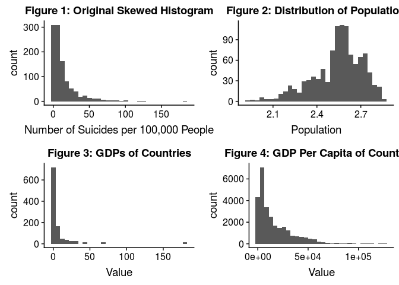
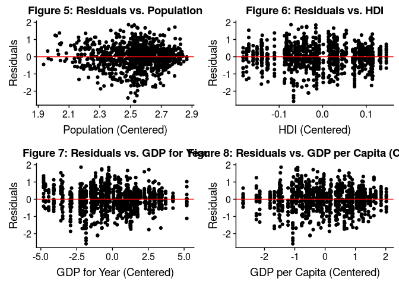
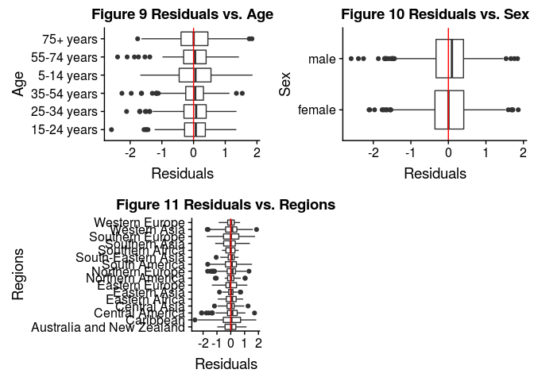

CAMFAM: An Analysis of Suicide Rates
================
May 1st, 2019

## Introduction

With suicide being one of the leading causes of death for teens in the
world, it is important to not only see how Northern America (Canada,
Greenland, and the United States) stack up with the rest of the world,
but also the key trends of suicide rates among different groups and what
factors shed light onto these different rates.\[1\] We want to explore
how economic status, along with variables such as age, sex, and human
development index, affects suicide rates all across the world. Our
hypothesis is that generally, in poorer countries we predict that
suicide rates will be lower.

Our response variable will be suicides/100k pop, which is the number of
suicides per 100,000 people in a certain country and year and is stored
as a numeric in our dataset. Our predictor variables will be age, sex,
HDI, gdp\_for\_year, gdp\_per\_capita, generation, population, region
and continent. Age is the age an individual was when they passed, sex is
the gender of that individual, country is the country they are from,
year is the year they passed, HDI for year is the human development
index for a given country and year, gdp\_for\_year is the GDP for a
given country and year, gdp\_per\_capita is the GDP per capita for a
given country and year, and generation is the generation that an
individual belongs to. There generations are Silent (born 1928-1945),
Generation X (born 1965-1980), Millennials (born 1981-1996), and
Generation Z (born 1997-2015). We wish to understand how the number of
suicides per 100,000 people in a certain country and year changes as
population, GDP, GDP per capita, and HDI increase or decreases, meaning
we want to understand the population coefficients for gdp\_for\_year,
gdp\_per\_capita, and HDI for year. Additionally, we want to understand
whether age, sex, generation, and location have an effect on the number
of suicides per 100,000 people, meaning we also want to understand the
population coefficients for these variables. We will not include country
and suicide/no in our analysis because having 188 different levels is
unrealistic for the former, and the latter is manifested in the response
variable.

### EDA

Given the longitudinal structure of our data and the need for making a
multilevel model, we are going to use the data collected in 2010. This
year has a majority of the countries in the origianl data set and also
is one of the years HDI values were collected. Since region and
continent were not in this data set orginally, we used the gapminder
data set as a cold deck and merged those values into the suicide data
set.

Since South Korea and Russia did not have HDI values, we found them
online and imputed those (they had values of 0.884 and 0.780
respectively) as well. However, Aruba and Puerto Rico’s HDIs were not
available, so we took the average of the HDI in the Caribbean and used a
mean imputation for those values.

For the response variable, there were several 0 values in the dataset.
After seeing that the distribution was extremely right skewed (Figure
1), we decided to log these values. However, this results in several
negative infinity values, so we decided to add one to each value in the
number of suicides column in the dataset and then divide this column by
(population/100,000) to make this our new suicides/100k. Finally, we log
transformed suicides/100k afterwards. We decided to shift the
distribution by 1 so as to not alter the overall distribution of the
response variable.

<!-- -->

The mean number of suicides per 100,000 people is 11.22, while the
maximum number of suicides per 100,000 people in this dataset is 182.32.
The distribution of the log of the reponse variable is normal. We see
that most of our countries are from the Americas and Europe and are in
the regions of Western Asia, Southern Europe, South America, Northern
Europe, and the Caribbean. In general, each continent has a similar
average log suicide rate, with Europe having many more outliers with
fewer suicides than the others.

<!-- -->

As age increases, log suicide rate tends to increase in general. The
5-14 age group is far lower than the other age groups, which is
expected. The average number of suicides/100k for each region is around
7.38. We see Southern Africa as a key outlier with far less suicides and
Eastern Africa with far more suicides than the average. We notice that
males have a higher log suicide rate/100k people than females. However,
there are many outliers in this data set so we must explore further.
Finally, we notice that Generation Z is significantly lower in terms of
the average number of log suicides/100k.

Due to the skewed histograms of GDP, GDP per capita, and population, we
log transformed these variables (Figures 2,3,4). We also mean center all
of the quantitative variables.

<!-- -->

The HDI does not have a set distribution. Rather, it is quite sparse.
The distribution of log population is slightly skewed left and has a
unimodal distribution. We notice that the distribution of log GDPs of
countries has a near-bimodal distribution. The log GDP Per Capita is
skewed to the left and is bimodal.

<!-- -->

We do not see correlations between HDI, log GDP, and log GDP per capita
and log suicides/100k. We notice that there could some sort of linear
trend or threshold for log population and log suicides/100k. In those
countries with extremely low populations, the number of suicides/100k is
generally higher.

<!-- -->

From the pairs plot, it looks as if HDI and log gdp\_for\_year do not
have a clear linear relationship with suicides/100k pop. However, log
gdp\_per\_capita seems to be positively correlated with log
suicides/100k pop, meaning as log gdp\_per\_capita increases, so does
log suicides/100k pop. Additionally, it looks as if HDI and log
gdp\_per\_capita seem to have a strong non-linear relationship,
indicating that we should continue looking into this relationship.
Similarly, HDI and log gdp\_for\_year also seem to have a strong
non-linear relationship. We also see strong evidence of
multicollinearity between log GDP for year and log GDP per capita that
we must address in the model.

We are very concerned about multicollinearity between all of these
variables, so we will look into VIF.

We plan to do a multiple linear regression because suicides/100k pop is
a quantitative variable (there are no levels to it, since it is a
continuous variable).

## Regression Analysis

After conducting backwards selection, we found that sex, age, log
population, HDI, log gdp for year, log gdp per capita, and region are
all relevant predictors, whereas continent and generation are not (See
Figure 13).

### Interesting Interactions

<!-- -->
Note: Legend for this plot encompasses the other three. From all of
these plots, we see interactions between each qualitative and
quantitative variable tested. However, after conducting nested F tests,
we see that there are interaction effects between all of the above
interactions except region and population. There were no interaction
effects between sex and any quantitative
    variable.

    ## `stat_bin()` using `bins = 30`. Pick better value with `binwidth`.

<!-- -->

From the residual vs. predicted values, the residuals with lower
predicted values seem to be more sparse and spread out than the others,
which may be worth looking into. However, for the most part, the
majority of the residuals are randomly distributed around the red line
and do not exhibit any obvious nonlinear trends. Thus, we can conclude
that constant variance is satisfied. According to the QQ-plot, the
normality assumption seems to be satisfied because the majority of the
points seem to align well with the expected QQ-plot line. In addition,
the histogram seems to be approximately normal and follows a mostly
smooth curve. Based on the description of the data, the independence
assumption seems to be met because this data was not collected over
time, since we only took the year 2010, and there does not appear to be
a cluster effect.

For our quantitative predictors, the residuals seem to be scattered
pretty evenly around the 0 line, and none of them show an obvious
curving shape, so we can conclude that the linearity assumption is met
for these predictors as well (seen in figures 5,6,7,8).

For our qualitative predictors, linearity is moderately to completely
satisfied as well (Figures 9, 10, 11 have more
information).

<!-- -->

There are 762 points with high leverage, meaning these points are some
sorts of outliers. However, these points do not have a significant
influence on the model coefficients. There are 66 observations that are
considered to have standarized residuals with large magnitude, which is
about 6.25% of the total number of observations. This is not a concern
because this is only a small percentage greater than the standard 5%.

There are some obvious concerns with multicollinearity in this model
because some of the variance inflation factors are higher than 10. Log
population, HDI, log gdp\_for\_year, and log gdp per capita all have
variance inflation factors greater than 10. Based on the pairs plot, we
can see that HDI, log gdp\_for\_year, log gdp\_per\_capita, and log
population are all very correlated. After removing HDI and log GDP for
year, all VIF values are below 10, meaning we do not have any
multicollinearity. (Figure 12 has more
information)

|                   term                    |   estimate   | std.error |  statistic  |  p.value  |
| :---------------------------------------: | :----------: | :-------: | :---------: | :-------: |
|                (Intercept)                |  7.4319749   | 1.2976134 |  5.7274183  | 0.0000000 |
|                  sexmale                  |  1.0443624   | 0.0449309 | 23.2437684  | 0.0000000 |
|              age25-34 years               |  0.1824455   | 1.3419519 |  0.1359553  | 0.8918837 |
|              age35-54 years               | \-1.3271798  | 1.3766342 | \-0.9640758 | 0.3352389 |
|               age5-14 years               |  10.1969348  | 1.3442199 |  7.5857637  | 0.0000000 |
|              age55-74 years               | \-0.2663786  | 1.2902339 | \-0.2064576 | 0.8364751 |
|               age75+ years                |  3.1581620   | 1.1867781 |  2.6611225  | 0.0079117 |
|                population                 | \-2.2538772  | 0.4120662 | \-5.4696964 | 0.0000001 |
|             gdp\_per\_capita              | \-0.1044137  | 0.7169762 | \-0.1456307 | 0.8842420 |
|              regionCaribbean              | \-0.7702552  | 0.8021422 | \-0.9602477 | 0.3371606 |
|           regionCentral America           | \-0.8791535  | 0.8181826 | \-1.0745199 | 0.2828466 |
|            regionCentral Asia             |  0.2394507   | 0.8298430 |  0.2885494  | 0.7729855 |
|           regionEastern Africa            | \-0.0058994  | 0.9071472 | \-0.0065032 | 0.9948125 |
|            regionEastern Asia             |  1.5168428   | 0.8822089 |  1.7193692  | 0.0858538 |
|           regionEastern Europe            |  0.0924298   | 0.8074347 |  0.1144735  | 0.9088853 |
|          regionNorthern America           | \-13.2357265 | 9.3860403 | \-1.4101502 | 0.1588035 |
|           regionNorthern Europe           |  0.0393244   | 0.8077281 |  0.0486852  | 0.9611798 |
|            regionSouth America            |  0.1015780   | 0.8111703 |  0.1252240  | 0.9003712 |
|         regionSouth-Eastern Asia          | \-0.5331926  | 0.8128215 | \-0.6559774 | 0.5119882 |
|           regionSouthern Africa           | \-2.0401081  | 1.2465380 | \-1.6366193 | 0.1020219 |
|            regionSouthern Asia            | \-1.2780679  | 1.2686499 | \-1.0074236 | 0.3139728 |
|           regionSouthern Europe           | \-0.5779351  | 0.8046075 | \-0.7182820 | 0.4727497 |
|            regionWestern Asia             | \-1.4212634  | 0.8036647 | \-1.7684781 | 0.0772831 |
|           regionWestern Europe            |  1.1486307   | 0.8856006 |  1.2970077  | 0.1949250 |
|     gdp\_per\_capita:regionCaribbean      |  0.2446517   | 0.7233934 |  0.3382000  | 0.7352828 |
|  gdp\_per\_capita:regionCentral America   | \-0.0706397  | 0.7265289 | \-0.0972290 | 0.9225638 |
|    gdp\_per\_capita:regionCentral Asia    |  0.2544162   | 0.7245420 |  0.3511407  | 0.7255561 |
|   gdp\_per\_capita:regionEastern Africa   |  1.1741816   | 1.2550743 |  0.9355475  | 0.3497301 |
|    gdp\_per\_capita:regionEastern Asia    | \-0.4709708  | 0.8263977 | \-0.5699081 | 0.5688669 |
|   gdp\_per\_capita:regionEastern Europe   | \-0.3288133  | 0.7274604 | \-0.4520017 | 0.6513649 |
|  gdp\_per\_capita:regionNorthern America  |  11.0440498  | 7.5988765 |  1.4533793  | 0.1464294 |
|  gdp\_per\_capita:regionNorthern Europe   | \-0.2052237  | 0.7213537 | \-0.2844981 | 0.7760871 |
|   gdp\_per\_capita:regionSouth America    |  0.2566074   | 0.7266446 |  0.3531402  | 0.7240571 |
| gdp\_per\_capita:regionSouth-Eastern Asia |  0.0830189   | 0.7223317 |  0.1149318  | 0.9085220 |
|  gdp\_per\_capita:regionSouthern Europe   | \-0.0255527  | 0.7213259 | \-0.0354246 | 0.9717482 |
|    gdp\_per\_capita:regionWestern Asia    |  0.0086593   | 0.7193692 |  0.0120374  | 0.9903981 |
|   gdp\_per\_capita:regionWestern Europe   | \-0.8165807  | 0.7657223 | \-1.0664189 | 0.2864894 |
|         age25-34 years:population         | \-0.0015690  | 0.5238859 | \-0.0029950 | 0.9976110 |
|         age35-54 years:population         |  0.6714523   | 0.5329288 |  1.2599288  | 0.2079864 |
|         age5-14 years:population          | \-4.7499597  | 0.5258463 | \-9.0329811 | 0.0000000 |
|         age55-74 years:population         |  0.2749182   | 0.5042421 |  0.5452108  | 0.5857290 |
|          age75+ years:population          | \-1.0223252  | 0.4703201 | \-2.1736796 | 0.0299611 |
|      age25-34 years:gdp\_per\_capita      |  0.0983139   | 0.0743233 |  1.3227877  | 0.1862057 |
|      age35-54 years:gdp\_per\_capita      |  0.2275430   | 0.0744419 |  3.0566512  | 0.0022971 |
|      age5-14 years:gdp\_per\_capita       | \-0.1951639  | 0.0743597 | \-2.6245917 | 0.0088064 |
|      age55-74 years:gdp\_per\_capita      |  0.2579984   | 0.0745822 |  3.4592480  | 0.0005643 |
|       age75+ years:gdp\_per\_capita       |  0.2824247   | 0.0746506 |  3.7832888  | 0.0001639 |

In validating our model, we see that the mean squared error values are
small, so we can conclude that our model predicts well.

## Discussion and Limitations

Our intercept is interpreted as when the mean-centered population and
gdp per capita are log(x) = 0, the expected median of suicides per
100,000 people is around 1689.14 with a baseline of female, age between
15-24 years and region of Australia and New Zealand. We will discuss
this high number in limitations. When population is doubled, the median
of suicides/100k is expected to multiply by a factor of 0.105, which
shows that increases in population correlate with lower suicide rates.
In general, countries with higher GDP have lower suicide rates because
when GDP / capita is doubled, the median of suicides/100k is expected to
multiply by a factor of 0.93. When the gender is male, the median of
suicides/100k is expected to multiply by a factor of 2.85 when compared
to the baseline of females.

We see the lowest increases in suicide rate in the Northern America
region, but the greatest increases in western Europe; however, since gdp
per capita interacts with region, those effects are limited. For
Northern America, we also did predictions based on sex, population, and
age. We empirically found that in North America, as age increases,
suicide rates tend to increase as well. This does not corroborate the
general coeffiients with respect to region. However, since region is
generally not significant, our original hypothesis regarding suicides
being dependent on region is not extremely valid.

Before we checked for multicollinearity, the intercept for our final
model was a reasonable number of approximately 12 suicides per 100,000,
which seemed to fit the distribution of suicides per 100,000 seen in
EDA. However, after removing HDI and log gdp\_for\_year from the final
model while checking for multicollinearity, the intercept shot up to
approximately 1689 suicides per 100,000. This is an error that we would
want to look into in the future. Additionally, the coefficient for 5-14
years is extremely high in both final models, which also does not make
sense given the distribution of the number of suicides per 100,000 for
each age group seen in EDA. Although the interaction effects seem to
somewhat make up for this error, this is also something we would want to
investigate in the future.

Suicide rates in general can vary a lot depending on the year. Just from
looking through the different years, we noticed that some countries’
suicide rates tend to change over time. As such, our model might not be
the most accurate; however, we can predict certain things to a
reasonable degree of accuracy. HDI is a limitation because you can only
calculate this value every 5 years. For predicting, we have to plug in
numbers that make sense for a region, or else it gives us a negative
grade. In terms of what we could have done better, we could have
assessed multicollinearity before selecting the model, which potentially
could have changed the variables in the final model. We also could have
renamed our mean-centered and logged variables so that we wouldn’t get
confused later on when trying to differentiate these. If we were to
conduct this project again, we would utilize a time series model, as
suicide rates vary across time.

We believe our regression model is appropriate given our skillset. If we
could continue to work on this data set, we would see how suicide rates
are changing over time and use this data to make better conclusions
about future rates.

## Conclusion

Our original hypothesis was that generally, in poorer countries we
predict that suicide rates will lower. According to our final model,
when GDP / capita is doubled, the median of suicides/100k is expected to
multiply by a factor of .93. This proved our hypothesis to be incorrect,
since when the GDP is lower, the median of suicides/100k is expected to
higher than it would be when the GDP is higher. However, GDP / capita
was not significant in our model, meaning it may not have a significant
effect on suicides/100k. Surprisingly, North America has a substantially
lower suicide rate than other developed regions such as Northern Europe.
However, region was found to not be significant either. We did find that
population, sex, and age are all significant predictors of
suicides/100k. According to our final model, suicide rates are higher
for males than they are for females. Additionally, as age group
increases, suicide rate increases as well. Finally, smaller populations
tend to have higher suicides rates than larger populations do. Overall,
we found that economic status and location do not have as large of an
effect on suicide rates as population, age, and sex do.

## Additional Work

AIC Table:

    ## Start:  AIC=-436.98
    ## `suicides/100k pop` ~ sex + age + population + HDI + (`gdp_for_year ($)`) + 
    ##     (`gdp_per_capita ($)`) + continent + region + generation
    ## 
    ## 
    ## Step:  AIC=-436.98
    ## `suicides/100k pop` ~ sex + age + population + HDI + `gdp_for_year ($)` + 
    ##     `gdp_per_capita ($)` + continent + region
    ## 
    ## 
    ## Step:  AIC=-436.98
    ## `suicides/100k pop` ~ sex + age + population + HDI + `gdp_for_year ($)` + 
    ##     `gdp_per_capita ($)` + region
    ## 
    ##                        Df Sum of Sq     RSS     AIC
    ## - `gdp_per_capita ($)`  1      0.13  664.73 -438.78
    ## <none>                               664.61 -436.98
    ## - HDI                   1      1.56  666.16 -436.51
    ## - `gdp_for_year ($)`    1      2.85  667.46 -434.46
    ## - population            1      4.97  669.58 -431.11
    ## - region               15    241.88  906.49 -139.21
    ## - sex                   1    290.42  955.02  -56.14
    ## - age                   5    769.95 1434.55  365.52
    ## 
    ## Step:  AIC=-438.78
    ## `suicides/100k pop` ~ sex + age + population + HDI + `gdp_for_year ($)` + 
    ##     region
    ## 
    ##                      Df Sum of Sq     RSS     AIC
    ## <none>                             664.73 -438.78
    ## - `gdp_for_year ($)`  1      3.65  668.38 -435.00
    ## - HDI                 1      4.50  669.23 -433.66
    ## - population          1     10.81  675.55 -423.74
    ## - region             15    252.00  916.73 -129.35
    ## - sex                 1    290.37  955.10  -58.05
    ## - age                 5    773.61 1438.34  366.31

|                    term                     |   estimate   | std.error  |  statistic  |  p.value  |
| :-----------------------------------------: | :----------: | :--------: | :---------: | :-------: |
|                 (Intercept)                 |  2.5199093   | 7.9046711  |  0.3187874  | 0.7499557 |
|                   sexmale                   |  1.0366314   | 0.0416535  | 24.8870099  | 0.0000000 |
|               age25-34 years                |  15.9584239  | 9.2728953  |  1.7209753  | 0.0855709 |
|               age35-54 years                |  1.8670545   | 10.5753940 |  0.1765470  | 0.8599007 |
|                age5-14 years                |  20.9964213  | 9.4840301  |  2.2138712  | 0.0270672 |
|               age55-74 years                |  2.5874080   | 8.6162296  |  0.3002947  | 0.7640161 |
|                age75+ years                 |  13.8415938  | 7.9241816  |  1.7467537  | 0.0809933 |
|                 population                  |  0.4260107   | 2.9634448  |  0.1437552  | 0.8857233 |
|                     HDI                     | \-21.2343535 | 25.8760051 | \-0.8206195 | 0.4120626 |
|             `gdp_for_year ($)`              |  0.0173486   | 0.2649987  |  0.0654667  | 0.9478158 |
|            `gdp_per_capita ($)`             |  0.2966462   | 0.6165608  |  0.4811304  | 0.6305312 |
|               regionCaribbean               | \-2.5301383  | 2.5003136  | \-1.0119284 | 0.3118221 |
|            regionCentral America            | \-2.8510033  | 2.5000954  | \-1.1403578 | 0.2544159 |
|             regionCentral Asia              | \-0.4741630  | 2.5167399  | \-0.1884037 | 0.8505992 |
|            regionEastern Africa             | \-4.6153287  | 2.6322969  | \-1.7533466 | 0.0798552 |
|             regionEastern Asia              |  1.4758395   | 0.8509792  |  1.7342840  | 0.0831822 |
|            regionEastern Europe             | \-2.1334831  | 2.5062684  | \-0.8512588 | 0.3948336 |
|           regionNorthern America            | \-1.8160963  | 6.1183772  | \-0.2968265 | 0.7666619 |
|            regionNorthern Europe            | \-1.5592014  | 2.5133883  | \-0.6203584 | 0.5351661 |
|             regionSouth America             | \-1.5769908  | 2.4982817  | \-0.6312302 | 0.5280372 |
|          regionSouth-Eastern Asia           | \-3.7384365  | 2.5820779  | \-1.4478403 | 0.1479815 |
|            regionSouthern Africa            | \-7.0399931  | 6.2848695  | \-1.1201494 | 0.2629245 |
|             regionSouthern Asia             | \-4.5399118  | 4.6823311  | \-0.9695837 | 0.3324933 |
|            regionSouthern Europe            | \-2.5972177  | 2.4974147  | \-1.0399625 | 0.2986138 |
|             regionWestern Asia              | \-3.2628672  | 2.4967473  | \-1.3068472 | 0.1915712 |
|            regionWestern Europe             | \-1.2096246  | 2.9662786  | \-0.4077920 | 0.6835155 |
|             HDI:regionCaribbean             |  30.6319097  | 26.1112565 |  1.1731304  | 0.2410286 |
|          HDI:regionCentral America          |  28.1189251  | 26.1829169 |  1.0739417  | 0.2831132 |
|           HDI:regionCentral Asia            |  48.5437722  | 26.3251933 |  1.8440044  | 0.0654842 |
|          HDI:regionEastern Africa           | \-46.4758831 | 27.7448886 | \-1.6751151 | 0.0942307 |
|          HDI:regionEastern Europe           |  17.1884396  | 26.4418585 |  0.6500466  | 0.5158145 |
|         HDI:regionNorthern America          |  13.7593264  | 57.1696475 |  0.2406754  | 0.8098571 |
|          HDI:regionNorthern Europe          |  8.5400096   | 26.7660263 |  0.3190615  | 0.7497478 |
|           HDI:regionSouth America           |  15.4973642  | 25.9436039 |  0.5973482  | 0.5504129 |
|        HDI:regionSouth-Eastern Asia         |  19.7525334  | 19.9735295 |  0.9889355  | 0.3229388 |
|          HDI:regionSouthern Europe          |  22.8910983  | 26.1949093 |  0.8738758  | 0.3824000 |
|           HDI:regionWestern Asia            |  29.1020965  | 25.9735906 |  1.1204495  | 0.2627968 |
|          HDI:regionWestern Europe           |  7.8557090   | 22.4001193 |  0.3506994  | 0.7258892 |
|     `gdp_for_year ($)`:regionCaribbean      | \-0.3349923  | 0.1478963  | \-2.2650494 | 0.0237273 |
|  `gdp_for_year ($)`:regionCentral America   | \-0.1011988  | 0.1495226  | \-0.6768122 | 0.4986848 |
|    `gdp_for_year ($)`:regionCentral Asia    | \-0.4495542  | 0.2142800  | \-2.0979757 | 0.0361629 |
|    `gdp_for_year ($)`:regionEastern Asia    | \-0.3831628  | 0.4005241  | \-0.9566536 | 0.3389780 |
|   `gdp_for_year ($)`:regionEastern Europe   |  0.1395157   | 0.1574637  |  0.8860182  | 0.3758251 |
|  `gdp_for_year ($)`:regionNorthern Europe   | \-0.2227774  | 0.1488423  | \-1.4967347 | 0.1347843 |
|   `gdp_for_year ($)`:regionSouth America    | \-0.3887931  | 0.1442737  | \-2.6948304 | 0.0071629 |
| `gdp_for_year ($)`:regionSouth-Eastern Asia |  0.9425181   | 0.5213408  |  1.8078732  | 0.0709327 |
|  `gdp_for_year ($)`:regionSouthern Europe   | \-0.2046936  | 0.1469101  | \-1.3933262 | 0.1638371 |
|    `gdp_for_year ($)`:regionWestern Asia    | \-0.0094657  | 0.1502833  | \-0.0629858 | 0.9497906 |
|    `gdp_per_capita ($)`:regionCaribbean     |  0.1449404   | 0.5516732  |  0.2627288  | 0.7928149 |
| `gdp_per_capita ($)`:regionCentral America  | \-1.0923013  | 0.6995542  | \-1.5614248 | 0.1187464 |
|   `gdp_per_capita ($)`:regionCentral Asia   | \-0.9175886  | 0.5856206  | \-1.5668653 | 0.1174690 |
|  `gdp_per_capita ($)`:regionEastern Europe  | \-0.4036319  | 0.6647629  | \-0.6071817 | 0.5438710 |
| `gdp_per_capita ($)`:regionNorthern Europe  |  0.4096081   | 0.6600452  |  0.6205758  | 0.5350230 |
|  `gdp_per_capita ($)`:regionSouth America   |  1.0100262   | 0.6016985  |  1.6786251  | 0.0935439 |
| `gdp_per_capita ($)`:regionSouthern Europe  | \-0.2989290  | 0.6246232  | \-0.4785749 | 0.6323478 |
|   `gdp_per_capita ($)`:regionWestern Asia   | \-0.5832564  | 0.5619691  | \-1.0378798 | 0.2995820 |
|             age25-34 years:HDI              |  1.7942578   | 2.0339682  |  0.8821465  | 0.3779139 |
|             age35-54 years:HDI              |  6.9028518   | 2.0954559  |  3.2942004  | 0.0010224 |
|              age5-14 years:HDI              | \-5.2616333  | 2.0945989  | \-2.5120003 | 0.0121647 |
|             age55-74 years:HDI              |  7.5700050   | 2.2512405  |  3.3625928  | 0.0008020 |
|              age75+ years:HDI               |  8.1133422   | 2.2604839  |  3.5892060  | 0.0003481 |
|          age25-34 years:population          | \-6.1706187  | 3.6261276  | \-1.7017103 | 0.0891269 |
|          age35-54 years:population          | \-0.6014393  | 4.1004269  | \-0.1466772 | 0.8834170 |
|          age5-14 years:population           | \-8.9796033  | 3.7153035  | \-2.4169232 | 0.0158341 |
|          age55-74 years:population          | \-0.8372444  | 3.3715255  | \-0.2483281 | 0.8039326 |
|           age75+ years:population           | \-5.2747910  | 3.1110562  | \-1.6954985 | 0.0902985 |
|     age25-34 years:`gdp_per_capita ($)`     | \-0.5576948  | 0.3397704  | \-1.6413874 | 0.1010379 |
|     age35-54 years:`gdp_per_capita ($)`     | \-0.3679886  | 0.3791281  | \-0.9706181 | 0.3319780 |
|     age5-14 years:`gdp_per_capita ($)`      | \-0.2251742  | 0.3435985  | \-0.6553412 | 0.5124019 |
|     age55-74 years:`gdp_per_capita ($)`     | \-0.3477536  | 0.3500694  | \-0.9933848 | 0.3207677 |
|      age75+ years:`gdp_per_capita ($)`      | \-0.6278469  | 0.3310567  | \-1.8964934 | 0.0581887 |
|      age25-34 years:`gdp_for_year ($)`      |  0.4831941   | 0.2873713  |  1.6814278  | 0.0929985 |
|      age35-54 years:`gdp_for_year ($)`      |  0.0558644   | 0.3172164  |  0.1761082  | 0.8602453 |
|      age5-14 years:`gdp_for_year ($)`       |  0.3607650   | 0.2951526  |  1.2222998  | 0.2218882 |
|      age55-74 years:`gdp_for_year ($)`      |  0.0088806   | 0.2681111  |  0.0331229  | 0.9735833 |
|       age75+ years:`gdp_for_year ($)`       |  0.3127316   | 0.2495005  |  1.2534309  | 0.2103479 |

This was our original final model, but concerns of multicollienarity
made us get rid of a few variables. In this original model, the
intercept is much more realistic at around 7 suicides/100k given the
baseline values. Concerns of multicollinearity made us get rid of two
variables. However, we also believe that the interaction effects were
able to counterract the high intercept and values of certain parameters.
For example, we notice that for Northern America the estimate is -13,
but the interaction effects between GDP and Region for North America are
around 11, which counterracts this. It also makes sense that HDI and gdp
were multicollinear, considering that they both reflect economic status
of a
country.

<!-- -->

<!-- -->

<!-- -->

While there are some differences between some of the means of the
residuals for some regions, these means do not seem to vary by too much,
and thus the linearity assumption is moderately satisfied for this
variable. However, there are a few regions with some extreme residuals,
such as the Carribean and Western Asia. It could be worth looking into
these more. While there is some differences between the means of the
residuals for the two gender groups, these means do not seem to vary by
too much, and the plots seem to have very similar distributions, and
thus the linearity assumption is moderately satisfied for this variable.
Again, while there are some differences between some of the means of the
residuals for some age groups, these means do not seem to vary by too
much, and thus the linearity assumption is satisfied for this variable.
