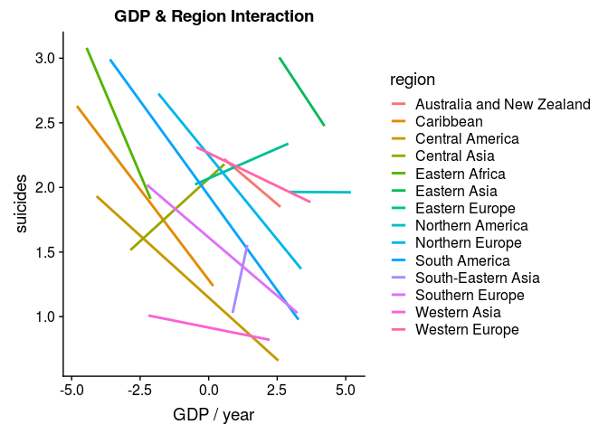
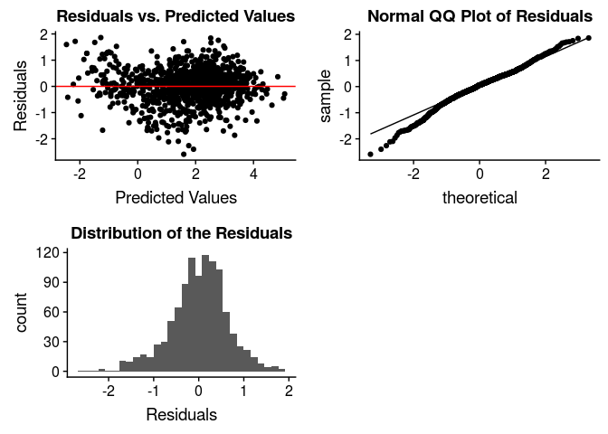

CAMFAM: An Analysis of Suicide Rates
================
May 1st, 2019

## Introduction

With suicide being one of the leading causes of death for teens in the
world, it is important to not only see how Northern America (Canada,
Greenland, and the United States) stack up with the rest of the world
but also the key trends of suicide rates among different groups and what
factors shed light onto these different rates\[1\] We want to explore
how economic status, along with variables such as age, sex, and human
development index, affects suicide rates all across the world. Our
hypothesis is that generally, in poorer countries we predict that
suicide rates will lower.

Our response variable will be suicides/100k pop, which is the number of
suicides per 100,000 people in a certain country and year, which is
stored as a numeric in our dataset. Our predictors variables will be
age, sex, HDI, gdp\_for\_year, gdp\_per\_capita, generation, region and
continent. Age is the age an individual was when they passed, sex is the
gender of that individual, country is the country they are from, year is
the year they passed, HDI for year is the human development index for a
given country and year, gdp\_for\_year is the GDP for a given country
and year, gdp\_per\_capita is the GDP per capita for a given country and
year, and generation is the generation that an individual belongs to. We
wish to understand how the number of suicides per 100,000 people in a
certain country and year changes as year, GDP, GDP per capita, and HDI
increase or decreases, meaning we want to understand the population
coefficients for year, gdp\_for\_year, gdp\_per\_capita, and HDI for
year. Additionally, we want to understand whether age, sex, generation,
and country have an effect on the number of suicides per 100,000 people,
meaning we also want to understand the population coefficients for these
variables. We will not include country and suicide/no in our analysis
because having 188 different levels is unrealistic for the former and
the latter is manifested in the response variable and population.

### EDA

Given the longitudinal structure of our data and the need for making a
multilevel model, we are going to use the data collected in 2010. This
year has a majority of the countries in the origianl data set and also
is the year HDI values were collected. Since region and continent were
not in this data set orginially, we used the gapminder data set as the
cold deck and merged those values into the suicide data set.

Since South Korea and Russia did not have HDI values, we found them from
online and imputed those (had values of .884 and .780 respectively).
However, Aruba and Puerto Rico’s HDI’s were not available, so we took
the average of the HDI in the Caribbean and used a mean imputation for
those values.

For the response variable, since there are a few negative infinity
values, we added one to each number of suicides, divided by population
(to turn into suicided/100k) and then log transformed. We log
transformed because of the original skewed histogram (Figure 1).

    ## Loading required package: cowplot

    ## 
    ## Attaching package: 'cowplot'

    ## The following object is masked from 'package:ggplot2':
    ## 
    ##     ggsave

    ## `stat_bin()` using `bins = 30`. Pick better value with `binwidth`.

<!-- -->

The mean number of suicides per 100,000 people is 11.22, while the
maximum number of suicides per 100,000 people in this dataset is 182.32.
The distribution of this reponse variable is normal. We see that most of
our countries are from the Amerias and Europe and are in the regions of
Western Asia, Southern Europe, South America, Northern Europe, and the
Caribbean. In general, each continent has a similar average number of
suicides, with Europe having much more outliers with fewer suicides than
the others.

<!-- -->

As age increases, suicide rate tends to increase in general. The 5-14
age group is far lower than the other age groups, which is expected. The
average number of suicides/100k for each region is around 7.38. We see
Southern Africa as a key outlier with far less suicides and Eastern
Africa with far more suicides than the average. We notice that males
have a higher suicide rate/100k people than females. However, there are
many outliers in this data set so we must explore further. We notice
that Generation Z is significantly lower in terms of the average number
of suicides/100k of 7.38.

Due to the skewed histograms of GDP, GDP per capita, and population, we
log transformed them (Figures 2,3,4). We also mean center all the
quantitative
    variables.

    ## `stat_bin()` using `bins = 30`. Pick better value with `binwidth`.
    ## `stat_bin()` using `bins = 30`. Pick better value with `binwidth`.
    ## `stat_bin()` using `bins = 30`. Pick better value with `binwidth`.
    ## `stat_bin()` using `bins = 30`. Pick better value with `binwidth`.

<!-- -->

The HDI does not have a set distribution. Rather, it is quite sparse.
The distribution of population is skewed left and has a unimodal
distribution. We notice that the distribution of GDPs of countries has a
near-bimodal distribution.The GDP Per Capita is skewed to the left and
is bimodal.

<!-- -->

We do not see correlations between HDI, GDP, and GDP per capita and
suicides/100k. We notice that there could some sort of linear trend or
threshold for population and suicides. Perhaps in those countries with
extremely low populations the number of suicides/100k is generally
higher.

<!-- -->

From the pairs plot, it looks as if HDI, and gdp\_for\_year do not have
a clear linear relationship with suicides/100k pop. However,
gdp\_per\_capita seems to be positively correlated with suicides/100k
pop, meaning as gdp\_per\_capita increases, so does suicides/100k pop.
Additionally, it looks as if HDI and gdp\_per\_capita seem to have a
strong non-linear relationship, indicating that we should continue
looking into this relationship and perhaps include an interaction term
between these two variables. Similarly, HDI and gdp\_for\_year also seem
to have a strong non-linear relationship, so we should include an
interaction term between these two variables as well. We also see a
strong evidence of multicollinearity between GDP for year and GDP per
capita that we must address in the model.

We are very concerned about multicollinearity between all of these
variables, so we will look into VIF.

We plan to do a multiple linear regression because suicides/100k pop is
a quantitative variable (there are no levels to it, since it is a
continuous variable).

## Regression Analysis

    ## Start:  AIC=-436.98
    ## `suicides/100k pop` ~ sex + age + population + HDI + (`gdp_for_year ($)`) + 
    ##     (`gdp_per_capita ($)`) + continent + region + generation
    ## 
    ## 
    ## Step:  AIC=-436.98
    ## `suicides/100k pop` ~ sex + age + population + HDI + `gdp_for_year ($)` + 
    ##     `gdp_per_capita ($)` + continent + region
    ## 
    ## 
    ## Step:  AIC=-436.98
    ## `suicides/100k pop` ~ sex + age + population + HDI + `gdp_for_year ($)` + 
    ##     `gdp_per_capita ($)` + region
    ## 
    ##                        Df Sum of Sq     RSS     AIC
    ## - `gdp_per_capita ($)`  1      0.13  664.73 -438.78
    ## <none>                               664.61 -436.98
    ## - HDI                   1      1.56  666.16 -436.51
    ## - `gdp_for_year ($)`    1      2.85  667.46 -434.46
    ## - population            1      4.97  669.58 -431.11
    ## - region               15    241.88  906.49 -139.21
    ## - sex                   1    290.42  955.02  -56.14
    ## - age                   5    769.95 1434.55  365.52
    ## 
    ## Step:  AIC=-438.78
    ## `suicides/100k pop` ~ sex + age + population + HDI + `gdp_for_year ($)` + 
    ##     region
    ## 
    ##                      Df Sum of Sq     RSS     AIC
    ## <none>                             664.73 -438.78
    ## - `gdp_for_year ($)`  1      3.65  668.38 -435.00
    ## - HDI                 1      4.50  669.23 -433.66
    ## - population          1     10.81  675.55 -423.74
    ## - region             15    252.00  916.73 -129.35
    ## - sex                 1    290.37  955.10  -58.05
    ## - age                 5    773.61 1438.34  366.31

After conducting a backward selection, we we found that sex, age
population, HDI, gdp for year, and gdp per capita, and region are
relevant predictors, whereas population, continent, and generation are
not.

### Interesting Interactions

<!-- -->

From all of these plots, we see interactions between each qualitative
and quantitative variable tested. However, after conducting nested F
tests, we see that there are interaction effects between all the above
interactions except region and population. There were no interaction
effects between sex and any quantitative
    variable.

    ## `stat_bin()` using `bins = 30`. Pick better value with `binwidth`.

<!-- -->

From the residual vs. predicted values, the residuals with lower
predicted values seem to be more sparse and spread out than the others,
which may be worth looking into. However, for the most part, the
majority of the residuals are randomly distributed around the red line
and do not exhibit any obvious nonlinear trends. Thus, we can conclude
that constant variance is satisfied. According to the QQ-plot, the
normality assumption seems to be satisfied because the majority of the
points seem to align well with the expected QQ-plot line. In addition,
the histogram seems to be approximately normal and follows a mostly
smooth curve. Based on the description of the data, the independence
assumption seems to be met because this data was not collected over
time, since we only took the year 2010, and there does not appear to be
a cluster effect.

For our quantitative predictors,the residuals seem to be scattered
pretty evenly around the 0 line, and none of them show an obvious
curving shape, so we can conclude that the linearity assumption is met
for these predictors as well (Seen in figures 5,6,7,8)

For our qualitative predictors, linearity is moderately to completely
satisfied (Figures 9, 10, 11 have more
information).

<!-- -->

There are 762 points with high leverage, meaning they affect something
about the model. However, these points do not have a significant
influence on the model coefficients. There are 66 observations that are
considered to have standarized residuals with large magnitude, which is
about 6.25% of the total number of observations. This is not a concern
because this is only a small percentage greater than the standard 5%.

There are some obvious concerns with multicollinearity in this model
because some of the variance inflation factors are higher than 10.
Population, HDI, gdp\_for\_year, and gdp per capita all have variance
inflation factors greater than 10. Based on the pairs plot, we can see
that HDI, gdp\_for\_year, gdp\_per\_capita, and population are all very
correlated. After removing HDI and GDP for year, all VIF values are
below 10, meaning we do not have any multicollinearity. (Figure 12 has
more
information)

|                   term                    |   estimate   | std.error |  statistic  |  p.value  |
| :---------------------------------------: | :----------: | :-------: | :---------: | :-------: |
|                (Intercept)                |  7.4319749   | 1.2976134 |  5.7274183  | 0.0000000 |
|                  sexmale                  |  1.0443624   | 0.0449309 | 23.2437684  | 0.0000000 |
|              age25-34 years               |  0.1824455   | 1.3419519 |  0.1359553  | 0.8918837 |
|              age35-54 years               | \-1.3271798  | 1.3766342 | \-0.9640758 | 0.3352389 |
|               age5-14 years               |  10.1969348  | 1.3442199 |  7.5857637  | 0.0000000 |
|              age55-74 years               | \-0.2663786  | 1.2902339 | \-0.2064576 | 0.8364751 |
|               age75+ years                |  3.1581620   | 1.1867781 |  2.6611225  | 0.0079117 |
|                population                 | \-2.2538772  | 0.4120662 | \-5.4696964 | 0.0000001 |
|             gdp\_per\_capita              | \-0.1044137  | 0.7169762 | \-0.1456307 | 0.8842420 |
|              regionCaribbean              | \-0.7702552  | 0.8021422 | \-0.9602477 | 0.3371606 |
|           regionCentral America           | \-0.8791535  | 0.8181826 | \-1.0745199 | 0.2828466 |
|            regionCentral Asia             |  0.2394507   | 0.8298430 |  0.2885494  | 0.7729855 |
|           regionEastern Africa            | \-0.0058994  | 0.9071472 | \-0.0065032 | 0.9948125 |
|            regionEastern Asia             |  1.5168428   | 0.8822089 |  1.7193692  | 0.0858538 |
|           regionEastern Europe            |  0.0924298   | 0.8074347 |  0.1144735  | 0.9088853 |
|          regionNorthern America           | \-13.2357265 | 9.3860403 | \-1.4101502 | 0.1588035 |
|           regionNorthern Europe           |  0.0393244   | 0.8077281 |  0.0486852  | 0.9611798 |
|            regionSouth America            |  0.1015780   | 0.8111703 |  0.1252240  | 0.9003712 |
|         regionSouth-Eastern Asia          | \-0.5331926  | 0.8128215 | \-0.6559774 | 0.5119882 |
|           regionSouthern Africa           | \-2.0401081  | 1.2465380 | \-1.6366193 | 0.1020219 |
|            regionSouthern Asia            | \-1.2780679  | 1.2686499 | \-1.0074236 | 0.3139728 |
|           regionSouthern Europe           | \-0.5779351  | 0.8046075 | \-0.7182820 | 0.4727497 |
|            regionWestern Asia             | \-1.4212634  | 0.8036647 | \-1.7684781 | 0.0772831 |
|           regionWestern Europe            |  1.1486307   | 0.8856006 |  1.2970077  | 0.1949250 |
|     gdp\_per\_capita:regionCaribbean      |  0.2446517   | 0.7233934 |  0.3382000  | 0.7352828 |
|  gdp\_per\_capita:regionCentral America   | \-0.0706397  | 0.7265289 | \-0.0972290 | 0.9225638 |
|    gdp\_per\_capita:regionCentral Asia    |  0.2544162   | 0.7245420 |  0.3511407  | 0.7255561 |
|   gdp\_per\_capita:regionEastern Africa   |  1.1741816   | 1.2550743 |  0.9355475  | 0.3497301 |
|    gdp\_per\_capita:regionEastern Asia    | \-0.4709708  | 0.8263977 | \-0.5699081 | 0.5688669 |
|   gdp\_per\_capita:regionEastern Europe   | \-0.3288133  | 0.7274604 | \-0.4520017 | 0.6513649 |
|  gdp\_per\_capita:regionNorthern America  |  11.0440498  | 7.5988765 |  1.4533793  | 0.1464294 |
|  gdp\_per\_capita:regionNorthern Europe   | \-0.2052237  | 0.7213537 | \-0.2844981 | 0.7760871 |
|   gdp\_per\_capita:regionSouth America    |  0.2566074   | 0.7266446 |  0.3531402  | 0.7240571 |
| gdp\_per\_capita:regionSouth-Eastern Asia |  0.0830189   | 0.7223317 |  0.1149318  | 0.9085220 |
|  gdp\_per\_capita:regionSouthern Europe   | \-0.0255527  | 0.7213259 | \-0.0354246 | 0.9717482 |
|    gdp\_per\_capita:regionWestern Asia    |  0.0086593   | 0.7193692 |  0.0120374  | 0.9903981 |
|   gdp\_per\_capita:regionWestern Europe   | \-0.8165807  | 0.7657223 | \-1.0664189 | 0.2864894 |
|         age25-34 years:population         | \-0.0015690  | 0.5238859 | \-0.0029950 | 0.9976110 |
|         age35-54 years:population         |  0.6714523   | 0.5329288 |  1.2599288  | 0.2079864 |
|         age5-14 years:population          | \-4.7499597  | 0.5258463 | \-9.0329811 | 0.0000000 |
|         age55-74 years:population         |  0.2749182   | 0.5042421 |  0.5452108  | 0.5857290 |
|          age75+ years:population          | \-1.0223252  | 0.4703201 | \-2.1736796 | 0.0299611 |
|      age25-34 years:gdp\_per\_capita      |  0.0983139   | 0.0743233 |  1.3227877  | 0.1862057 |
|      age35-54 years:gdp\_per\_capita      |  0.2275430   | 0.0744419 |  3.0566512  | 0.0022971 |
|      age5-14 years:gdp\_per\_capita       | \-0.1951639  | 0.0743597 | \-2.6245917 | 0.0088064 |
|      age55-74 years:gdp\_per\_capita      |  0.2579984   | 0.0745822 |  3.4592480  | 0.0005643 |
|       age75+ years:gdp\_per\_capita       |  0.2824247   | 0.0746506 |  3.7832888  | 0.0001639 |

In validating our model, we see that the mean squared error values are
small, so we can conclude that our model predicts well.

## Discussion and Limitations

Our Intercept is interpreted as when the predictor variables are log(x)
= 0, the expected median of suicides per 100,000 people is around
1689.14 with a baseline of female, age between 15-24 years and region of
Australia and New Zealand. We will discuss this high amount in
limitations.

When population is doubled, the median of suicides/100k is expected to
multiply by a factor of 0.105, which shows that increases in population
correlate with lower suicide rates. In general countries a higher GDP
because when when GDP / capita is doubled, the median of suicides/100k
is expected to multiply by a factor of 0.93. When the gender is male,
the the median of suicides/100k is expected to multiply by a factor of
2.85 when compared to the baseline of females

We see the lowest increases in suicide rate in the Northern America
model, but the greatest increases in western Europe; however, since gdp
per capita interacts greatly with this those effects are limited.

Before we checked for multicollinearity, the intercept for our final
model was a reasonable number of approximately 12 suicides per 100,000,
which seemed to fit the distribution of suicides per 100,000 seen in
EDA. However, after removing HDI and gdp\_for\_year from the final model
while checking for multicollinearity, the intercept shot up to
approximately 1689 suicides per 100,000. This is an error that we would
want to look into in the future. Additionally, the coefficient for 5-14
years is extremely high in both final models, which also does not make
sense given the distribution of the number of suicides per 100,000 for
each age group seen in EDA. Although the interaction effects seem to
somewhat make up for this error, this is also something we would want to
investigate in the future.

## Conclusion

In this section, you should summarize your project and highlight any
final points you wish the reader to get from the project.

## Additional Work

This was our original final model, but concerns of multicollienarity

###
