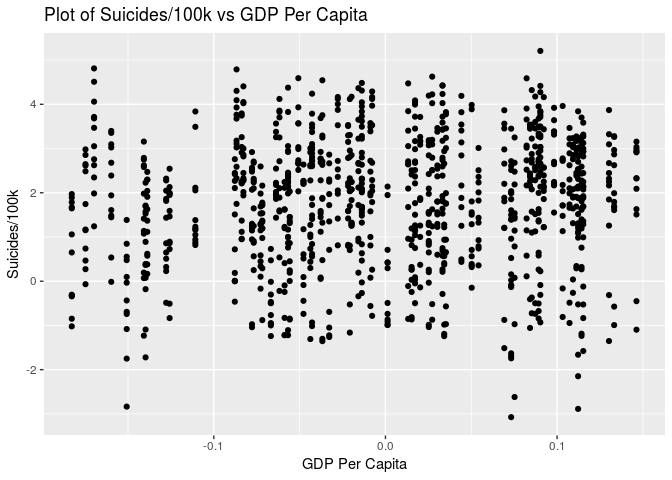

Stat210 Final Project
================
CamFam
May 1st, 2019

    ## ── Attaching packages ─────────────────────────── tidyverse 1.2.1 ──

    ## ✔ ggplot2 3.1.0     ✔ purrr   0.2.5
    ## ✔ tibble  2.0.0     ✔ dplyr   0.7.8
    ## ✔ tidyr   0.8.2     ✔ stringr 1.3.1
    ## ✔ readr   1.3.1     ✔ forcats 0.3.0

    ## ── Conflicts ────────────────────────────── tidyverse_conflicts() ──
    ## ✖ dplyr::filter() masks stats::filter()
    ## ✖ dplyr::lag()    masks stats::lag()

    ## 
    ## Attaching package: 'skimr'

    ## The following object is masked from 'package:knitr':
    ## 
    ##     kable

    ## 
    ## Attaching package: 'modelr'

    ## The following object is masked from 'package:broom':
    ## 
    ##     bootstrap

    ## The following object is masked from 'package:dslabs':
    ## 
    ##     heights

    ## -------------------------------------------------------------------------

    ## You have loaded plyr after dplyr - this is likely to cause problems.
    ## If you need functions from both plyr and dplyr, please load plyr first, then dplyr:
    ## library(plyr); library(dplyr)

    ## -------------------------------------------------------------------------

    ## 
    ## Attaching package: 'plyr'

    ## The following objects are masked from 'package:dplyr':
    ## 
    ##     arrange, count, desc, failwith, id, mutate, rename, summarise,
    ##     summarize

    ## The following object is masked from 'package:purrr':
    ## 
    ##     compact

    ## Loading required package: Hmisc

    ## Loading required package: lattice

    ## Loading required package: survival

    ## Loading required package: Formula

    ## 
    ## Attaching package: 'Hmisc'

    ## The following objects are masked from 'package:plyr':
    ## 
    ##     is.discrete, summarize

    ## The following objects are masked from 'package:dplyr':
    ## 
    ##     src, summarize

    ## The following objects are masked from 'package:base':
    ## 
    ##     format.pval, units

    ## Loading required package: SparseM

    ## 
    ## Attaching package: 'SparseM'

    ## The following object is masked from 'package:base':
    ## 
    ##     backsolve

    ## Parsed with column specification:
    ## cols(
    ##   country = col_character(),
    ##   year = col_double(),
    ##   sex = col_character(),
    ##   age = col_character(),
    ##   suicides_no = col_double(),
    ##   population = col_double(),
    ##   `suicides/100k pop` = col_double(),
    ##   `country-year` = col_character(),
    ##   `HDI for year` = col_double(),
    ##   `gdp_for_year ($)` = col_number(),
    ##   `gdp_per_capita ($)` = col_double(),
    ##   generation = col_character()
    ## )

## Section 1. Introduction

With suicide being one of the leading causes of death for teens in
America, we thought it would be interesting to see how the U.S. stacks
up against other countries all over the world in terms of the number of
suicides that occur, as well as what factors may contribute to the
significant number of suicides in the U.S. and other countries.\[1\] We
want to explore how economic status, along with variables such as age,
sex, and human development index, affects suicide rates all across the
world. Our hypothesis is that generally, in poorer countries we predict
that suicide rates will lower.

Our response variable will be suicides/100k pop, which is the number of
suicides per 100,000 people in a certain country and year, which is
stored as a numeric in our dataset. Our predictors variables will be
age, sex, country, year, HDI, gdp\_for\_year, gdp\_per\_capita,
generation, region and continent. Age is the age an individual was when
they passed, sex is the gender of that individual, country is the
country they are from, year is the year they passed, HDI for year is the
human development index for a given country and year, gdp\_for\_year is
the GDP for a given country and year, gdp\_per\_capita is the GDP per
capita for a given country and year, and generation is the generation
that an individual belongs to. We wish to understand how the number of
suicides per 100,000 people in a certain country and year changes as
year, GDP, GDP per capita, and HDI increase or decreases, meaning we
want to understand the population coefficients for year, gdp\_for\_year,
gdp\_per\_capita, and HDI for year. Additionally, we want to understand
whether age, sex, generation, and country have an effect on the number
of suicides per 100,000 people, meaning we also want to understand the
population coefficients for these variables.

The variables relevant to the analysis of our research question are
stated above: suicides/100k pop, age, sex, country, year, HDI for year,
gdp\_for\_year, gdp\_per\_capita, and generation. Additionally,
suicides\_no (which is the number of suicides for individuals who are of
a certain age group and sex and who passed in a certain country and
year) and population, (which is the total number of individuals who are
of a certain age group and sex and who live in a certain country in a
certain year), since these are used to calculate suicides/100k pop.

We will now perform exploratory data analysis on the variables that we
plan to use in our model.

Given the longitudinal structure of our data and the need for making a
multilevel model, we are going to use the data collected in 2010 as that
year has a majority of the countries in the origianl data set and also
is the year HDI values were collected.

    ## Skim summary statistics
    ##  n obs: 1056 
    ##  n variables: 12 
    ## 
    ## ── Variable type:character ─────────────────────────────────────────
    ##      variable missing complete    n min max empty n_unique
    ##           age       0     1056 1056   9  11     0        6
    ##       country       0     1056 1056   4  28     0       88
    ##  country-year       0     1056 1056   8  32     0       88
    ##    generation       0     1056 1056   6  12     0        4
    ##           sex       0     1056 1056   4   6     0        2
    ## 
    ## ── Variable type:numeric ───────────────────────────────────────────
    ##            variable missing complete    n          mean            sd
    ##    gdp_for_year ($)       0     1056 1056       5.9e+11       1.8e+12
    ##  gdp_per_capita ($)       0     1056 1056   23857.19      22474.17   
    ##        HDI for year      48     1008 1056       0.79          0.086  
    ##          population       0     1056 1056 1891380.05    4052946.65   
    ##         suicides_no       0     1056 1056     226.04        805.51   
    ##   suicides/100k pop       0     1056 1056      11.22         16.94   
    ##                year       0     1056 1056    2010             0      
    ##          p0       p25          p50           p75         p100     hist
    ##     6.8e+08  2e+10         9.4e+10       3.8e+11      1.5e+13 ▇▁▁▁▁▁▁▁
    ##   991         7008.5   13817.5       36326       111328       ▇▂▂▂▁▁▁▁
    ##     0.61         0.73      0.8           0.88         0.94    ▃▃▆▇▆▆▇▇
    ##  1015       107517.75 453842.5     1548637.25         4.3e+07 ▇▁▁▁▁▁▁▁
    ##     0            2        22           107.5      11767       ▇▁▁▁▁▁▁▁
    ##     0            0.8       4.81         14.37       182.32    ▇▁▁▁▁▁▁▁
    ##  2010         2010      2010          2010         2010       ▁▁▁▇▁▁▁▁

We first need to turn our character variables into factors.

The countries that do not have HDI calculated for them are Aruba, Puerto
Rico, Korea, and Russia. Online, we can find the HDI from 2010 of South
Korea and Russia, which are .884 and .780 respectively. We will do these
after we add regions to our data set.

Later on in this EDA, we will want to do a boxplot of the countries;
however, that will be indiscernable based on the number of countries.
Instead, we should group countries into regions and their continents.

We will use the gapminder dataset for countries and regions. We will
extract the country, continent, and region from gapMinder, change the
names of differing countries, and then merge.

Online, we can find the HDI from 2010 of South Korea and Russia, which
are .884 and .780 respectively. Since the HDI’s of Puerto Rico and Aruba
are not publicly available, those we will find use the average HDI from
the Caribbean to impute.

    ##                       region      mean
    ## 1  Australia and New Zealand 0.9160000
    ## 2                  Caribbean 0.7511250
    ## 3            Central America 0.6928571
    ## 4               Central Asia 0.6802500
    ## 5             Eastern Africa 0.7495000
    ## 6               Eastern Asia 0.8840000
    ## 7             Eastern Europe 0.8020000
    ## 8           Northern America 0.9060000
    ## 9            Northern Europe 0.8809000
    ## 10             South America 0.7293333
    ## 11        South-Eastern Asia 0.7556667
    ## 12           Southern Africa 0.6430000
    ## 13             Southern Asia 0.6830000
    ## 14           Southern Europe 0.8231111
    ## 15              Western Asia 0.8020000
    ## 16            Western Europe 0.8954286

To see the shape of the distribution of the number of suicides per
100,000 people, we can plot a histogram of the suicides/100k pop
variable.

    ## Skim summary statistics
    ##  n obs: 1056 
    ##  n variables: 14 
    ## 
    ## ── Variable type:character ─────────────────────────────────────────
    ##      variable missing complete    n min max empty n_unique
    ##  country-year       0     1056 1056   8  32     0       88
    ## 
    ## ── Variable type:factor ────────────────────────────────────────────
    ##    variable missing complete    n n_unique
    ##         age       0     1056 1056        6
    ##   continent       0     1056 1056        5
    ##     country       0     1056 1056       88
    ##  generation       0     1056 1056        4
    ##      region       0     1056 1056       16
    ##         sex       0     1056 1056        2
    ##                              top_counts ordered
    ##  15-: 176, 25-: 176, 35-: 176, 5-1: 176   FALSE
    ##   Eur: 420, Ame: 336, Asi: 240, Afr: 36   FALSE
    ##      Alb: 12, Arg: 12, Arm: 12, Aru: 12   FALSE
    ##  Gen: 352, Sil: 352, Gen: 176, Mil: 176   FALSE
    ##  Car: 120, Nor: 120, Wes: 120, Eas: 108   FALSE
    ##               fem: 528, mal: 528, NA: 0   FALSE
    ## 
    ## ── Variable type:numeric ───────────────────────────────────────────
    ##            variable missing complete    n          mean            sd
    ##    gdp_for_year ($)       0     1056 1056       5.9e+11       1.8e+12
    ##  gdp_per_capita ($)       0     1056 1056   23857.19      22474.17   
    ##                 HDI       0     1056 1056       0.79          0.085  
    ##          population       0     1056 1056 1891380.05    4052946.65   
    ##         suicides_no       0     1056 1056     226.04        805.51   
    ##   suicides/100k pop       0     1056 1056      11.22         16.94   
    ##                year       0     1056 1056    2010             0      
    ##          p0       p25          p50           p75         p100     hist
    ##     6.8e+08  2e+10         9.4e+10       3.8e+11      1.5e+13 ▇▁▁▁▁▁▁▁
    ##   991         7008.5   13817.5       36326       111328       ▇▂▂▂▁▁▁▁
    ##     0.61         0.73      0.79          0.88         0.94    ▂▃▆▇▆▆▇▆
    ##  1015       107517.75 453842.5     1548637.25         4.3e+07 ▇▁▁▁▁▁▁▁
    ##     0            2        22           107.5      11767       ▇▁▁▁▁▁▁▁
    ##     0            0.8       4.81         14.37       182.32    ▇▁▁▁▁▁▁▁
    ##  2010         2010      2010          2010         2010       ▁▁▁▇▁▁▁▁

    ## `stat_bin()` using `bins = 30`. Pick better value with `binwidth`.

<!-- -->

    ## 
    ## Skim summary statistics
    ## 
    ## ── Variable type:numeric ───────────────────────────────────────────
    ##                          variable missing complete    n  mean    sd p0 p25
    ##  suicideFinal$`suicides/100k pop`       0     1056 1056 11.22 16.94  0 0.8
    ##   p50   p75   p100     hist
    ##  4.81 14.37 182.32 ▇▁▁▁▁▁▁▁

Based on this histogram, we can see that it is not normally distributed
and is extremely right skewed. In fact, from skimming this variable, we
can see that the mean number of suicides per 100,000 people is only
11.22, while the maximum number of suicides per 100,000 people in this
dataset is 182.32. Thus, there is at least one extreme outlier in the
response variable, indicating that we should perform a log
transformation on the response variable.

Since this response variable has negative infinity values (this stems
from the fact that some countries have 0 suicides), we will first
increase the suicide number by 1 for each country and then recalculate
suicides per
    100k.

    ## `stat_bin()` using `bins = 30`. Pick better value with `binwidth`.

<!-- -->

Based on this histogram, we can see that it is not normally distributed
and is extremely right skewed. In fact, from skimming this variable, we
can see that the mean number of suicides per 100,000 people is only
11.22, while the maximum number of suicides per 100,000 people in this
dataset is 182.32. Thus, there is at least one extreme outlier in the
response variable, indicating that we should perform a log
transformation on the response variable.

Since this response variable has negative infinity values (this stems
from the fact that some countries have 0 suicides), we will first
increase the suicide number by 1 for each country and then recalculate
suicides per
    100k.

    ## `stat_bin()` using `bins = 30`. Pick better value with `binwidth`.

<!-- -->

From log transforming suicides/100k pop, we can already see that the
extreme outliers have disappeared, and the histogram seems to be
approximately normally distributed.

Note: suicides/100k pop is now log transformed for all plots below.

We will now look at an overview of the relationships that suicides/100k
pop has with each of the quantitative predictor variables (age, sex,
country, year, HDI, gdp\_for\_year, gdp\_per\_capita, and generation),
as well as the relationships these variables have with each other.

<!-- --> In
our data set, all ages have the same number of counts.
<!-- --> In
our data set, male and female have the same count

<!-- --> In
our data set, we see that most of the countries are from the Americas
and Europe.

<!-- -->
From this bar graph, we notice that most of our data set seems high in
regions from Western Asia, Southern Europe, South America, Northern
Europe, and the Caribbean.

<!-- -->

By examining these boxplots, we can tell that as age increases, suicide
rate tends to increase in general.

<!-- --> In
general, each continent has a similar average number of suicides, with
Europe having much more outliers with fewer suicides than the others.

<!-- --> The
average number of suicides/100k for each region is around 2. We see
Souther Africa as a key outlier with far less suicides and Eastern
Africa with far more suicides than the average.

<!-- -->

From this boxplot, we notice that males have a higher suicide rate/100k
people than females. However, there are many outliers in this data set
so we must explore further.

<!-- -->

From this boxplot, we see that the average suicide rate/100k people is
varied among generation. More specifically, we notice that Generation Z
and Millienials have lower rates than the average value of around
    2.

    ## `stat_bin()` using `bins = 30`. Pick better value with `binwidth`.

<!-- --> The
distribution of HDI shows that as HDI increases, suicide rate increases
until about .75 and then begins to slightly
    decrease.

    ## `stat_bin()` using `bins = 30`. Pick better value with `binwidth`.

<!-- -->
Because this is skewed greatly, a log transformation of gdp is
    needed.

    ## `stat_bin()` using `bins = 30`. Pick better value with `binwidth`.

<!-- -->

Log transforming the data set, we notice that the distribution of GDPs
of countries has a bimonial
    distribution.

    ## `stat_bin()` using `bins = 30`. Pick better value with `binwidth`.

<!-- -->
Like GDP, we will need to log transform this data
    set.

    ## `stat_bin()` using `bins = 30`. Pick better value with `binwidth`.

<!-- -->

Like the GDP of the country, the GDP Per Capita has a non-normal
distribution. Rather, it is skewed to the left. Since these variables
are so similar, there could be mulitcollinearity between the two.

<!-- --> We
do not see a correlation between HDI and Suicides/100k.
<!-- --> We
do not see a correlation between GDP and Suicides/100k.

<!-- --> We
do not see a correlation between GDP per capita and Suicides/100k.

<!-- -->

From the pairs plot, it looks as if HDI, and gdp\_for\_year do not have
a clear linear relationship with suicides/100k pop. However,
gdp\_per\_capita seems to be positively correlated with suicides/100k
pop, meaning as gdp\_per\_capita increases, so does suicides/100k pop.
Additionally, it looks as if HDI and gdp\_per\_capita seem to have a
strong non-linear relationship, indicating that we should continue
looking into this relationship and perhaps include an interaction term
between these two variables. Similarly, HDI and gdp\_for\_year also seem
to have a strong non-linear relationship, so we should include an
interaction term between these two variables as well.

<!-- -->

As mentioned before, we do see evidence of multicollinearity that we
must address in the model.

We plan to do a multiple linear regression because suicides/100k pop is
a quantitative variable (there are no levels to it, since it is a
continuous variable).

## Section 3. Data

    ## Start:  AIC=-896.85
    ## `suicides/100k pop` ~ country + year + sex + age + suicides_no + 
    ##     population + country - year + HDI + (`gdp_for_year ($)`) + 
    ##     (`gdp_per_capita ($)`) + continent + region + generation
    ## 
    ## 
    ## Step:  AIC=-896.85
    ## `suicides/100k pop` ~ country + sex + age + suicides_no + population + 
    ##     HDI + `gdp_for_year ($)` + `gdp_per_capita ($)` + continent + 
    ##     region
    ## 
    ## 
    ## Step:  AIC=-896.85
    ## `suicides/100k pop` ~ country + sex + age + suicides_no + population + 
    ##     HDI + `gdp_for_year ($)` + `gdp_per_capita ($)` + continent
    ## 
    ## 
    ## Step:  AIC=-896.85
    ## `suicides/100k pop` ~ country + sex + age + suicides_no + population + 
    ##     HDI + `gdp_for_year ($)` + `gdp_per_capita ($)`
    ## 
    ## 
    ## Step:  AIC=-896.85
    ## `suicides/100k pop` ~ country + sex + age + suicides_no + population + 
    ##     HDI + `gdp_for_year ($)`
    ## 
    ## 
    ## Step:  AIC=-896.85
    ## `suicides/100k pop` ~ country + sex + age + suicides_no + population + 
    ##     HDI
    ## 
    ## 
    ## Step:  AIC=-896.85
    ## `suicides/100k pop` ~ country + sex + age + suicides_no + population
    ## 
    ##               Df Sum of Sq     RSS     AIC
    ## <none>                      376.58 -896.85
    ## - population   1      1.23  377.81 -895.42
    ## - suicides_no  1     15.35  391.93 -856.65
    ## - sex          1    210.13  586.71 -430.62
    ## - country     87    561.64  938.22 -106.88
    ## - age          5    653.60 1030.18  155.86

    ## 
    ## Call:
    ## lm(formula = `suicides/100k pop` ~ country + sex + age + suicides_no + 
    ##     population, data = suicideFinal)
    ## 
    ## Coefficients:
    ##                         (Intercept)                     countryArgentina  
    ##                           9.014e-01                            1.490e-01  
    ##                      countryArmenia                         countryAruba  
    ##                          -1.326e-01                            2.221e+00  
    ##                    countryAustralia                       countryAustria  
    ##                           4.065e-01                            7.584e-01  
    ##                      countryBahamas                       countryBahrain  
    ##                           1.109e+00                            2.949e-01  
    ##                     countryBarbados                       countryBelarus  
    ##                           1.023e+00                            1.143e+00  
    ##                      countryBelgium                        countryBelize  
    ##                           9.444e-01                            1.437e+00  
    ##                       countryBrazil                      countryBulgaria  
    ##                          -7.087e-01                            4.593e-01  
    ##                       countryCanada                         countryChile  
    ##                           4.516e-01                            6.073e-01  
    ##                     countryColombia                    countryCosta Rica  
    ##                          -3.182e-01                            1.858e-01  
    ##                      countryCroatia                          countryCuba  
    ##                           9.210e-01                            6.538e-01  
    ##                       countryCyprus                countryCzech Republic  
    ##                           5.998e-01                            5.401e-01  
    ##                      countryDenmark                       countryEcuador  
    ##                           4.176e-01                            2.550e-01  
    ##                  countryEl Salvador                       countryEstonia  
    ##                           2.486e-01                            1.198e+00  
    ##                      countryFinland                        countryFrance  
    ##                           9.982e-01                            4.345e-01  
    ##                      countryGeorgia                       countryGermany  
    ##                          -5.559e-01                            9.758e-02  
    ##                       countryGreece                       countryGrenada  
    ##                          -7.577e-01                            2.017e+00  
    ##                    countryGuatemala                        countryGuyana  
    ##                          -6.321e-01                            1.952e+00  
    ##                      countryHungary                       countryIceland  
    ##                           9.846e-01                            1.696e+00  
    ##                      countryIreland                        countryIsrael  
    ##                           6.173e-01                            1.723e-01  
    ##                        countryItaly                       countryJamaica  
    ##                          -4.124e-01                           -1.225e+00  
    ##                        countryJapan                    countryKazakhstan  
    ##                           2.618e-01                            1.320e+00  
    ##                       countryKuwait                    countryKyrgyzstan  
    ##                          -4.164e-01                            7.366e-01  
    ##                       countryLatvia                     countryLithuania  
    ##                           1.071e+00                            1.473e+00  
    ##                   countryLuxembourg                      countryMaldives  
    ##                           1.247e+00                            9.613e-01  
    ##                        countryMalta                     countryMauritius  
    ##                           1.079e+00                            7.901e-01  
    ##                       countryMexico                   countryNetherlands  
    ##                          -6.148e-01                            2.956e-01  
    ##                  countryNew Zealand                     countryNicaragua  
    ##                           8.795e-01                            3.089e-01  
    ##                       countryNorway                          countryOman  
    ##                           6.582e-01                           -7.654e-01  
    ##                       countryPanama                      countryParaguay  
    ##                          -1.350e-01                           -5.306e-02  
    ##                  countryPhilippines                        countryPoland  
    ##                          -9.445e-01                            3.441e-01  
    ##                     countryPortugal                   countryPuerto Rico  
    ##                           3.196e-01                            2.153e-01  
    ##                        countryQatar             countryRepublic of Korea  
    ##                           4.751e-01                            1.218e+00  
    ##                      countryRomania            countryRussian Federation  
    ##                           4.217e-01                            2.959e-01  
    ##                  countrySaint Lucia  countrySaint Vincent and Grenadines  
    ##                           1.585e+00                            2.113e+00  
    ##                       countrySerbia                    countrySeychelles  
    ##                           6.376e-01                            2.312e+00  
    ##                    countrySingapore                      countrySlovakia  
    ##                           5.259e-01                            5.400e-01  
    ##                     countrySlovenia                  countrySouth Africa  
    ##                           1.161e+00                           -1.753e+00  
    ##                        countrySpain                      countrySuriname  
    ##                          -4.174e-01                            2.115e+00  
    ##                       countrySweden                   countrySwitzerland  
    ##                           6.162e-01                            6.422e-01  
    ##                     countryThailand           countryTrinidad and Tobago  
    ##                          -1.952e-01                            1.040e+00  
    ##                       countryTurkey                  countryTurkmenistan  
    ##                          -8.912e-01                           -6.857e-02  
    ##                      countryUkraine          countryUnited Arab Emirates  
    ##                           7.687e-01                           -4.556e-01  
    ##               countryUnited Kingdom                 countryUnited States  
    ##                          -4.118e-01                           -7.604e-01  
    ##                      countryUruguay                    countryUzbekistan  
    ##                           1.109e+00                           -2.452e-02  
    ##                             sexmale                       age25-34 years  
    ##                           9.230e-01                            1.525e-01  
    ##                      age35-54 years                        age5-14 years  
    ##                           1.581e-01                           -1.612e+00  
    ##                      age55-74 years                         age75+ years  
    ##                           3.926e-01                            1.037e+00  
    ##                         suicides_no                           population  
    ##                           2.458e-04                            2.311e-08

We chose a multiple linear regression model because we want to predict
the value of a variable based on multile different independent
variables. Based on backward selection, we found that continent, region,
generation, HDI, gdp/year and gdp/capita, so decided to include country,
sex, age, suicides\_no and population.

# Testing of Interesting Interactions

    ## Analysis of Variance Table
    ## 
    ## Model 1: `suicides/100k pop` ~ country + year + sex + age + suicides_no + 
    ##     population + country - year + HDI + (`gdp_for_year ($)`) + 
    ##     (`gdp_per_capita ($)`) + continent + region + generation
    ## Model 2: `suicides/100k pop` ~ country * sex + sex + age + suicides_no + 
    ##     population
    ##   Res.Df    RSS Df Sum of Sq      F    Pr(>F)    
    ## 1    960 376.58                                  
    ## 2    873 323.64 87    52.943 1.6415 0.0003672 ***
    ## ---
    ## Signif. codes:  0 '***' 0.001 '**' 0.01 '*' 0.05 '.' 0.1 ' ' 1

The F statistic is 1.4266 and the p-value is 0.008494, which is small.
We can can conclude that the interaction effect of country and sex is a
significant predictor.

    ## Analysis of Variance Table
    ## 
    ## Model 1: `suicides/100k pop` ~ country + year + sex + age + suicides_no + 
    ##     population + country - year + HDI + (`gdp_for_year ($)`) + 
    ##     (`gdp_per_capita ($)`) + continent + region + generation
    ## Model 2: `suicides/100k pop` ~ country * age + sex + age + suicides_no + 
    ##     population
    ##   Res.Df    RSS  Df Sum of Sq      F    Pr(>F)    
    ## 1    960 376.58                                   
    ## 2    525 126.46 435    250.12 2.3872 < 2.2e-16 ***
    ## ---
    ## Signif. codes:  0 '***' 0.001 '**' 0.01 '*' 0.05 '.' 0.1 ' ' 1

The F statistic is 2.2847 and the p-value is 2.2e-16, which is very
small. We can can conclude that the interaction effect of country and
age is a significant predictor.

    ## Analysis of Variance Table
    ## 
    ## Model 1: `suicides/100k pop` ~ country + year + sex + age + suicides_no + 
    ##     population + country - year + HDI + (`gdp_for_year ($)`) + 
    ##     (`gdp_per_capita ($)`) + continent + region + generation
    ## Model 2: `suicides/100k pop` ~ country * suicides_no + sex + age + suicides_no + 
    ##     population
    ##   Res.Df    RSS Df Sum of Sq      F    Pr(>F)    
    ## 1    960 376.58                                  
    ## 2    874 214.98 86    161.61 7.6398 < 2.2e-16 ***
    ## ---
    ## Signif. codes:  0 '***' 0.001 '**' 0.01 '*' 0.05 '.' 0.1 ' ' 1

The F statistic is 6.7103 and the p-value is 2.2e-16, which is very
small. We can can conclude that the interaction effect of country and
suicides\_no is a significant predictor.

    ## Analysis of Variance Table
    ## 
    ## Model 1: `suicides/100k pop` ~ country + year + sex + age + suicides_no + 
    ##     population + country - year + HDI + (`gdp_for_year ($)`) + 
    ##     (`gdp_per_capita ($)`) + continent + region + generation
    ## Model 2: `suicides/100k pop` ~ country * population + sex + age + suicides_no + 
    ##     population
    ##   Res.Df    RSS Df Sum of Sq      F Pr(>F)    
    ## 1    960 376.58                               
    ## 2    873 290.14 87     86.44 2.9895  5e-16 ***
    ## ---
    ## Signif. codes:  0 '***' 0.001 '**' 0.01 '*' 0.05 '.' 0.1 ' ' 1

The F statistic is 2.6156 and the p-value is 2.103e-12, which is very
small. We can can conclude that the interaction effect of country and
population is a significant predictor.

    ## Analysis of Variance Table
    ## 
    ## Model 1: `suicides/100k pop` ~ country + year + sex + age + suicides_no + 
    ##     population + country - year + HDI + (`gdp_for_year ($)`) + 
    ##     (`gdp_per_capita ($)`) + continent + region + generation
    ## Model 2: `suicides/100k pop` ~ country + sex * age + age + suicides_no + 
    ##     population
    ##   Res.Df    RSS Df Sum of Sq      F    Pr(>F)    
    ## 1    960 376.58                                  
    ## 2    955 339.96  5    36.621 20.575 < 2.2e-16 ***
    ## ---
    ## Signif. codes:  0 '***' 0.001 '**' 0.01 '*' 0.05 '.' 0.1 ' ' 1

The F statistic is 19.946 and the p-value is 2.2e-16, which is very
small. We can can conclude that the interaction effect of sex and age is
a significant predictor.

    ## Analysis of Variance Table
    ## 
    ## Model 1: `suicides/100k pop` ~ country + year + sex + age + suicides_no + 
    ##     population + country - year + HDI + (`gdp_for_year ($)`) + 
    ##     (`gdp_per_capita ($)`) + continent + region + generation
    ## Model 2: `suicides/100k pop` ~ country + sex * suicides_no + age + suicides_no + 
    ##     population
    ##   Res.Df    RSS Df Sum of Sq      F    Pr(>F)    
    ## 1    960 376.58                                  
    ## 2    959 372.15  1    4.4341 11.427 0.0007532 ***
    ## ---
    ## Signif. codes:  0 '***' 0.001 '**' 0.01 '*' 0.05 '.' 0.1 ' ' 1

The F statistic is 8.8535 and the p-value is 0.002999, which is very
small. We can can conclude that the interaction effect of sex and
suicides\_no is a significant predictor.

    ## Analysis of Variance Table
    ## 
    ## Model 1: `suicides/100k pop` ~ country + year + sex + age + suicides_no + 
    ##     population + country - year + HDI + (`gdp_for_year ($)`) + 
    ##     (`gdp_per_capita ($)`) + continent + region + generation
    ## Model 2: `suicides/100k pop` ~ country + sex * population + age + suicides_no + 
    ##     population
    ##   Res.Df    RSS Df Sum of Sq      F Pr(>F)  
    ## 1    960 376.58                             
    ## 2    959 375.43  1     1.149 2.9351  0.087 .
    ## ---
    ## Signif. codes:  0 '***' 0.001 '**' 0.01 '*' 0.05 '.' 0.1 ' ' 1

The F statistic is 2.9748 and the p-value is 0.08489, which is larger
than 0.05. We can can conclude that the interaction effect of sex and
population is not significant predictor.

    ## Analysis of Variance Table
    ## 
    ## Model 1: `suicides/100k pop` ~ country + year + sex + age + suicides_no + 
    ##     population + country - year + HDI + (`gdp_for_year ($)`) + 
    ##     (`gdp_per_capita ($)`) + continent + region + generation
    ## Model 2: `suicides/100k pop` ~ country + sex + age * suicides_no + suicides_no + 
    ##     population
    ##   Res.Df    RSS Df Sum of Sq    F    Pr(>F)    
    ## 1    960 376.58                                
    ## 2    955 363.32  5    13.258 6.97 2.092e-06 ***
    ## ---
    ## Signif. codes:  0 '***' 0.001 '**' 0.01 '*' 0.05 '.' 0.1 ' ' 1

The F statistic is 6.2058 and the p-value is 1.132e-05, which is smaller
than 0.05. We can can conclude that the interaction effect of age and
suicides\_no is significant predictor.

    ## Analysis of Variance Table
    ## 
    ## Model 1: `suicides/100k pop` ~ country + year + sex + age + suicides_no + 
    ##     population + country - year + HDI + (`gdp_for_year ($)`) + 
    ##     (`gdp_per_capita ($)`) + continent + region + generation
    ## Model 2: `suicides/100k pop` ~ country + sex + age * population + suicides_no + 
    ##     population
    ##   Res.Df    RSS Df Sum of Sq      F    Pr(>F)    
    ## 1    960 376.58                                  
    ## 2    955 366.22  5    10.362 5.4041 6.562e-05 ***
    ## ---
    ## Signif. codes:  0 '***' 0.001 '**' 0.01 '*' 0.05 '.' 0.1 ' ' 1

The F statistic is 3.7101 and the p-value is 0.002483, which is smaller
than 0.05. We can can conclude that the interaction effect of age and
population is significant predictor.

    ## Analysis of Variance Table
    ## 
    ## Model 1: `suicides/100k pop` ~ country + year + sex + age + suicides_no + 
    ##     population + country - year + HDI + (`gdp_for_year ($)`) + 
    ##     (`gdp_per_capita ($)`) + continent + region + generation
    ## Model 2: `suicides/100k pop` ~ country + sex + age + suicides_no * population + 
    ##     population
    ##   Res.Df    RSS Df Sum of Sq      F    Pr(>F)    
    ## 1    960 376.58                                  
    ## 2    959 355.49  1    21.086 56.883 1.071e-13 ***
    ## ---
    ## Signif. codes:  0 '***' 0.001 '**' 0.01 '*' 0.05 '.' 0.1 ' ' 1

The F statistic is 43.415 and the p-value is 7.291e-11, which is smaller
than 0.05. We can can conclude that the interaction effect of
suicides\_no and population is significant predictor.

So, we can conclude that to not include the interaction effect between
sex and population. Our updated model will
be:

|                        term                        |   estimate   | std.error  |  statistic  |  p.value  |
| :------------------------------------------------: | :----------: | :--------: | :---------: | :-------: |
|                    (Intercept)                     |  2.1865210   | 2.7584619  |  0.7926595  | 0.4287339 |
|                  countryArgentina                  |  9.0834236   | 3.7868565  |  2.3986712  | 0.0171940 |
|                   countryArmenia                   | \-1.9220344  | 3.5991057  | \-0.5340311 | 0.5937984 |
|                    countryAruba                    |  0.5674425   | 3.2577145  |  0.1741842  | 0.8618628 |
|                  countryAustralia                  |  3.1041024   | 3.4895632  |  0.8895389  | 0.3745756 |
|                   countryAustria                   | \-0.2902153  | 2.9338780  | \-0.0989187 | 0.9212828 |
|                   countryBahamas                   | \-0.6445810  | 4.3040153  | \-0.1497627 | 0.8810736 |
|                   countryBahrain                   | \-0.8803213  | 2.7763426  | \-0.3170795 | 0.7514500 |
|                  countryBarbados                   | \-0.4158466  | 3.1732880  | \-0.1310460 | 0.8958452 |
|                   countryBelarus                   |  1.1784096   | 2.8464239  |  0.4139965  | 0.6792345 |
|                   countryBelgium                   |  0.4902938   | 2.9357032  |  0.1670107  | 0.8674977 |
|                   countryBelize                    | \-6.7417622  | 7.8837599  | \-0.8551455 | 0.3932960 |
|                   countryBrazil                    |  29.1847866  | 10.1449802 |  2.8767712  | 0.0043674 |
|                  countryBulgaria                   | \-1.7108693  | 2.9203659  | \-0.5858407 | 0.5585153 |
|                   countryCanada                    |  4.6477719   | 3.3924182  |  1.3700469  | 0.1719113 |
|                    countryChile                    |  9.6974890   | 3.5826830  |  2.7067672  | 0.0072663 |
|                  countryColombia                   |  20.7970983  | 4.5125950  |  4.6086782  | 0.0000065 |
|                 countryCosta Rica                  |  4.2118976   | 4.9780524  |  0.8460935  | 0.3983162 |
|                   countryCroatia                   | \-0.4857311  | 2.8920039  | \-0.1679566 | 0.8667543 |
|                    countryCuba                     |  0.8699129   | 3.9773483  |  0.2187168  | 0.8270505 |
|                   countryCyprus                    |  0.1855290   | 3.7134775  |  0.0499610  | 0.9601937 |
|               countryCzech Republic                | \-0.0520734  | 2.8832658  | \-0.0180606 | 0.9856051 |
|                   countryDenmark                   | \-0.0844125  | 3.0677805  | \-0.0275158 | 0.9780705 |
|                   countryEcuador                   |  11.3289117  | 5.3957105  |  2.0996145  | 0.0367735 |
|                 countryEl Salvador                 |  8.3120330   | 3.8586691  |  2.1541191  | 0.0321945 |
|                   countryEstonia                   | \-0.4578294  | 2.8090671  | \-0.1629827 | 0.8706648 |
|                   countryFinland                   |  0.7350654   | 2.8876996  |  0.2545505  | 0.7992812 |
|                   countryFrance                    |  4.6723008   | 3.9813419  |  1.1735493  | 0.2417014 |
|                   countryGeorgia                   | \-4.2685849  | 2.9474721  | \-1.4482190 | 0.1488189 |
|                   countryGermany                   |  5.1668363   | 4.0028819  |  1.2907791  | 0.1979823 |
|                   countryGreece                    | \-0.6227036  | 2.9148524  | \-0.2136313 | 0.8310101 |
|                   countryGrenada                   |  1.5370972   | 4.0508872  |  0.3794471  | 0.7046806 |
|                  countryGuatemala                  |  16.0318027  | 4.4043237  |  3.6400146  | 0.0003318 |
|                   countryGuyana                    |  5.7829266   | 4.2760555  |  1.3523975  | 0.1774801 |
|                   countryHungary                   | \-0.0464834  | 2.8486252  | \-0.0163178 | 0.9869940 |
|                   countryIceland                   |  0.5479485   | 3.6970888  |  0.1482108  | 0.8822968 |
|                   countryIreland                   |  0.2288013   | 3.6226221  |  0.0631590  | 0.9496907 |
|                   countryIsrael                    |  0.3670265   | 3.5165515  |  0.1043711  | 0.9169592 |
|                    countryItaly                    |  1.8396897   | 3.3818038  |  0.5439966  | 0.5869325 |
|                   countryJamaica                   | \-3.6580455  | 4.1929014  | \-0.8724378 | 0.3838135 |
|                    countryJapan                    |  9.2929042   | 4.7252804  |  1.9666355  | 0.0503403 |
|                 countryKazakhstan                  |  7.6861194   | 3.3961457  |  2.2631890  | 0.0244891 |
|                   countryKuwait                    | \-1.6137520  | 2.7719267  | \-0.5821770 | 0.5609763 |
|                 countryKyrgyzstan                  |  5.0127375   | 4.1306450  |  1.2135484  | 0.2260747 |
|                   countryLatvia                    | \-0.7263248  | 2.8051325  | \-0.2589271 | 0.7959063 |
|                  countryLithuania                  | \-0.0389573  | 2.8244471  | \-0.0137929 | 0.9890063 |
|                 countryLuxembourg                  |  0.8921622   | 2.9680007  |  0.3005937  | 0.7639762 |
|                  countryMaldives                   | \-0.4227596  | 2.9999807  | \-0.1409208 | 0.8880469 |
|                    countryMalta                    |  0.1756155   | 3.0293233  |  0.0579719  | 0.9538177 |
|                  countryMauritius                  |  3.2100771   | 3.6512001  |  0.8791841  | 0.3801525 |
|                   countryMexico                    |  33.3286536  | 7.0436271  |  4.7317459  | 0.0000037 |
|                 countryNetherlands                 | \-0.7435733  | 3.0625468  | \-0.2427957 | 0.8083643 |
|                 countryNew Zealand                 |  1.9863161   | 3.4980786  |  0.5678306  | 0.5706637 |
|                  countryNicaragua                  |  9.1942316   | 3.7593759  |  2.4456803  | 0.0151540 |
|                   countryNorway                    |  0.6032141   | 3.0082021  |  0.2005231  | 0.8412358 |
|                    countryOman                     | \-2.1458727  | 2.7979801  | \-0.7669364 | 0.4438488 |
|                   countryPanama                    |  8.4339943   | 5.5708133  |  1.5139610  | 0.1313091 |
|                  countryParaguay                   |  5.5715409   | 7.0823545  |  0.7866792  | 0.4322208 |
|                 countryPhilippines                 |  12.1035439  | 6.0078546  |  2.0146200  | 0.0450239 |
|                   countryPoland                    |  2.3354789   | 3.2715078  |  0.7138846  | 0.4759699 |
|                  countryPortugal                   | \-1.4871413  | 3.2715717  | \-0.4545648 | 0.6498200 |
|                 countryPuerto Rico                 |  1.3639613   | 3.3633970  |  0.4055309  | 0.6854370 |
|                    countryQatar                    | \-0.9343537  | 2.7662737  | \-0.3377662 | 0.7358251 |
|              countryRepublic of Korea              |  4.5922164   | 3.3743651  |  1.3609127  | 0.1747767 |
|                   countryRomania                   |  0.4069824   | 3.0126881  |  0.1350895  | 0.8926507 |
|             countryRussian Federation              |  19.8892584  | 7.2229233  |  2.7536300  | 0.0063300 |
|                 countrySaint Lucia                 | \-1.5894966  | 6.2169575  | \-0.2556711 | 0.7984167 |
|        countrySaint Vincent and Grenadines         | \-1.6590492  | 3.9950626  | \-0.4152749 | 0.6782997 |
|                   countrySerbia                    | \-3.2795069  | 3.1698209  | \-1.0346032 | 0.3018621 |
|                 countrySeychelles                  |  2.3302960   | 3.0481310  |  0.7645000  | 0.4452962 |
|                  countrySingapore                  |  0.3454084   | 3.7533691  |  0.0920262  | 0.9267515 |
|                  countrySlovakia                   | \-0.5437777  | 2.9131499  | \-0.1866631 | 0.8520774 |
|                  countrySlovenia                   | \-0.7814817  | 2.8331866  | \-0.2758313 | 0.7829073 |
|                countrySouth Africa                 |  8.7516146   | 4.5049785  |  1.9426540  | 0.0531899 |
|                    countrySpain                    |  1.1117797   | 3.1710151  |  0.3506069  | 0.7261809 |
|                  countrySuriname                   |  4.2984384   | 3.6254454  |  1.1856304  | 0.2369030 |
|                   countrySweden                    |  1.1286540   | 3.0109468  |  0.3748502  | 0.7080922 |
|                 countrySwitzerland                 |  0.1134082   | 2.9544469  |  0.0383856  | 0.9694111 |
|                  countryThailand                   |  7.7883316   | 4.1792591  |  1.8635675  | 0.0635643 |
|             countryTrinidad and Tobago             |  7.9139149   | 4.1662984  |  1.8995075  | 0.0586580 |
|                   countryTurkey                    |  6.3951703   | 4.7093878  |  1.3579621  | 0.1757099 |
|                countryTurkmenistan                 |  11.7934572  | 4.5979195  |  2.5649551  | 0.0109083 |
|                   countryUkraine                   |  4.8653361   | 3.3952576  |  1.4329799  | 0.1531230 |
|            countryUnited Arab Emirates             | \-1.0743187  | 2.7686408  | \-0.3880311 | 0.6983259 |
|               countryUnited Kingdom                |  5.1027222   | 3.7413528  |  1.3638709  | 0.1738448 |
|                countryUnited States                |  36.7543693  | 15.2646513 |  2.4078093  | 0.0167794 |
|                   countryUruguay                   |  0.6356637   | 3.0389920  |  0.2091693  | 0.8344878 |
|                 countryUzbekistan                  |  12.9097325  | 5.5685756  |  2.3183186  | 0.0212460 |
|                      sexmale                       |  0.0416509   | 0.1855555  |  0.2244663  | 0.8225793 |
|                   age25-34 years                   | \-0.2795550  | 0.9275678  | \-0.3013850 | 0.7633735 |
|                   age35-54 years                   | \-0.1056150  | 1.2197920  | \-0.0865844 | 0.9310717 |
|                   age5-14 years                    | \-0.4182683  | 0.5541807  | \-0.7547508 | 0.4511147 |
|                   age55-74 years                   | \-0.5109512  | 0.4042430  | \-1.2639703 | 0.2074274 |
|                    age75+ years                    | \-0.4443948  | 2.1748171  | \-0.2043366 | 0.8382580 |
|                    suicides\_no                    |  0.0906843   | 0.0285304  |  3.1785105  | 0.0016684 |
|                     population                     | \-0.0000067  | 0.0000099  | \-0.6802289 | 0.4969941 |
|              countryArgentina:sexmale              |  0.8754573   | 0.3702102  |  2.3647572  | 0.0188127 |
|               countryArmenia:sexmale               |  0.3072167   | 0.3503792  |  0.8768120  | 0.3814373 |
|                countryAruba:sexmale                |  0.1311881   | 0.2533722  |  0.5177684  | 0.6050814 |
|              countryAustralia:sexmale              |  0.8791366   | 0.2783165  |  3.1587660  | 0.0017809 |
|               countryAustria:sexmale               |  0.9299887   | 0.2985782  |  3.1147243  | 0.0020576 |
|               countryBahamas:sexmale               |  0.1683048   | 0.2483249  |  0.6777604  | 0.4985555 |
|               countryBahrain:sexmale               |  0.0365230   | 0.2629377  |  0.1389034  | 0.8896392 |
|              countryBarbados:sexmale               |  0.1323161   | 0.2583463  |  0.5121655  | 0.6089910 |
|               countryBelarus:sexmale               |  1.1532123   | 0.2866567  |  4.0229742  | 0.0000763 |
|               countryBelgium:sexmale               |  0.9806992   | 0.2921473  |  3.3568655  | 0.0009121 |
|               countryBelize:sexmale                |  0.0500531   | 0.2933330  |  0.1706357  | 0.8646494 |
|               countryBrazil:sexmale                |  1.6016694   | 0.4747646  |  3.3736075  | 0.0008607 |
|              countryBulgaria:sexmale               |  0.8988823   | 0.2912790  |  3.0859841  | 0.0022590 |
|               countryCanada:sexmale                |  0.8112291   | 0.2870966  |  2.8256307  | 0.0051030 |
|                countryChile:sexmale                |  1.0375159   | 0.3113726  |  3.3320724  | 0.0009935 |
|              countryColombia:sexmale               |  1.6034648   | 0.3119879  |  5.1395089  | 0.0000006 |
|             countryCosta Rica:sexmale              |  1.3758899   | 0.2836237  |  4.8511103  | 0.0000022 |
|               countryCroatia:sexmale               |  0.6344113   | 0.2769919  |  2.2903600  | 0.0228404 |
|                countryCuba:sexmale                 |  0.8136034   | 0.2923471  |  2.7830047  | 0.0058003 |
|               countryCyprus:sexmale                |  0.2386656   | 0.2971406  |  0.8032076  | 0.4226239 |
|           countryCzech Republic:sexmale            |  1.0658810   | 0.2789253  |  3.8213856  | 0.0001678 |
|               countryDenmark:sexmale               |  0.6136807   | 0.2821185  |  2.1752589  | 0.0305557 |
|               countryEcuador:sexmale               |  0.6382895   | 0.2966427  |  2.1517117  | 0.0323859 |
|             countryEl Salvador:sexmale             |  0.4355798   | 0.2860385  |  1.5228013  | 0.1290825 |
|               countryEstonia:sexmale               |  0.6891126   | 0.2885119  |  2.3885071  | 0.0176657 |
|               countryFinland:sexmale               |  0.7599126   | 0.3133144  |  2.4253995  | 0.0160062 |
|               countryFrance:sexmale                |  0.9008833   | 0.2964423  |  3.0389840  | 0.0026278 |
|               countryGeorgia:sexmale               |  0.7917856   | 0.2898874  |  2.7313560  | 0.0067605 |
|               countryGermany:sexmale               |  1.2051649   | 0.3227662  |  3.7338631  | 0.0002339 |
|               countryGreece:sexmale                |  0.7865503   | 0.2843959  |  2.7656881  | 0.0061075 |
|               countryGrenada:sexmale               |  0.1885866   | 0.2248497  |  0.8387232  | 0.4024323 |
|              countryGuatemala:sexmale              |  1.1489799   | 0.2884045  |  3.9839185  | 0.0000892 |
|               countryGuyana:sexmale                |  0.3948894   | 0.2463847  |  1.6027353  | 0.1102660 |
|               countryHungary:sexmale               |  0.9849699   | 0.2685942  |  3.6671298  | 0.0003001 |
|               countryIceland:sexmale               |  0.6629211   | 0.3870994  |  1.7125345  | 0.0880481 |
|               countryIreland:sexmale               |  0.6005940   | 0.2856416  |  2.1026135  | 0.0365078 |
|               countryIsrael:sexmale                |  0.5875864   | 0.3299689  |  1.7807327  | 0.0761802 |
|                countryItaly:sexmale                |  1.5216523   | 0.3054860  |  4.9810872  | 0.0000012 |
|               countryJamaica:sexmale               |  0.0214428   | 0.2632660  |  0.0814492  | 0.9351504 |
|                countryJapan:sexmale                |  0.8973105   | 0.3808992  |  2.3557687  | 0.0192636 |
|             countryKazakhstan:sexmale              |  0.4555139   | 0.3138211  |  1.4515085  | 0.1479021 |
|               countryKuwait:sexmale                |  0.0147463   | 0.2508235  |  0.0587917  | 0.9531653 |
|             countryKyrgyzstan:sexmale              |  0.6263112   | 0.2799169  |  2.2374899  | 0.0261430 |
|               countryLatvia:sexmale                |  1.1179547   | 0.2833617  |  3.9453281  | 0.0001038 |
|              countryLithuania:sexmale              |  0.9197750   | 0.2790515  |  3.2960759  | 0.0011238 |
|             countryLuxembourg:sexmale              |  0.4563438   | 0.2539388  |  1.7970619  | 0.0735424 |
|              countryMaldives:sexmale               |  0.0192090   | 0.2735005  |  0.0702339  | 0.9440641 |
|                countryMalta:sexmale                |  0.3980000   | 0.2533726  |  1.5708092  | 0.1175019 |
|              countryMauritius:sexmale              |  0.5161741   | 0.3069042  |  1.6818739  | 0.0938520 |
|               countryMexico:sexmale                |  1.7583506   | 0.3940469  |  4.4622878  | 0.0000123 |
|             countryNetherlands:sexmale             |  0.9524678   | 0.2805743  |  3.3947081  | 0.0007998 |
|             countryNew Zealand:sexmale             |  0.4534992   | 0.2758709  |  1.6438819  | 0.1014677 |
|              countryNicaragua:sexmale              |  1.0649317   | 0.2828124  |  3.7655059  | 0.0002076 |
|               countryNorway:sexmale                |  0.8116683   | 0.3463746  |  2.3433252  | 0.0199034 |
|                countryOman:sexmale                 |  0.1089707   | 0.2666565  |  0.4086560  | 0.6831448 |
|               countryPanama:sexmale                |  0.5485612   | 0.2796652  |  1.9614927  | 0.0509403 |
|              countryParaguay:sexmale               |  0.4900110   | 0.2993894  |  1.6367013  | 0.1029612 |
|             countryPhilippines:sexmale             |  1.7237562   | 0.3650753  |  4.7216461  | 0.0000039 |
|               countryPoland:sexmale                |  1.3126168   | 0.2929716  |  4.4803546  | 0.0000114 |
|              countryPortugal:sexmale               |  0.4559766   | 0.2818363  |  1.6178775  | 0.1069601 |
|             countryPuerto Rico:sexmale             |  1.0098450   | 0.2876204  |  3.5110338  | 0.0005301 |
|                countryQatar:sexmale                | \-0.2233638  | 0.2564923  | \-0.8708404 | 0.3846835 |
|          countryRepublic of Korea:sexmale          |  1.1257342   | 0.3619643  |  3.1100699  | 0.0020890 |
|               countryRomania:sexmale               |  1.1359562   | 0.2707944  |  4.1949030  | 0.0000380 |
|         countryRussian Federation:sexmale          | \-0.5943035  | 0.7351536  | \-0.8084072 | 0.4196310 |
|             countrySaint Lucia:sexmale             |  0.1612637   | 0.2859042  |  0.5640479  | 0.5732312 |
|    countrySaint Vincent and Grenadines:sexmale     |  0.1816244   | 0.2406191  |  0.7548213  | 0.4510724 |
|               countrySerbia:sexmale                |  0.6928005   | 0.2922225  |  2.3707979  | 0.0185149 |
|             countrySeychelles:sexmale              |  0.1898927   | 0.2428371  |  0.7819757  | 0.4349748 |
|              countrySingapore:sexmale              |  0.2168069   | 0.2555227  |  0.8484836  | 0.3969869 |
|              countrySlovakia:sexmale               |  1.2445590   | 0.2748586  |  4.5279973  | 0.0000093 |
|              countrySlovenia:sexmale               |  1.3761193   | 0.2912464  |  4.7249325  | 0.0000039 |
|            countrySouth Africa:sexmale             |  0.8746378   | 0.2976120  |  2.9388530  | 0.0036049 |
|                countrySpain:sexmale                |  1.4080723   | 0.2911072  |  4.8369542  | 0.0000023 |
|              countrySuriname:sexmale               |  0.2601913   | 0.2585568  |  1.0063214  | 0.3152418 |
|               countrySweden:sexmale                |  0.4835931   | 0.2986613  |  1.6192025  | 0.1066747 |
|             countrySwitzerland:sexmale             |  0.8863919   | 0.2876015  |  3.0820146  | 0.0022882 |
|              countryThailand:sexmale               |  1.0871568   | 0.3058201  |  3.5548904  | 0.0004527 |
|         countryTrinidad and Tobago:sexmale         |  0.4655506   | 0.2816896  |  1.6527077  | 0.0996557 |
|               countryTurkey:sexmale                |  0.9906301   | 0.3256305  |  3.0421912  | 0.0026010 |
|            countryTurkmenistan:sexmale             |  0.3538619   | 0.2801252  |  1.2632276  | 0.2076937 |
|               countryUkraine:sexmale               |  0.7831360   | 0.3324349  |  2.3557579  | 0.0192641 |
|        countryUnited Arab Emirates:sexmale         | \-0.0097982  | 0.2586420  | \-0.0378831 | 0.9698113 |
|           countryUnited Kingdom:sexmale            |  0.7047920   | 0.2919540  |  2.4140515  | 0.0165013 |
|            countryUnited States:sexmale            |  0.0129819   | 1.2005386  |  0.0108134  | 0.9913810 |
|               countryUruguay:sexmale               |  0.1310730   | 0.3647578  |  0.3593424  | 0.7196447 |
|             countryUzbekistan:sexmale              |  0.7027726   | 0.2731406  |  2.5729338  | 0.0106665 |
|          countryArgentina:age25-34 years           | \-1.2264103  | 1.8895917  | \-0.6490346 | 0.5169166 |
|           countryArmenia:age25-34 years            |  0.1856681   | 0.9812137  |  0.1892229  | 0.8500729 |
|            countryAruba:age25-34 years             |  0.2876960   | 0.9589086  |  0.3000244  | 0.7644099 |
|          countryAustralia:age25-34 years           | \-0.0186618  | 1.1750312  | \-0.0158820 | 0.9873413 |
|           countryAustria:age25-34 years            |  0.2952780   | 0.9596281  |  0.3077005  | 0.7585685 |
|           countryBahamas:age25-34 years            |  0.3770340   | 1.0824748  |  0.3483074  | 0.7279048 |
|           countryBahrain:age25-34 years            |  0.3407881   | 0.9745147  |  0.3497003  | 0.7268604 |
|           countryBarbados:age25-34 years           |  0.2355675   | 0.9602467  |  0.2453198  | 0.8064117 |
|           countryBelarus:age25-34 years            |  0.3848094   | 0.9752234  |  0.3945859  | 0.6934877 |
|           countryBelgium:age25-34 years            |  0.4893964   | 0.9737271  |  0.5026011  | 0.6156907 |
|            countryBelize:age25-34 years            |  1.7840881   | 1.9360887  |  0.9214909  | 0.3576898 |
|            countryBrazil:age25-34 years            | \-5.7589296  | 9.1865092  | \-0.6268899 | 0.5313081 |
|           countryBulgaria:age25-34 years           |  0.1035271   | 0.9780334  |  0.1058524  | 0.9157851 |
|            countryCanada:age25-34 years            | \-0.1828494  | 1.4416781  | \-0.1268309 | 0.8991770 |
|            countryChile:age25-34 years             | \-1.0662705  | 1.1287801  | \-0.9446220 | 0.3457713 |
|           countryColombia:age25-34 years           | \-3.3084945  | 2.2500294  | \-1.4704228 | 0.1427149 |
|          countryCosta Rica:age25-34 years          | \-0.1083635  | 1.0354551  | \-0.1046531 | 0.9167357 |
|           countryCroatia:age25-34 years            | \-0.1705227  | 0.9596847  | \-0.1776862 | 0.8591145 |
|             countryCuba:age25-34 years             |  0.0338203   | 1.0377949  |  0.0325886  | 0.9740289 |
|            countryCyprus:age25-34 years            | \-0.0084826  | 0.9586477  | \-0.0088485 | 0.9929471 |
|        countryCzech Republic:age25-34 years        |  0.3061546   | 1.0082797  |  0.3036406  | 0.7616563 |
|           countryDenmark:age25-34 years            |  0.2788468   | 0.9489034  |  0.2938622  | 0.7691090 |
|           countryEcuador:age25-34 years            | \-2.0806587  | 1.3450204  | \-1.5469347 | 0.1231541 |
|         countryEl Salvador:age25-34 years          | \-2.1810499  | 1.1604501  | \-1.8794862 | 0.0613506 |
|           countryEstonia:age25-34 years            |  0.4467955   | 0.9547739  |  0.4679594  | 0.6402246 |
|           countryFinland:age25-34 years            |  0.2818058   | 0.9495207  |  0.2967874  | 0.7668772 |
|            countryFrance:age25-34 years            | \-0.6684148  | 2.1465280  | \-0.3113935 | 0.7557631 |
|           countryGeorgia:age25-34 years            |  0.1818952   | 0.9487461  |  0.1917217  | 0.8481171 |
|           countryGermany:age25-34 years            | \-0.6681821  | 2.5403227  | \-0.2630304 | 0.7927455 |
|            countryGreece:age25-34 years            |  0.6669736   | 1.0430575  |  0.6394409  | 0.5231264 |
|           countryGrenada:age25-34 years            |  0.2472127   | 1.2098179  |  0.2043388  | 0.8382564 |
|          countryGuatemala:age25-34 years           | \-4.9801125  | 1.4723027  | \-3.3825330 | 0.0008344 |
|            countryGuyana:age25-34 years            | \-0.7009473  | 1.1403153  | \-0.6146961 | 0.5393190 |
|           countryHungary:age25-34 years            |  0.5995029   | 0.9883307  |  0.6065813  | 0.5446837 |
|           countryIceland:age25-34 years            |  0.3161275   | 0.9596825  |  0.3294084  | 0.7421250 |
|           countryIreland:age25-34 years            |  0.3690752   | 1.2345570  |  0.2989535  | 0.7652259 |
|            countryIsrael:age25-34 years            | \-0.0075679  | 0.9640990  | \-0.0078497 | 0.9937432 |
|            countryItaly:age25-34 years             |  0.5883859   | 1.9377424  |  0.3036450  | 0.7616529 |
|           countryJamaica:age25-34 years            |  0.2567572   | 1.1353603  |  0.2261460  | 0.8212742 |
|            countryJapan:age25-34 years             |  0.2918226   | 3.5835070  |  0.0814349  | 0.9351618 |
|          countryKazakhstan:age25-34 years          | \-1.1398584  | 1.1630314  | \-0.9800754 | 0.3280040 |
|            countryKuwait:age25-34 years            | \-0.1543162  | 1.1470909  | \-0.1345283 | 0.8930940 |
|          countryKyrgyzstan:age25-34 years          | \-1.4762805  | 1.2739421  | \-1.1588286 | 0.2476407 |
|            countryLatvia:age25-34 years            |  0.1303307   | 0.9505568  |  0.1371099  | 0.8910552 |
|          countryLithuania:age25-34 years           |  0.2651329   | 0.9493230  |  0.2792862  | 0.7802579 |
|          countryLuxembourg:age25-34 years          |  0.5848565   | 0.9870939  |  0.5925034  | 0.5540534 |
|           countryMaldives:age25-34 years           |  0.2395020   | 0.9761228  |  0.2453605  | 0.8063802 |
|            countryMalta:age25-34 years             |  0.2261263   | 0.9650482  |  0.2343160  | 0.8149330 |
|          countryMauritius:age25-34 years           |  0.6559483   | 0.9607072  |  0.6827765  | 0.4953854 |
|            countryMexico:age25-34 years            | \-7.0249103  | 5.5513147  | \-1.2654498 | 0.2068977 |
|         countryNetherlands:age25-34 years          |  0.3252530   | 1.0267389  |  0.3167826  | 0.7516751 |
|         countryNew Zealand:age25-34 years          | \-0.0145326  | 0.9822037  | \-0.0147959 | 0.9882069 |
|          countryNicaragua:age25-34 years           | \-1.9103436  | 1.0703282  | \-1.7848204 | 0.0755127 |
|            countryNorway:age25-34 years            |  0.4232218   | 0.9484694  |  0.4462156  | 0.6558309 |
|             countryOman:age25-34 years             |  0.1482957   | 0.9732576  |  0.1523704  | 0.8790187 |
|            countryPanama:age25-34 years            | \-1.4779271  | 1.0241584  | \-1.4430649 | 0.1502641 |
|           countryParaguay:age25-34 years           | \-1.4823210  | 1.7771638  | \-0.8340936 | 0.4050309 |
|         countryPhilippines:age25-34 years          | \-5.2339930  | 4.4918737  | \-1.1652138 | 0.2450520 |
|            countryPoland:age25-34 years            |  0.1219471   | 1.6640758  |  0.0732822  | 0.9416406 |
|           countryPortugal:age25-34 years           |  0.2756965   | 1.0971838  |  0.2512765  | 0.8018084 |
|         countryPuerto Rico:age25-34 years          |  0.2871923   | 0.9496874  |  0.3024072  | 0.7625952 |
|            countryQatar:age25-34 years             | \-0.0454238  | 0.9675416  | \-0.0469476 | 0.9625928 |
|      countryRepublic of Korea:age25-34 years       | \-0.1547864  | 1.9950256  | \-0.0775862 | 0.9382198 |
|           countryRomania:age25-34 years            | \-0.0422366  | 1.1778982  | \-0.0358576 | 0.9714248 |
|      countryRussian Federation:age25-34 years      | \-0.6614359  | 5.5886227  | \-0.1183540 | 0.9058830 |
|         countrySaint Lucia:age25-34 years          |  0.5434260   | 1.1895423  |  0.4568362  | 0.6481886 |
| countrySaint Vincent and Grenadines:age25-34 years |  0.7982055   | 1.0663606  |  0.7485325  | 0.4548483 |
|            countrySerbia:age25-34 years            |  0.3661956   | 0.9957097  |  0.3677735  | 0.7133558 |
|          countrySeychelles:age25-34 years          |  0.2597974   | 0.9603986  |  0.2705100  | 0.7869929 |
|          countrySingapore:age25-34 years           |  0.5011843   | 1.0019950  |  0.5001864  | 0.6173874 |
|           countrySlovakia:age25-34 years           |  0.3308827   | 0.9723811  |  0.3402809  | 0.7339330 |
|           countrySlovenia:age25-34 years           |  0.5010288   | 0.9748019  |  0.5139801  | 0.6077236 |
|         countrySouth Africa:age25-34 years         | \-2.7164279  | 2.7323856  | \-0.9941598 | 0.3211141 |
|            countrySpain:age25-34 years             |  1.2085685   | 1.8077637  |  0.6685434  | 0.5044086 |
|           countrySuriname:age25-34 years           | \-0.2918739  | 1.0279875  | \-0.2839275 | 0.7767029 |
|            countrySweden:age25-34 years            |  0.0764618   | 0.9670920  |  0.0790637  | 0.9370457 |
|         countrySwitzerland:age25-34 years          |  0.6000686   | 0.9652612  |  0.6216644  | 0.5347336 |
|           countryThailand:age25-34 years           | \-0.3503534  | 2.7120254  | \-0.1291851 | 0.8973159 |
|     countryTrinidad and Tobago:age25-34 years      |  0.6993254   | 0.9798574  |  0.7137011  | 0.4760831 |
|            countryTurkey:age25-34 years            | \-1.9223252  | 3.3582175  | \-0.5724243 | 0.5675531 |
|         countryTurkmenistan:age25-34 years         | \-2.9322432  | 1.2743155  | \-2.3010339 | 0.0222198 |
|           countryUkraine:age25-34 years            | \-0.1187740  | 1.8759951  | \-0.0633125 | 0.9495686 |
|     countryUnited Arab Emirates:age25-34 years     |  1.0749485   | 1.1964904  |  0.8984180  | 0.3698342 |
|        countryUnited Kingdom:age25-34 years        | \-0.9364951  | 2.2516440  | \-0.4159161 | 0.6778310 |
|        countryUnited States:age25-34 years         | \-8.5379314  | 11.2216925 | \-0.7608417 | 0.4474744 |
|           countryUruguay:age25-34 years            |  0.2785787   | 0.9502777  |  0.2931551  | 0.7696488 |
|          countryUzbekistan:age25-34 years          | \-3.8277148  | 2.0281092  | \-1.8873317 | 0.0602835 |
|          countryArgentina:age35-54 years           | \-3.3898702  | 2.4426280  | \-1.3877964 | 0.1664447 |
|           countryArmenia:age35-54 years            | \-0.5345472  | 1.7640064  | \-0.3030302 | 0.7621209 |
|            countryAruba:age35-54 years             | \-0.6369526  | 2.9992062  | \-0.2123737 | 0.8319899 |
|          countryAustralia:age35-54 years           | \-1.0061838  | 2.6377098  | \-0.3814611 | 0.7031877 |
|           countryAustria:age35-54 years            | \-0.8215850  | 2.0334696  | \-0.4040311 | 0.6865380 |
|           countryBahamas:age35-54 years            |  0.1646040   | 2.2257009  |  0.0739560  | 0.9411050 |
|           countryBahrain:age35-54 years            |  0.0298021   | 1.2558955  |  0.0237298  | 0.9810872 |
|           countryBarbados:age35-54 years           | \-0.2697303  | 2.1917219  | \-0.1230678 | 0.9021531 |
|           countryBelarus:age35-54 years            | \-0.2672311  | 1.4905557  | \-0.1792829 | 0.8578620 |
|           countryBelgium:age35-54 years            | \-0.2222563  | 1.8847024  | \-0.1179265 | 0.9062214 |
|            countryBelize:age35-54 years            |  0.0857338   | 1.2757967  |  0.0672002  | 0.9464765 |
|            countryBrazil:age35-54 years            | \-26.9191516 | 11.3889584 | \-2.3636184 | 0.0188693 |
|           countryBulgaria:age35-54 years           | \-1.6517980  | 1.9037745  | \-0.8676437 | 0.3864282 |
|            countryCanada:age35-54 years            | \-1.6065966  | 2.8994224  | \-0.5541092 | 0.5800034 |
|            countryChile:age35-54 years             |  3.2135930   | 2.0551464  |  1.5636809  | 0.1191676 |
|           countryColombia:age35-54 years           | \-1.4033882  | 2.9825571  | \-0.4705319 | 0.6383886 |
|          countryCosta Rica:age35-54 years          |  1.8433679   | 2.1734935  |  0.8481129  | 0.3971929 |
|           countryCroatia:age35-54 years            | \-0.8358025  | 1.7519420  | \-0.4770720 | 0.6337310 |
|             countryCuba:age35-54 years             |  0.2469352   | 4.3741386  |  0.0564534  | 0.9550260 |
|            countryCyprus:age35-54 years            |  0.4654969   | 2.1688047  |  0.2146329  | 0.8302299 |
|        countryCzech Republic:age35-54 years        | \-0.8473846  | 1.6599437  | \-0.5104899 | 0.6101623 |
|           countryDenmark:age35-54 years            |  0.6840380   | 2.2307412  |  0.3066416  | 0.7593735 |
|           countryEcuador:age35-54 years            | \-0.5323487  | 1.6069376  | \-0.3312815 | 0.7407116 |
|         countryEl Salvador:age35-54 years          | \-0.6468539  | 1.2460878  | \-0.5191078 | 0.6041485 |
|           countryEstonia:age35-54 years            | \-0.2214572  | 1.3641013  | \-0.1623466 | 0.8711651 |
|           countryFinland:age35-54 years            | \-0.1487826  | 1.5736275  | \-0.0945475 | 0.9247506 |
|            countryFrance:age35-54 years            | \-7.2288412  | 4.1596286  | \-1.7378574 | 0.0834772 |
|           countryGeorgia:age35-54 years            | \-2.2710647  | 1.5390575  | \-1.4756205 | 0.1413143 |
|           countryGermany:age35-54 years            | \-9.1194349  | 4.7994044  | \-1.9001181 | 0.0585775 |
|            countryGreece:age35-54 years            |  0.0066625   | 2.1955413  |  0.0030346  | 0.9975812 |
|           countryGrenada:age35-54 years            |  0.3253189   | 1.2721648  |  0.2557208  | 0.7983784 |
|          countryGuatemala:age35-54 years           | \-6.4553243  | 1.7282992  | \-3.7350733 | 0.0002329 |
|            countryGuyana:age35-54 years            |  0.9816351   | 1.5224422  |  0.6447766  | 0.5196679 |
|           countryHungary:age35-54 years            | \-0.3591876  | 1.5823160  | \-0.2270012 | 0.8206098 |
|           countryIceland:age35-54 years            |  0.3919001   | 2.4056323  |  0.1629094  | 0.8707224 |
|           countryIreland:age35-54 years            | \-0.0911032  | 2.9452859  | \-0.0309319 | 0.9753488 |
|            countryIsrael:age35-54 years            | \-0.3117711  | 1.6635034  | \-0.1874184 | 0.8514859 |
|            countryItaly:age35-54 years             | \-6.0966997  | 3.9334062  | \-1.5499797 | 0.1224215 |
|           countryJamaica:age35-54 years            | \-0.5248452  | 1.4795259  | \-0.3547388 | 0.7230868 |
|            countryJapan:age35-54 years             | \-11.1381318 | 6.2272017  | \-1.7886255 | 0.0748957 |
|          countryKazakhstan:age35-54 years          | \-0.3159698  | 1.6309518  | \-0.1937334 | 0.8465432 |
|            countryKuwait:age35-54 years            | \-0.2470408  | 1.2778218  | \-0.1933296 | 0.8468590 |
|          countryKyrgyzstan:age35-54 years          | \-0.5608110  | 1.2468814  | \-0.4497709 | 0.6532685 |
|            countryLatvia:age35-54 years            | \-0.4050064  | 1.3574542  | \-0.2983573 | 0.7656803 |
|          countryLithuania:age35-54 years           | \-0.4539793  | 1.4023125  | \-0.3237362 | 0.7464106 |
|          countryLuxembourg:age35-54 years          |  1.7568428   | 2.1704428  |  0.8094398  | 0.4190381 |
|           countryMaldives:age35-54 years           |  0.2704315   | 1.2514313  |  0.2160977  | 0.8290892 |
|            countryMalta:age35-54 years             | \-0.0712816  | 1.7254726  | \-0.0413114 | 0.9670809 |
|          countryMauritius:age35-54 years           |  3.1693443   | 2.3694846  |  1.3375670  | 0.1822630 |
|            countryMexico:age35-54 years            | \-13.8012705 | 6.8331075  | \-2.0197649 | 0.0444833 |
|         countryNetherlands:age35-54 years          | \-2.6744054  | 2.2433219  | \-1.1921630 | 0.2343368 |
|         countryNew Zealand:age35-54 years          |  0.8436004   | 2.3610505  |  0.3572987  | 0.7211720 |
|          countryNicaragua:age35-54 years           | \-1.4684458  | 1.2686194  | \-1.1575149 | 0.2481756 |
|            countryNorway:age35-54 years            |  0.6661695   | 1.8544150  |  0.3592343  | 0.7197255 |
|             countryOman:age35-54 years             | \-0.2024351  | 1.2300572  | \-0.1645737 | 0.8694136 |
|            countryPanama:age35-54 years            |  3.0750058   | 2.2991895  |  1.3374303  | 0.1823075 |
|           countryParaguay:age35-54 years           | \-1.0642918  | 1.3198754  | \-0.8063578 | 0.4208091 |
|         countryPhilippines:age35-54 years          | \-15.1008348 | 5.5496465  | \-2.7210445 | 0.0069686 |
|            countryPoland:age35-54 years            | \-4.3776589  | 2.4269234  | \-1.8037895 | 0.0724778 |
|           countryPortugal:age35-54 years           | \-2.6505501  | 3.5167727  | \-0.7536882 | 0.4517514 |
|         countryPuerto Rico:age35-54 years          |  1.9840442   | 2.0376756  |  0.9736801  | 0.3311642 |
|            countryQatar:age35-54 years             | \-0.2805750  | 1.3167460  | \-0.2130821 | 0.8314380 |
|      countryRepublic of Korea:age35-54 years       | \-6.4521593  | 3.8169617  | \-1.6903914 | 0.0922095 |
|           countryRomania:age35-54 years            | \-2.8491400  | 1.9119039  | \-1.4902109 | 0.1374395 |
|      countryRussian Federation:age35-54 years      | \-11.9676999 | 8.2404087  | \-1.4523187 | 0.1476770 |
|         countrySaint Lucia:age35-54 years          | \-0.4845783  | 2.8859832  | \-0.1679075 | 0.8667929 |
| countrySaint Vincent and Grenadines:age35-54 years | \-0.6624616  | 1.6202408  | \-0.4088661 | 0.6829907 |
|            countrySerbia:age35-54 years            | \-3.2982247  | 2.5309496  | \-1.3031570 | 0.1937298 |
|          countrySeychelles:age35-54 years          |  1.2308688   | 1.6324867  |  0.7539840  | 0.4515741 |
|          countrySingapore:age35-54 years           |  0.9012981   | 3.9693770  |  0.2270629  | 0.8205619 |
|           countrySlovakia:age35-54 years           |  0.1441359   | 1.5766874  |  0.0914169  | 0.9272351 |
|           countrySlovenia:age35-54 years           |  0.7024798   | 1.6304593  |  0.4308478  | 0.6669533 |
|         countrySouth Africa:age35-54 years         | \-7.9293213  | 3.1308528  | \-2.5326394 | 0.0119384 |
|            countrySpain:age35-54 years             | \-4.0862817  | 3.1486827  | \-1.2977750 | 0.1955704 |
|           countrySuriname:age35-54 years           |  1.5117277   | 1.6250410  |  0.9302705  | 0.3531357 |
|            countrySweden:age35-54 years            | \-0.1857727  | 1.7638476  | \-0.1053224 | 0.9162051 |
|         countrySwitzerland:age35-54 years          |  0.3878882   | 2.1632156  |  0.1793109  | 0.8578400 |
|           countryThailand:age35-54 years           | \-6.0039689  | 4.5325171  | \-1.3246434 | 0.1865088 |
|     countryTrinidad and Tobago:age35-54 years      |  4.9858544   | 2.4078792  |  2.0706414  | 0.0394272 |
|            countryTurkey:age35-54 years            | \-10.9878345 | 4.4464894  | \-2.4711257 | 0.0141417 |
|         countryTurkmenistan:age35-54 years         | \-0.1910101  | 1.2492455  | \-0.1529004 | 0.8786012 |
|           countryUkraine:age35-54 years            | \-4.6026633  | 2.8196460  | \-1.6323550 | 0.1038738 |
|     countryUnited Arab Emirates:age35-54 years     | \-2.6442611  | 1.4825005  | \-1.7836494 | 0.0757034 |
|        countryUnited Kingdom:age35-54 years        | \-7.0941811  | 3.6872208  | \-1.9239914 | 0.0555001 |
|        countryUnited States:age35-54 years         | \-35.4390479 | 19.2304016 | \-1.8428657 | 0.0665421 |
|           countryUruguay:age35-54 years            |  0.1722333   | 1.4796503  |  0.1164014  | 0.9074287 |
|          countryUzbekistan:age35-54 years          | \-4.5857736  | 2.0958337  | \-2.1880427 | 0.0296001 |
|           countryArgentina:age5-14 years           |  1.1216136   | 2.1237987  |  0.5281167  | 0.5978906 |
|            countryArmenia:age5-14 years            |  0.7977527   | 1.0047847  |  0.7939539  | 0.4279813 |
|             countryAruba:age5-14 years             |  0.4503857   | 0.6547565  |  0.6878675  | 0.4921790 |
|           countryAustralia:age5-14 years           | \-1.3854359  | 0.9781768  | \-1.4163451 | 0.1579293 |
|            countryAustria:age5-14 years            | \-1.2376359  | 0.6278218  | \-1.9713172 | 0.0497993 |
|            countryBahamas:age5-14 years            |  0.7418162   | 0.8630571  |  0.8595216  | 0.3908829 |
|            countryBahrain:age5-14 years            |  0.5839483   | 0.5920719  |  0.9862794  | 0.3249573 |
|           countryBarbados:age5-14 years            |  0.5822304   | 0.6008872  |  0.9689512  | 0.3335136 |
|            countryBelarus:age5-14 years            | \-2.0342542  | 0.6560377  | \-3.1008191 | 0.0021528 |
|            countryBelgium:age5-14 years            | \-1.2424476  | 0.6308679  | \-1.9694260 | 0.0500173 |
|            countryBelize:age5-14 years             | \-0.6370673  | 1.3928507  | \-0.4573838 | 0.6477956 |
|            countryBrazil:age5-14 years             |  9.2092270   | 10.6052158 |  0.8683677  | 0.3860326 |
|           countryBulgaria:age5-14 years            | \-0.6701452  | 0.6576452  | \-1.0190073 | 0.3091925 |
|            countryCanada:age5-14 years             | \-1.3084773  | 1.2715052  | \-1.0290775 | 0.3044459 |
|             countryChile:age5-14 years             | \-1.6560273  | 0.9213524  | \-1.7973876 | 0.0734906 |
|           countryColombia:age5-14 years            | \-0.2332939  | 2.5081847  | \-0.0930130 | 0.9259683 |
|          countryCosta Rica:age5-14 years           | \-1.2037657  | 0.6951120  | \-1.7317581 | 0.0845601 |
|            countryCroatia:age5-14 years            | \-1.1968997  | 0.6037157  | \-1.9825552 | 0.0485207 |
|             countryCuba:age5-14 years              | \-0.7063073  | 0.7698046  | \-0.9175151 | 0.3597642 |
|            countryCyprus:age5-14 years             |  0.1427618   | 1.0350909  |  0.1379220  | 0.8904140 |
|        countryCzech Republic:age5-14 years         | \-1.7230407  | 0.6484518  | \-2.6571606 | 0.0083919 |
|            countryDenmark:age5-14 years            | \-1.0454763  | 0.5882324  | \-1.7773185 | 0.0767414 |
|            countryEcuador:age5-14 years            |  0.7518736   | 1.0792105  |  0.6966885  | 0.4866502 |
|          countryEl Salvador:age5-14 years          | \-0.5163268  | 0.7178711  | \-0.7192472 | 0.4726658 |
|            countryEstonia:age5-14 years            | \-0.2729790  | 0.6187013  | \-0.4412129 | 0.6594433 |
|            countryFinland:age5-14 years            | \-1.9675147  | 0.6083064  | \-3.2344140 | 0.0013846 |
|            countryFrance:age5-14 years             |  0.9716300   | 2.3505227  |  0.4133676  | 0.6796945 |
|            countryGeorgia:age5-14 years            |  1.1863268   | 0.6794872  |  1.7459148  | 0.0820641 |
|            countryGermany:age5-14 years            | \-0.4101075  | 2.4296912  | \-0.1687899 | 0.8660994 |
|            countryGreece:age5-14 years             | \-0.5250010  | 0.6204075  | \-0.8462196 | 0.3982460 |
|            countryGrenada:age5-14 years            |  0.5701175   | 0.8237019  |  0.6921406  | 0.4894966 |
|           countryGuatemala:age5-14 years           |  3.1625888   | 1.2730338  |  2.4842930  | 0.0136418 |
|            countryGuyana:age5-14 years             |  0.6805792   | 1.0257467  |  0.6634963  | 0.5076290 |
|            countryHungary:age5-14 years            | \-1.3928883  | 0.6229741  | \-2.2358686 | 0.0262506 |
|            countryIceland:age5-14 years            |  0.1086627   | 0.6441268  |  0.1686977  | 0.8661719 |
|            countryIreland:age5-14 years            | \-0.6403838  | 0.5958954  | \-1.0746580 | 0.2835723 |
|            countryIsrael:age5-14 years             | \-0.0827934  | 0.7173938  | \-0.1154086 | 0.9082147 |
|             countryItaly:age5-14 years             |  0.0362746   | 1.7596889  |  0.0206142  | 0.9835700 |
|            countryJamaica:age5-14 years            |  0.6365571   | 0.5970032  |  1.0662540  | 0.2873457 |
|             countryJapan:age5-14 years             |  1.4527921   | 3.5388972  |  0.4105211  | 0.6817781 |
|          countryKazakhstan:age5-14 years           | \-2.8004001  | 1.0486755  | \-2.6704163 | 0.0080767 |
|            countryKuwait:age5-14 years             |  0.5123690   | 0.6050020  |  0.8468882  | 0.3978739 |
|          countryKyrgyzstan:age5-14 years           | \-1.2578815  | 0.7518715  | \-1.6730005 | 0.0955881 |
|            countryLatvia:age5-14 years             | \-0.6464275  | 0.6178734  | \-1.0462136 | 0.2964810 |
|           countryLithuania:age5-14 years           | \-1.2315185  | 0.6164543  | \-1.9977451 | 0.0468366 |
|          countryLuxembourg:age5-14 years           |  0.4037328   | 0.5995049  |  0.6734436  | 0.5012922 |
|           countryMaldives:age5-14 years            |  0.6608136   | 0.7184801  |  0.9197382  | 0.3586033 |
|             countryMalta:age5-14 years             |  0.4583102   | 0.6677481  |  0.6863520  | 0.4931324 |
|           countryMauritius:age5-14 years           | \-0.5185180  | 0.6297955  | \-0.8233117 | 0.4111217 |
|            countryMexico:age5-14 years             |  7.3289615   | 7.0631389  |  1.0376352  | 0.3004506 |
|          countryNetherlands:age5-14 years          | \-1.0315054  | 0.7551836  | \-1.3659002 | 0.1732077 |
|          countryNew Zealand:age5-14 years          | \-1.2050279  | 0.6874773  | \-1.7528259 | 0.0808675 |
|           countryNicaragua:age5-14 years           | \-0.6801373  | 0.6845088  | \-0.9936136 | 0.3213795 |
|            countryNorway:age5-14 years             | \-1.4896431  | 0.6341967  | \-2.3488662 | 0.0196162 |
|             countryOman:age5-14 years              |  0.6838042   | 0.5949526  |  1.1493425  | 0.2515220 |
|            countryPanama:age5-14 years             |  0.5066786   | 0.7716830  |  0.6565890  | 0.5120540 |
|           countryParaguay:age5-14 years            |  0.4221357   | 0.9817128  |  0.4299992  | 0.6675696 |
|          countryPhilippines:age5-14 years          |  7.3173130   | 5.9123853  |  1.2376245  | 0.2170258 |
|            countryPoland:age5-14 years             | \-1.3414668  | 1.3569745  | \-0.9885719 | 0.3238362 |
|           countryPortugal:age5-14 years            | \-0.7059228  | 0.6271580  | \-1.1255900 | 0.2614272 |
|          countryPuerto Rico:age5-14 years          | \-0.9521354  | 0.6267890  | \-1.5190683 | 0.1300191 |
|             countryQatar:age5-14 years             |  0.5978510   | 0.6020509  |  0.9930240  | 0.3216662 |
|       countryRepublic of Korea:age5-14 years       | \-0.5797580  | 1.8307247  | \-0.3166822 | 0.7517511 |
|            countryRomania:age5-14 years            | \-0.9359446  | 0.8766401  | \-1.0676497 | 0.2867167 |
|      countryRussian Federation:age5-14 years       | \-4.6873810  | 5.0506647  | \-0.9280721 | 0.3542725 |
|          countrySaint Lucia:age5-14 years          |  0.7693754   | 0.7386409  |  1.0416095  | 0.2986071 |
| countrySaint Vincent and Grenadines:age5-14 years  |  0.7608788   | 0.6127691  |  1.2417056  | 0.2155183 |
|            countrySerbia:age5-14 years             | \-0.6051582  | 0.6457337  | \-0.9371637 | 0.3495861 |
|          countrySeychelles:age5-14 years           |  0.4581347   | 0.6226725  |  0.7357555  | 0.4625748 |
|           countrySingapore:age5-14 years           | \-0.6269437  | 0.6393218  | \-0.9806387 | 0.3277266 |
|           countrySlovakia:age5-14 years            | \-0.5949474  | 0.6454062  | \-0.9218185 | 0.3575191 |
|           countrySlovenia:age5-14 years            | \-0.2756930  | 0.6066473  | \-0.4544536 | 0.6498999 |
|         countrySouth Africa:age5-14 years          |  2.8827154   | 3.1812050  |  0.9061709  | 0.3657250 |
|             countrySpain:age5-14 years             | \-0.5860869  | 1.4082703  | \-0.4161750 | 0.6776419 |
|           countrySuriname:age5-14 years            |  0.1269257   | 0.6526483  |  0.1944779  | 0.8459609 |
|            countrySweden:age5-14 years             | \-1.5771718  | 0.6595019  | \-2.3914590 | 0.0175276 |
|          countrySwitzerland:age5-14 years          | \-1.3485707  | 0.6141973  | \-2.1956637 | 0.0290427 |
|           countryThailand:age5-14 years            |  0.5788481   | 2.7476362  |  0.2106713  | 0.8333168 |
|      countryTrinidad and Tobago:age5-14 years      | \-1.9131040  | 0.8412847  | \-2.2740269 | 0.0238194 |
|            countryTurkey:age5-14 years             |  3.4895415   | 3.8459366  |  0.9073321  | 0.3651120 |
|         countryTurkmenistan:age5-14 years          | \-1.8369813  | 0.8393275  | \-2.1886348 | 0.0295564 |
|            countryUkraine:age5-14 years            | \-2.2477344  | 1.5715310  | \-1.4302832 | 0.1538944 |
|     countryUnited Arab Emirates:age5-14 years      | \-0.9250966  | 0.8142515  | \-1.1361313 | 0.2569983 |
|        countryUnited Kingdom:age5-14 years         | \-0.9131813  | 2.2584897  | \-0.4043327 | 0.6863165 |
|         countryUnited States:age5-14 years         |  10.2863527  | 12.7854363 |  0.8045367  | 0.4218577 |
|            countryUruguay:age5-14 years            | \-0.5209123  | 0.6330963  | \-0.8228010 | 0.4114116 |
|          countryUzbekistan:age5-14 years           | \-1.7113909  | 1.9780971  | \-0.8651703 | 0.3877814 |
|          countryArgentina:age55-74 years           | \-5.3856434  | 1.9868336  | \-2.7106665 | 0.0071838 |
|           countryArmenia:age55-74 years            |  0.3539078   | 0.4820902  |  0.7341112  | 0.4635744 |
|            countryAruba:age55-74 years             |  0.2267978   | 1.0763995  |  0.2107004  | 0.8332941 |
|          countryAustralia:age55-74 years           | \-1.4901672  | 1.1895998  | \-1.2526626 | 0.2115084 |
|           countryAustria:age55-74 years            | \-0.0247765  | 0.9363132  | \-0.0264617 | 0.9789103 |
|           countryBahamas:age55-74 years            |  0.7530446   | 0.9578888  |  0.7861503  | 0.4325299 |
|           countryBahrain:age55-74 years            |  0.7465079   | 0.6309831  |  1.1830870  | 0.2379076 |
|           countryBarbados:age55-74 years           |  0.4025561   | 0.6594143  |  0.6104753  | 0.5421060 |
|           countryBelarus:age55-74 years            | \-0.0921219  | 0.5681591  | \-0.1621410 | 0.8713269 |
|           countryBelgium:age55-74 years            |  0.1542662   | 0.8818556  |  0.1749336  | 0.8612745 |
|            countryBelize:age55-74 years            |  5.4516435   | 4.7917756  |  1.1377084  | 0.2563402 |
|            countryBrazil:age55-74 years            | \-28.3005137 | 10.2618800 | \-2.7578293 | 0.0062517 |
|           countryBulgaria:age55-74 years           | \-0.7791794  | 1.2193073  | \-0.6390345 | 0.5233903 |
|            countryCanada:age55-74 years            | \-2.2279912  | 1.6441697  | \-1.3550859 | 0.1766232 |
|            countryChile:age55-74 years             | \-2.7923492  | 0.8662547  | \-3.2234738 | 0.0014363 |
|           countryColombia:age55-74 years           | \-13.2534901 | 2.6346129  | \-5.0305265 | 0.0000009 |
|          countryCosta Rica:age55-74 years          | \-1.5341542  | 1.4086580  | \-1.0890892 | 0.2771717 |
|           countryCroatia:age55-74 years            | \-0.1693080  | 1.0186712  | \-0.1662048 | 0.8681312 |
|             countryCuba:age55-74 years             |  0.3252591   | 1.0364933  |  0.3138072  | 0.7539313 |
|            countryCyprus:age55-74 years            |  0.4123280   | 0.6367809  |  0.6475194  | 0.5178948 |
|        countryCzech Republic:age55-74 years        | \-0.3375668  | 0.8972958  | \-0.3762045 | 0.7070865 |
|           countryDenmark:age55-74 years            |  0.8862080   | 1.3178949  |  0.6724421  | 0.5019283 |
|           countryEcuador:age55-74 years            | \-6.5500494  | 2.3841787  | \-2.7472980 | 0.0064498 |
|         countryEl Salvador:age55-74 years          | \-4.4792746  | 1.4109812  | \-3.1745815 | 0.0016903 |
|           countryEstonia:age55-74 years            |  0.4280246   | 0.6029124  |  0.7099283  | 0.4784156 |
|           countryFinland:age55-74 years            |  0.1137743   | 0.9303506  |  0.1222919  | 0.9027669 |
|            countryFrance:age55-74 years            | \-6.1114797  | 2.8326468  | \-2.1575156 | 0.0319262 |
|           countryGeorgia:age55-74 years            | \-0.3073477  | 0.5678343  | \-0.5412630 | 0.5888122 |
|           countryGermany:age55-74 years            | \-8.0645425  | 3.4076812  | \-2.3665778 | 0.0187225 |
|            countryGreece:age55-74 years            |  0.1608242   | 1.1915187  |  0.1349742  | 0.8927418 |
|           countryGrenada:age55-74 years            |  0.7693940   | 1.7817339  |  0.4318232  | 0.6662451 |
|          countryGuatemala:age55-74 years           | \-12.5946892 | 2.5323155  | \-4.9735861 | 0.0000012 |
|            countryGuyana:age55-74 years            | \-1.9469038  | 1.6830186  | \-1.1567928 | 0.2484701 |
|           countryHungary:age55-74 years            |  0.1938465   | 0.8555339  |  0.2265795  | 0.8209374 |
|           countryIceland:age55-74 years            |  0.7067778   | 0.5947011  |  1.1884590  | 0.2357895 |
|           countryIreland:age55-74 years            |  0.2871962   | 0.8690175  |  0.3304838  | 0.7413135 |
|            countryIsrael:age55-74 years            | \-0.1447137  | 0.4987430  | \-0.2901568 | 0.7719387 |
|            countryItaly:age55-74 years             | \-4.8081751  | 2.4063097  | \-1.9981531 | 0.0467920 |
|           countryJamaica:age55-74 years            |  0.7639463   | 1.2915765  |  0.5914836  | 0.5547352 |
|            countryJapan:age55-74 years             | \-11.3937537 | 4.9906611  | \-2.2830149 | 0.0232762 |
|          countryKazakhstan:age55-74 years          | \-3.5168517  | 1.1168613  | \-3.1488705 | 0.0018399 |
|            countryKuwait:age55-74 years            |  0.7359567   | 0.5564283  |  1.3226442  | 0.1871721 |
|          countryKyrgyzstan:age55-74 years          | \-3.0404920  | 2.0399361  | \-1.4904840 | 0.1373678 |
|            countryLatvia:age55-74 years            |  0.4862360   | 0.5743918  |  0.8465232  | 0.3980770 |
|          countryLithuania:age55-74 years           |  0.3422292   | 0.5382572  |  0.6358097  | 0.5254868 |
|          countryLuxembourg:age55-74 years          |  1.2046180   | 0.7548918  |  1.5957492  | 0.1118183 |
|           countryMaldives:age55-74 years           |  1.1862011   | 1.0480025  |  1.1318685  | 0.2587829 |
|            countryMalta:age55-74 years             |  0.6836673   | 1.0295027  |  0.6640753  | 0.5072590 |
|          countryMauritius:age55-74 years           |  0.1727242   | 0.5246836  |  0.3291969  | 0.7422847 |
|            countryMexico:age55-74 years            | \-26.0418567 | 6.2170227  | \-4.1887987 | 0.0000390 |
|         countryNetherlands:age55-74 years          | \-1.4619013  | 1.1644462  | \-1.2554477 | 0.2104979 |
|         countryNew Zealand:age55-74 years          |  0.1434385   | 0.6687604  |  0.2144841  | 0.8303458 |
|          countryNicaragua:age55-74 years           | \-6.4106142  | 1.7696149  | \-3.6226041 | 0.0003537 |
|            countryNorway:age55-74 years            |  0.6785676   | 0.7644454  |  0.8876599  | 0.3755838 |
|             countryOman:age55-74 years             |  1.1759830   | 0.6213346  |  1.8926726  | 0.0595659 |
|            countryPanama:age55-74 years            | \-3.7476681  | 1.9348093  | \-1.9369703 | 0.0538847 |
|           countryParaguay:age55-74 years           | \-3.4508394  | 3.6622928  | \-0.9422620 | 0.3469755 |
|         countryPhilippines:age55-74 years          | \-14.2711654 | 4.9790083  | \-2.8662667 | 0.0045101 |
|            countryPoland:age55-74 years            | \-3.4735696  | 1.6876417  | \-2.0582388 | 0.0406122 |
|           countryPortugal:age55-74 years           | \-1.3688200  | 2.1925769  | \-0.6242974 | 0.5330062 |
|         countryPuerto Rico:age55-74 years          |  1.1674501   | 0.6360763  |  1.8353932  | 0.0676449 |
|            countryQatar:age55-74 years             |  1.2091039   | 0.4642326  |  2.6045217  | 0.0097557 |
|      countryRepublic of Korea:age55-74 years       | \-5.1768842  | 2.1702209  | \-2.3854181 | 0.0178113 |
|           countryRomania:age55-74 years            | \-1.7397808  | 1.0562192  | \-1.6471778 | 0.1007880 |
|      countryRussian Federation:age55-74 years      | \-13.5367895 | 6.2564751  | \-2.1636448 | 0.0314469 |
|         countrySaint Lucia:age55-74 years          |  1.1540542   | 1.7783955  |  0.6489300  | 0.5169841 |
| countrySaint Vincent and Grenadines:age55-74 years |  1.9726407   | 1.3259905  |  1.4876733  | 0.1381074 |
|            countrySerbia:age55-74 years            | \-2.2709316  | 1.9694049  | \-1.1531055 | 0.2499772 |
|          countrySeychelles:age55-74 years          |  0.2916108   | 0.6841194  |  0.4262571  | 0.6702902 |
|          countrySingapore:age55-74 years           |  0.7829460   | 0.8489644  |  0.9222366  | 0.3573015 |
|           countrySlovakia:age55-74 years           |  0.5458939   | 0.5842773  |  0.9343062  | 0.3510548 |
|           countrySlovenia:age55-74 years           |  1.3826336   | 0.7845358  |  1.7623587  | 0.0792406 |
|         countrySouth Africa:age55-74 years         | \-9.6147003  | 3.1470895  | \-3.0551087 | 0.0024954 |
|            countrySpain:age55-74 years             | \-2.8582840  | 1.7830009  | \-1.6030749 | 0.1101909 |
|           countrySuriname:age55-74 years           | \-0.8317212  | 1.0806000  | \-0.7696846 | 0.4422195 |
|            countrySweden:age55-74 years            | \-0.0000954  | 0.9996239  | \-0.0000955 | 0.9999239 |
|         countrySwitzerland:age55-74 years          |  0.7257882   | 1.0149131  |  0.7151234  | 0.4752054 |
|           countryThailand:age55-74 years           | \-7.0249577  | 2.8205037  | \-2.4906749 | 0.0134052 |
|     countryTrinidad and Tobago:age55-74 years      | \-0.4837091  | 0.5497643  | \-0.8798480 | 0.3797934 |
|            countryTurkey:age55-74 years            | \-9.0677549  | 3.5337713  | \-2.5660276 | 0.0108755 |
|         countryTurkmenistan:age55-74 years         | \-8.0817446  | 2.4440747  | \-3.3066684 | 0.0010839 |
|           countryUkraine:age55-74 years            | \-4.1675122  | 1.9445572  | \-2.1431677 | 0.0330730 |
|     countryUnited Arab Emirates:age55-74 years     |  1.2287420   | 0.5261723  |  2.3352464  | 0.0203288 |
|        countryUnited Kingdom:age55-74 years        | \-6.2678186  | 2.7393219  | \-2.2880913 | 0.0229743 |
|        countryUnited States:age55-74 years         | \-34.4136074 | 14.4183977 | \-2.3867844 | 0.0177468 |
|           countryUruguay:age55-74 years            |  0.2964798   | 0.5208600  |  0.5692121  | 0.5697274 |
|          countryUzbekistan:age55-74 years          | \-10.4672139 | 3.4792884  | \-3.0084353 | 0.0028964 |
|           countryArgentina:age75+ years            | \-7.7576884  | 3.1598771  | \-2.4550601 | 0.0147736 |
|            countryArmenia:age75+ years             |  1.3196032   | 2.6405514  |  0.4997453  | 0.6176975 |
|             countryAruba:age75+ years              |  1.4538678   | 2.4037078  |  0.6048438  | 0.5458358 |
|           countryAustralia:age75+ years            | \-2.3368124  | 2.5607932  | \-0.9125346 | 0.3623736 |
|            countryAustria:age75+ years             |  0.8853013   | 2.2081934  |  0.4009166  | 0.6888268 |
|            countryBahamas:age75+ years             |  1.7531766   | 3.3750213  |  0.5194564  | 0.6039058 |
|            countryBahrain:age75+ years             |  2.1048427   | 2.2590078  |  0.9317554  | 0.3523691 |
|            countryBarbados:age75+ years            |  0.9923248   | 2.3169277  |  0.4282934  | 0.6688093 |
|            countryBelarus:age75+ years             | \-0.0409540  | 2.2259679  | \-0.0183983 | 0.9853359 |
|            countryBelgium:age75+ years             |  0.2599577   | 2.2144210  |  0.1173931  | 0.9066436 |
|             countryBelize:age75+ years             |  8.2439036   | 7.1294764  |  1.1563126  | 0.2486660 |
|             countryBrazil:age75+ years             | \-28.9648737 | 10.1369050 | \-2.8573686 | 0.0046343 |
|            countryBulgaria:age75+ years            |  1.5221068   | 2.1997482  |  0.6919459  | 0.4896186 |
|             countryCanada:age75+ years             | \-3.7451834  | 2.6234969  | \-1.4275539 | 0.1546782 |
|             countryChile:age75+ years              | \-7.8667508  | 2.8269079  | \-2.7828111 | 0.0058037 |
|            countryColombia:age75+ years            | \-20.0751963 | 3.9914626  | \-5.0295338 | 0.0000009 |
|           countryCosta Rica:age75+ years           | \-4.1567871  | 4.1245492  | \-1.0078161 | 0.3145250 |
|            countryCroatia:age75+ years             |  1.2089149   | 2.1985898  |  0.5498592  | 0.5829108 |
|              countryCuba:age75+ years              |  0.2130213   | 2.7903720  |  0.0763415  | 0.9392089 |
|             countryCyprus:age75+ years             |  0.2842537   | 2.6734616  |  0.1063242  | 0.9154111 |
|         countryCzech Republic:age75+ years         |  0.4425761   | 2.2253651  |  0.1988780  | 0.8425211 |
|            countryDenmark:age75+ years             |  0.8484369   | 2.2495130  |  0.3771647  | 0.7063738 |
|            countryEcuador:age75+ years             | \-10.4231169 | 4.6213400  | \-2.2554317 | 0.0249785 |
|          countryEl Salvador:age75+ years           | \-7.2105274  | 3.2061811  | \-2.2489458 | 0.0253941 |
|            countryEstonia:age75+ years             |  1.2842821   | 2.1935812  |  0.5854728  | 0.5587622 |
|            countryFinland:age75+ years             | \-0.0768294  | 2.2021307  | \-0.0348887 | 0.9721966 |
|             countryFrance:age75+ years             | \-4.2198383  | 3.2463761  | \-1.2998612 | 0.1948554 |
|            countryGeorgia:age75+ years             |  2.3835703   | 2.2557521  |  1.0566633  | 0.2916935 |
|            countryGermany:age75+ years             | \-5.1134660  | 3.6224615  | \-1.4115998 | 0.1593212 |
|             countryGreece:age75+ years             | \-0.0908496  | 2.1971309  | \-0.0413492 | 0.9670508 |
|            countryGrenada:age75+ years             |  1.2620669   | 3.3549882  |  0.3761762  | 0.7071075 |
|           countryGuatemala:age75+ years            | \-16.1642513 | 3.8888178  | \-4.1565978 | 0.0000445 |
|             countryGuyana:age75+ years             | \-3.3736870  | 3.7034925  | \-0.9109474 | 0.3632076 |
|            countryHungary:age75+ years             |  1.1248247   | 2.2093224  |  0.5091266  | 0.6111162 |
|            countryIceland:age75+ years             |  0.6990643   | 2.6427373  |  0.2645228  | 0.7915968 |
|            countryIreland:age75+ years             | \-0.2977407  | 2.6258006  | \-0.1133904 | 0.9098128 |
|             countryIsrael:age75+ years             | \-0.1371213  | 2.6495468  | \-0.0517527 | 0.9587674 |
|             countryItaly:age75+ years              | \-2.6205685  | 2.8675372  | \-0.9138743 | 0.3616705 |
|            countryJamaica:age75+ years             |  1.6692928   | 3.2389782  |  0.5153764  | 0.6067491 |
|             countryJapan:age75+ years              | \-7.7827225  | 4.7258628  | \-1.6468363 | 0.1008582 |
|           countryKazakhstan:age75+ years           | \-5.7420456  | 2.7897588  | \-2.0582588 | 0.0406103 |
|             countryKuwait:age75+ years             |  2.4860450   | 2.2193693  |  1.1201584  | 0.2637299 |
|           countryKyrgyzstan:age75+ years           | \-3.8889931  | 3.5493975  | \-1.0956770 | 0.2742831 |
|             countryLatvia:age75+ years             |  1.1142221   | 2.1936484  |  0.5079310  | 0.6119532 |
|           countryLithuania:age75+ years            |  1.0200487   | 2.1969021  |  0.4643123  | 0.6428314 |
|           countryLuxembourg:age75+ years           |  0.6708961   | 2.2381333  |  0.2997570  | 0.7646136 |
|            countryMaldives:age75+ years            |  2.3026254   | 2.5220527  |  0.9129966  | 0.3621311 |
|             countryMalta:age75+ years              |  0.6907328   | 2.2787863  |  0.3031143  | 0.7620568 |
|           countryMauritius:age75+ years            | \-1.8320156  | 2.9307206  | \-0.6251076 | 0.5324752 |
|             countryMexico:age75+ years             | \-32.4998262 | 6.7032098  | \-4.8483976 | 0.0000022 |
|          countryNetherlands:age75+ years           |  0.1157567   | 2.2958458  |  0.0504201  | 0.9598282 |
|          countryNew Zealand:age75+ years           | \-1.0493735  | 2.5398013  | \-0.4131715 | 0.6798380 |
|           countryNicaragua:age75+ years            | \-8.6964534  | 3.2074151  | \-2.7113588 | 0.0071693 |
|             countryNorway:age75+ years             | \-0.1587139  | 2.2438411  | \-0.0707331 | 0.9436671 |
|              countryOman:age75+ years              |  2.5432422   | 2.2587142  |  1.1259690  | 0.2612671 |
|             countryPanama:age75+ years             | \-6.9274574  | 4.6421284  | \-1.4923020 | 0.1368910 |
|            countryParaguay:age75+ years            | \-5.0428771  | 6.3292052  | \-0.7967631 | 0.4263507 |
|          countryPhilippines:age75+ years           | \-13.4098677 | 5.6710397  | \-2.3646224 | 0.0188194 |
|             countryPoland:age75+ years             | \-2.4012799  | 2.6934961  | \-0.8915104 | 0.3735195 |
|            countryPortugal:age75+ years            |  0.6759369   | 2.2009483  |  0.3071117  | 0.7590161 |
|          countryPuerto Rico:age75+ years           | \-0.7155591  | 2.4677406  | \-0.2899653 | 0.7720851 |
|             countryQatar:age75+ years              |  3.4697627   | 2.2062984  |  1.5726625  | 0.1170719 |
|       countryRepublic of Korea:age75+ years        | \-3.2816177  | 2.8977650  | \-1.1324651 | 0.2585327 |
|            countryRomania:age75+ years             | \-0.5732559  | 2.3596776  | \-0.2429382 | 0.8082541 |
|       countryRussian Federation:age75+ years       | \-15.9769570 | 6.8237495  | \-2.3413751 | 0.0200054 |
|          countrySaint Lucia:age75+ years           |  2.5595831   | 4.7443029  |  0.5395067  | 0.5900213 |
|  countrySaint Vincent and Grenadines:age75+ years  |  3.8969912   | 3.3194108  |  1.1740009  | 0.2415208 |
|             countrySerbia:age75+ years             |  2.3250241   | 2.2191012  |  1.0477323  | 0.2957820 |
|           countrySeychelles:age75+ years           |  0.2953364   | 2.4612567  |  0.1199942  | 0.9045849 |
|           countrySingapore:age75+ years            |  0.8649298   | 2.8449277  |  0.3040252  | 0.7613636 |
|            countrySlovakia:age75+ years            |  0.7485465   | 2.2564205  |  0.3317407  | 0.7403652 |
|            countrySlovenia:age75+ years            |  1.6337168   | 2.1948252  |  0.7443494  | 0.4573698 |
|          countrySouth Africa:age75+ years          | \-9.9983423  | 4.0845954  | \-2.4478171 | 0.0150665 |
|             countrySpain:age75+ years              | \-1.4640224  | 2.6007062  | \-0.5629326 | 0.5739893 |
|            countrySuriname:age75+ years            | \-1.4433245  | 3.0075257  | \-0.4799043 | 0.6317184 |
|             countrySweden:age75+ years             | \-0.3307878  | 2.2336019  | \-0.1480961 | 0.8823872 |
|          countrySwitzerland:age75+ years           |  0.6604347   | 2.2087139  |  0.2990132  | 0.7651804 |
|            countryThailand:age75+ years            | \-7.6549143  | 3.6950094  | \-2.0716901 | 0.0393284 |
|      countryTrinidad and Tobago:age75+ years       | \-5.8206230  | 3.3538401  | \-1.7355100 | 0.0838927 |
|             countryTurkey:age75+ years             | \-7.4601429  | 4.2620834  | \-1.7503512 | 0.0812943 |
|          countryTurkmenistan:age75+ years          | \-11.0362097 | 4.0330623  | \-2.7364342 | 0.0066601 |
|            countryUkraine:age75+ years             | \-3.5814593  | 2.8921961  | \-1.2383183 | 0.2167690 |
|      countryUnited Arab Emirates:age75+ years      |  2.7780082   | 2.1961323  |  1.2649548  | 0.2070748 |
|         countryUnited Kingdom:age75+ years         | \-5.3153126  | 3.2766166  | \-1.6221955 | 0.1060321 |
|         countryUnited States:age75+ years          | \-33.0367082 | 13.8813996 | \-2.3799263 | 0.0180728 |
|            countryUruguay:age75+ years             |  0.3751794   | 2.2763032  |  0.1648196  | 0.8692202 |
|           countryUzbekistan:age75+ years           | \-13.1139410 | 5.0216641  | \-2.6114732 | 0.0095649 |
|           countryArgentina:suicides\_no            | \-0.0872825  | 0.0285383  | \-3.0584378 | 0.0024689 |
|            countryArmenia:suicides\_no             |  0.0310674   | 0.0813868  |  0.3817260  | 0.7029915 |
|             countryAruba:suicides\_no              |  0.2934948   | 0.1562897  |  1.8778902  | 0.0615697 |
|           countryAustralia:suicides\_no            | \-0.0868615  | 0.0285234  | \-3.0452666 | 0.0025755 |
|            countryAustria:suicides\_no             | \-0.0849539  | 0.0285286  | \-2.9778544 | 0.0031904 |
|            countryBahamas:suicides\_no             |  0.3409454   | 0.1774604  |  1.9212475  | 0.0558468 |
|            countryBahrain:suicides\_no             |  0.2724654   | 0.1653091  |  1.6482180  | 0.1005742 |
|            countryBarbados:suicides\_no            |  0.3353658   | 0.1401064  |  2.3936514  | 0.0174256 |
|            countryBelarus:suicides\_no             | \-0.0868343  | 0.0285243  | \-3.0442185 | 0.0025841 |
|            countryBelgium:suicides\_no             | \-0.0870814  | 0.0285265  | \-3.0526493 | 0.0025152 |
|             countryBelize:suicides\_no             |  0.2269190   | 0.1140480  |  1.9896799  | 0.0477245 |
|             countryBrazil:suicides\_no             | \-0.0886624  | 0.0285437  | \-3.1062028 | 0.0021155 |
|            countryBulgaria:suicides\_no            | \-0.0819974  | 0.0285984  | \-2.8672035 | 0.0044972 |
|             countryCanada:suicides\_no             | \-0.0873028  | 0.0285263  | \-3.0604331 | 0.0024531 |
|             countryChile:suicides\_no              | \-0.0868738  | 0.0285262  | \-3.0454029 | 0.0025744 |
|            countryColombia:suicides\_no            | \-0.0896403  | 0.0285415  | \-3.1407037 | 0.0018899 |
|           countryCosta Rica:suicides\_no           | \-0.0814079  | 0.0288141  | \-2.8252756 | 0.0051085 |
|            countryCroatia:suicides\_no             | \-0.0802422  | 0.0285673  | \-2.8088791 | 0.0053674 |
|              countryCuba:suicides\_no              | \-0.0852739  | 0.0285200  | \-2.9899643 | 0.0030708 |
|             countryCyprus:suicides\_no             |  0.0717276   | 0.0747985  |  0.9589447  | 0.3385206 |
|         countryCzech Republic:suicides\_no         | \-0.0856542  | 0.0285155  | \-3.0037740 | 0.0029396 |
|            countryDenmark:suicides\_no             | \-0.0796131  | 0.0287023  | \-2.7737513 | 0.0059627 |
|            countryEcuador:suicides\_no             | \-0.0830982  | 0.0286338  | \-2.9021013 | 0.0040401 |
|          countryEl Salvador:suicides\_no           | \-0.0863149  | 0.0297384  | \-2.9024765 | 0.0040354 |
|            countryEstonia:suicides\_no             | \-0.0582168  | 0.0292801  | \-1.9882721 | 0.0478809 |
|            countryFinland:suicides\_no             | \-0.0838720  | 0.0285530  | \-2.9374116 | 0.0036212 |
|             countryFrance:suicides\_no             | \-0.0878034  | 0.0285351  | \-3.0770267 | 0.0023253 |
|            countryGeorgia:suicides\_no             | \-0.0160585  | 0.0325141  | \-0.4938945 | 0.6218178 |
|            countryGermany:suicides\_no             | \-0.0880878  | 0.0285354  | \-3.0869609 | 0.0022518 |
|             countryGreece:suicides\_no             | \-0.0715047  | 0.0286528  | \-2.4955541 | 0.0132268 |
|           countryGuatemala:suicides\_no            | \-0.0976867  | 0.0294864  | \-3.3129467 | 0.0010609 |
|             countryGuyana:suicides\_no             | \-0.0567399  | 0.0289154  | \-1.9622749 | 0.0508487 |
|            countryHungary:suicides\_no             | \-0.0866346  | 0.0285215  | \-3.0375222 | 0.0026401 |
|            countryIceland:suicides\_no             | \-0.0319941  | 0.0800067  | \-0.3998926 | 0.6895798 |
|            countryIreland:suicides\_no             | \-0.0771088  | 0.0286352  | \-2.6927958 | 0.0075686 |
|             countryIsrael:suicides\_no             | \-0.0726842  | 0.0288334  | \-2.5208353 | 0.0123358 |
|             countryItaly:suicides\_no              | \-0.0881007  | 0.0285301  | \-3.0879919 | 0.0022443 |
|            countryJamaica:suicides\_no             |  0.5804037   | 0.2770318  |  2.0950796  | 0.0371785 |
|             countryJapan:suicides\_no              | \-0.0881123  | 0.0285398  | \-3.0873483 | 0.0022490 |
|           countryKazakhstan:suicides\_no           | \-0.0871072  | 0.0285341  | \-3.0527435 | 0.0025145 |
|             countryKuwait:suicides\_no             |  0.1112464   | 0.1288155  |  0.8636103  | 0.3886364 |
|           countryKyrgyzstan:suicides\_no           | \-0.0780296  | 0.0286631  | \-2.7223052 | 0.0069428 |
|             countryLatvia:suicides\_no             | \-0.0751235  | 0.0285977  | \-2.6269072 | 0.0091531 |
|           countryLithuania:suicides\_no            | \-0.0826980  | 0.0285225  | \-2.8993966 | 0.0040739 |
|           countryLuxembourg:suicides\_no           | \-0.0137661  | 0.0355373  | \-0.3873705 | 0.6988142 |
|            countryMaldives:suicides\_no            |  0.2212227   | 0.4220617  |  0.5241477  | 0.6006440 |
|             countryMalta:suicides\_no              |  0.0476860   | 0.0376057  |  1.2680536  | 0.2059680 |
|           countryMauritius:suicides\_no            | \-0.0397066  | 0.0352662  | \-1.1259135 | 0.2612905 |
|             countryMexico:suicides\_no             | \-0.0889563  | 0.0285468  | \-3.1161546 | 0.0020480 |
|          countryNetherlands:suicides\_no           | \-0.0870511  | 0.0285248  | \-3.0517654 | 0.0025224 |
|          countryNew Zealand:suicides\_no           | \-0.0788280  | 0.0288044  | \-2.7366632 | 0.0066556 |
|           countryNicaragua:suicides\_no            | \-0.0879013  | 0.0290794  | \-3.0228006 | 0.0027671 |
|             countryNorway:suicides\_no             | \-0.0831617  | 0.0292064  | \-2.8473771 | 0.0047774 |
|              countryOman:suicides\_no              |  0.1142624   | 0.1066272  |  1.0716061  | 0.2849387 |
|             countryPanama:suicides\_no             | \-0.0333017  | 0.0297581  | \-1.1190813 | 0.2641882 |
|            countryParaguay:suicides\_no            | \-0.0568167  | 0.0309975  | \-1.8329456 | 0.0680094 |
|          countryPhilippines:suicides\_no           | \-0.0889741  | 0.0285510  | \-3.1163194 | 0.0020469 |
|             countryPoland:suicides\_no             | \-0.0878554  | 0.0285306  | \-3.0793347 | 0.0023081 |
|            countryPortugal:suicides\_no            | \-0.0804179  | 0.0286545  | \-2.8064610 | 0.0054066 |
|          countryPuerto Rico:suicides\_no           | \-0.0791814  | 0.0296643  | \-2.6692499 | 0.0081040 |
|             countryQatar:suicides\_no              |  0.0715387   | 0.0982968  |  0.7277822  | 0.4674335 |
|       countryRepublic of Korea:suicides\_no        | \-0.0879160  | 0.0285324  | \-3.0812741 | 0.0022936 |
|            countryRomania:suicides\_no             | \-0.0869125  | 0.0285253  | \-3.0468609 | 0.0025624 |
|       countryRussian Federation:suicides\_no       | \-0.0884115  | 0.0285425  | \-3.0975367 | 0.0021759 |
|          countrySaint Lucia:suicides\_no           |  0.3994618   | 0.1591911  |  2.5093216  | 0.0127348 |
|  countrySaint Vincent and Grenadines:suicides\_no  |  0.1200483   | 0.0976420  |  1.2294749  | 0.2200590 |
|             countrySerbia:suicides\_no             | \-0.0813691  | 0.0285716  | \-2.8479032 | 0.0047698 |
|           countrySeychelles:suicides\_no           |  0.2879309   | 0.1100068  |  2.6173916  | 0.0094051 |
|           countrySingapore:suicides\_no            | \-0.0660286  | 0.0290993  | \-2.2690800 | 0.0241231 |
|            countrySlovakia:suicides\_no            | \-0.0828370  | 0.0285385  | \-2.9026428 | 0.0040334 |
|            countrySlovenia:suicides\_no            | \-0.0838842  | 0.0287124  | \-2.9215299 | 0.0038044 |
|          countrySouth Africa:suicides\_no          | \-0.0788957  | 0.0288548  | \-2.7342250 | 0.0067036 |
|             countrySpain:suicides\_no              | \-0.0879645  | 0.0285245  | \-3.0838223 | 0.0022748 |
|            countrySuriname:suicides\_no            | \-0.0398089  | 0.0319520  | \-1.2458966 | 0.2139781 |
|             countrySweden:suicides\_no             | \-0.0827568  | 0.0285352  | \-2.9001643 | 0.0040643 |
|          countrySwitzerland:suicides\_no           | \-0.0857032  | 0.0285580  | \-3.0010181 | 0.0029653 |
|            countryThailand:suicides\_no            | \-0.0877954  | 0.0285349  | \-3.0767742 | 0.0023272 |
|      countryTrinidad and Tobago:suicides\_no       | \-0.0562829  | 0.0298565  | \-1.8851136 | 0.0605836 |
|             countryTurkey:suicides\_no             | \-0.0860389  | 0.0285319  | \-3.0155370 | 0.0028318 |
|          countryTurkmenistan:suicides\_no          | \-0.0665031  | 0.0304294  | \-2.1854878 | 0.0297889 |
|            countryUkraine:suicides\_no             | \-0.0878532  | 0.0285349  | \-3.0788001 | 0.0023121 |
|      countryUnited Arab Emirates:suicides\_no      | \-0.1944842  | 0.1208123  | \-1.6098043 | 0.1087127 |
|         countryUnited Kingdom:suicides\_no         | \-0.0871378  | 0.0285273  | \-3.0545430 | 0.0025000 |
|         countryUnited States:suicides\_no          | \-0.0883118  | 0.0285576  | \-3.0924134 | 0.0022124 |
|            countryUruguay:suicides\_no             | \-0.0675598  | 0.0290682  | \-2.3241836 | 0.0209242 |
|           countryUzbekistan:suicides\_no           | \-0.0859545  | 0.0285708  | \-3.0084710 | 0.0028961 |
|            countryArgentina:population             |  0.0000036   | 0.0000099  |  0.3677516  | 0.7133721 |
|             countryArmenia:population              |  0.0000052   | 0.0000123  |  0.4225571  | 0.6729845 |
|              countryAruba:population               | \-0.0000155  | 0.0002396  | \-0.0648879 | 0.9483155 |
|            countryAustralia:population             |  0.0000041   | 0.0000099  |  0.4169412  | 0.6770821 |
|             countryAustria:population              |  0.0000055   | 0.0000100  |  0.5490328  | 0.5834769 |
|             countryBahamas:population              | \-0.0000174  | 0.0000916  | \-0.1905100 | 0.8490653 |
|             countryBahrain:population              | \-0.0000070  | 0.0000124  | \-0.5677645 | 0.5707085 |
|             countryBarbados:population             | \-0.0000115  | 0.0000770  | \-0.1491925 | 0.8815230 |
|             countryBelarus:population              |  0.0000042   | 0.0000099  |  0.4299623  | 0.6675964 |
|             countryBelgium:population              |  0.0000049   | 0.0000099  |  0.4930935  | 0.6223828 |
|              countryBelize:population              |  0.0001826   | 0.0002218  |  0.8229593  | 0.4113218 |
|              countryBrazil:population              |  0.0000049   | 0.0000099  |  0.4964062  | 0.6200475 |
|             countryBulgaria:population             |  0.0000074   | 0.0000101  |  0.7345650  | 0.4632984 |
|              countryCanada:population              |  0.0000042   | 0.0000099  |  0.4303754  | 0.6672963 |
|              countryChile:population               | \-0.0000007  | 0.0000099  | \-0.0723396 | 0.9423899 |
|             countryColombia:population             |  0.0000015   | 0.0000099  |  0.1536702  | 0.8779947 |
|            countryCosta Rica:population            | \-0.0000070  | 0.0000140  | \-0.4988283 | 0.6183425 |
|             countryCroatia:population              |  0.0000064   | 0.0000103  |  0.6241414  | 0.5331085 |
|               countryCuba:population               |  0.0000040   | 0.0000105  |  0.3832650  | 0.7018516 |
|              countryCyprus:population              | \-0.0000128  | 0.0000364  | \-0.3512538 | 0.7256962 |
|          countryCzech Republic:population          |  0.0000052   | 0.0000099  |  0.5258671  | 0.5994505 |
|             countryDenmark:population              |  0.0000035   | 0.0000106  |  0.3291440  | 0.7423247 |
|             countryEcuador:population              | \-0.0000022  | 0.0000103  | \-0.2112640 | 0.8328548 |
|           countryEl Salvador:population            | \-0.0000075  | 0.0000104  | \-0.7187395 | 0.4729780 |
|             countryEstonia:population              |  0.0000051   | 0.0000113  |  0.4535235  | 0.6505684 |
|             countryFinland:population              |  0.0000041   | 0.0000102  |  0.4047076  | 0.6860413 |
|              countryFrance:population              |  0.0000051   | 0.0000099  |  0.5200509  | 0.6034920 |
|             countryGeorgia:population              |  0.0000111   | 0.0000102  |  1.0832115  | 0.2797666 |
|             countryGermany:population              |  0.0000052   | 0.0000099  |  0.5307163  | 0.5960903 |
|              countryGreece:population              |  0.0000039   | 0.0000100  |  0.3932654  | 0.6944613 |
|             countryGrenada:population              | \-0.0000941  | 0.0002576  | \-0.3651940 | 0.7152778 |
|            countryGuatemala:population             | \-0.0000043  | 0.0000100  | \-0.4267495 | 0.6699320 |
|              countryGuyana:population              | \-0.0000726  | 0.0000495  | \-1.4652836 | 0.1441102 |
|             countryHungary:population              |  0.0000053   | 0.0000099  |  0.5301164  | 0.5965056 |
|             countryIceland:population              | \-0.0000088  | 0.0001118  | \-0.0788696 | 0.9372000 |
|             countryIreland:population              |  0.0000035   | 0.0000126  |  0.2817105  | 0.7784004 |
|              countryIsrael:population              |  0.0000034   | 0.0000104  |  0.3233729  | 0.7466853 |
|              countryItaly:population               |  0.0000054   | 0.0000099  |  0.5429987  | 0.5876184 |
|             countryJamaica:population              |  0.0000060   | 0.0000150  |  0.4007232  | 0.6889689 |
|              countryJapan:population               |  0.0000049   | 0.0000099  |  0.4997803  | 0.6176729 |
|            countryKazakhstan:population            |  0.0000015   | 0.0000099  |  0.1519763  | 0.8793292 |
|              countryKuwait:population              |  0.0000028   | 0.0000101  |  0.2774917  | 0.7816338 |
|            countryKyrgyzstan:population            | \-0.0000034  | 0.0000110  | \-0.3063986 | 0.7595583 |
|              countryLatvia:population              |  0.0000065   | 0.0000104  |  0.6306823  | 0.5288290 |
|            countryLithuania:population             |  0.0000060   | 0.0000102  |  0.5918682  | 0.5544780 |
|            countryLuxembourg:population            | \-0.0000345  | 0.0000381  | \-0.9064384 | 0.3655837 |
|             countryMaldives:population             | \-0.0000126  | 0.0000334  | \-0.3768937 | 0.7065749 |
|              countryMalta:population               | \-0.0000162  | 0.0000470  | \-0.3452229 | 0.7302195 |
|            countryMauritius:population             | \-0.0000345  | 0.0000262  | \-1.3166915 | 0.1891575 |
|              countryMexico:population              |  0.0000035   | 0.0000099  |  0.3554546  | 0.7225512 |
|           countryNetherlands:population            |  0.0000063   | 0.0000099  |  0.6311479  | 0.5285251 |
|           countryNew Zealand:population            | \-0.0000003  | 0.0000117  | \-0.0245864 | 0.9804046 |
|            countryNicaragua:population             | \-0.0000096  | 0.0000105  | \-0.9108497 | 0.3632590 |
|              countryNorway:population              |  0.0000029   | 0.0000106  |  0.2737704  | 0.7844889 |
|               countryOman:population               |  0.0000041   | 0.0000101  |  0.4039824  | 0.6865738 |
|              countryPanama:population              | \-0.0000257  | 0.0000182  | \-1.4156724 | 0.1581260 |
|             countryParaguay:population             | \-0.0000051  | 0.0000143  | \-0.3569407 | 0.7214398 |
|           countryPhilippines:population            |  0.0000052   | 0.0000099  |  0.5234610  | 0.6011209 |
|              countryPoland:population              |  0.0000052   | 0.0000099  |  0.5318798  | 0.5952854 |
|             countryPortugal:population             |  0.0000069   | 0.0000103  |  0.6671557  | 0.5052930 |
|           countryPuerto Rico:population            | \-0.0000033  | 0.0000118  | \-0.2771933 | 0.7818626 |
|              countryQatar:population               |  0.0000008   | 0.0000110  |  0.0759505  | 0.9395197 |
|        countryRepublic of Korea:population         |  0.0000050   | 0.0000099  |  0.5059257  | 0.6133582 |
|             countryRomania:population              |  0.0000055   | 0.0000099  |  0.5599303  | 0.5760324 |
|        countryRussian Federation:population        |  0.0000046   | 0.0000099  |  0.4633752  | 0.6435018 |
|           countrySaint Lucia:population            |  0.0000599   | 0.0003466  |  0.1728459  | 0.8629136 |
|   countrySaint Vincent and Grenadines:population   |  0.0001948   | 0.0002837  |  0.6866163  | 0.4929661 |
|              countrySerbia:population              |  0.0000108   | 0.0000105  |  1.0326096  | 0.3027925 |
|            countrySeychelles:population            | \-0.0002730  | 0.0001968  | \-1.3874008 | 0.1665650 |
|            countrySingapore:population             |  0.0000011   | 0.0000139  |  0.0785749  | 0.9374341 |
|             countrySlovakia:population             |  0.0000046   | 0.0000101  |  0.4519624  | 0.6516911 |
|             countrySlovenia:population             |  0.0000054   | 0.0000112  |  0.4773491  | 0.6335339 |
|           countrySouth Africa:population           |  0.0000044   | 0.0000098  |  0.4438662  | 0.6575263 |
|              countrySpain:population               |  0.0000053   | 0.0000099  |  0.5373118  | 0.5915340 |
|             countrySuriname:population             | \-0.0000772  | 0.0000522  | \-1.4789506 | 0.1404226 |
|              countrySweden:population              |  0.0000038   | 0.0000100  |  0.3745143  | 0.7083418 |
|           countrySwitzerland:population            |  0.0000044   | 0.0000101  |  0.4364409  | 0.6628966 |
|             countryThailand:population             |  0.0000047   | 0.0000099  |  0.4797100  | 0.6318564 |
|       countryTrinidad and Tobago:population        | \-0.0000687  | 0.0000302  | \-2.2774854 | 0.0236091 |
|              countryTurkey:population              |  0.0000053   | 0.0000099  |  0.5381524  | 0.5909545 |
|           countryTurkmenistan:population           | \-0.0000172  | 0.0000116  | \-1.4786101 | 0.1405135 |
|             countryUkraine:population              |  0.0000048   | 0.0000099  |  0.4913205  | 0.6236343 |
|       countryUnited Arab Emirates:population       |  0.0000077   | 0.0000100  |  0.7650305  | 0.4449808 |
|          countryUnited Kingdom:population          |  0.0000051   | 0.0000099  |  0.5153350  | 0.6067780 |
|          countryUnited States:population           |  0.0000049   | 0.0000099  |  0.4925527  | 0.6227644 |
|             countryUruguay:population              |  0.0000014   | 0.0000108  |  0.1285325  | 0.8978318 |
|            countryUzbekistan:population            |  0.0000021   | 0.0000099  |  0.2156829  | 0.8294122 |
|               sexmale:age25-34 years               |  0.0448756   | 0.0630753  |  0.7114609  | 0.4774673 |
|               sexmale:age35-54 years               | \-0.4969957  | 0.1002458  | \-4.9577684 | 0.0000013 |
|               sexmale:age5-14 years                | \-0.4663530  | 0.0674794  | \-6.9110413 | 0.0000000 |
|               sexmale:age55-74 years               | \-0.1875650  | 0.0901363  | \-2.0809034 | 0.0384692 |
|                sexmale:age75+ years                |  0.2609071   | 0.0952237  |  2.7399385  | 0.0065916 |
|                sexmale:suicides\_no                | \-0.0011323  | 0.0004049  | \-2.7962270 | 0.0055753 |
|            age25-34 years:suicides\_no             | \-0.0006177  | 0.0001825  | \-3.3842370 | 0.0008295 |
|            age35-54 years:suicides\_no             | \-0.0008776  | 0.0003064  | \-2.8645308 | 0.0045341 |
|             age5-14 years:suicides\_no             |  0.0372010   | 0.0099016  |  3.7570765  | 0.0002143 |
|            age55-74 years:suicides\_no             | \-0.0008457  | 0.0003522  | \-2.4008983 | 0.0170921 |
|             age75+ years:suicides\_no              | \-0.0009220  | 0.0007796  | \-1.1827326 | 0.2380478 |
|             age25-34 years:population              |  0.0000003   | 0.0000005  |  0.6347734  | 0.5261614 |
|             age35-54 years:population              |  0.0000017   | 0.0000006  |  2.8552751  | 0.0046639 |
|              age5-14 years:population              | \-0.0000008  | 0.0000006  | \-1.2093895 | 0.2276649 |
|             age55-74 years:population              |  0.0000017   | 0.0000006  |  2.6434566  | 0.0087294 |
|              age75+ years:population               |  0.0000014   | 0.0000007  |  2.1507286  | 0.0324643 |
|              suicides\_no:population               |  0.0000000   | 0.0000000  |  0.5802224  | 0.5622914 |

### Section 4 - References

  - \[1\] <https://www.cdc.gov/nchs/fastats/adolescent-health.htm>
  - \[2\] <http://hdr.undp.org/en/content/human-development-index-hdi>
    Your project goes here\! Before you submit, make sure your chunks
    are turned off with `echo = FALSE`.

You can add sections as you see fit. At a minimum, you should have the
following sections:

  - Section 1: Introduction (includes introduction and exploratory data
    analysis)
  - Section 2: Regression Analysis (includes the final model and
    discussion of assumptions)
  - Section 3: Discussion and Limitations
  - Section 4: Conclusion
  - Section 5: Additional Work
