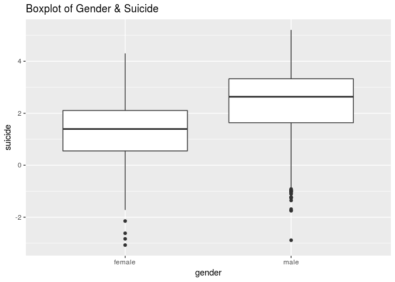
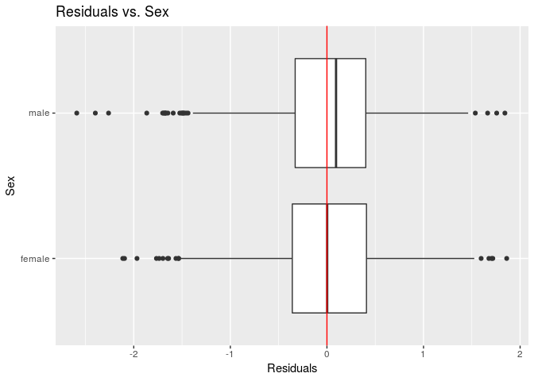
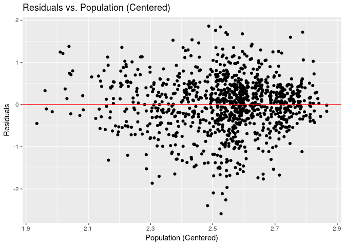
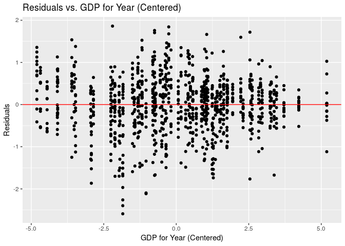
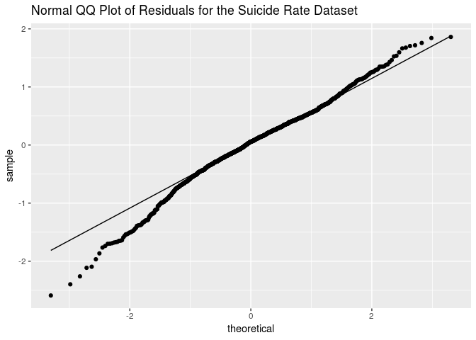

Stat210 Final Project
================
CamFam
May 1st, 2019

<<<<<<< HEAD
    ## ── Attaching packages ───────────────────────────────────────────────────────────────────────────── tidyverse 1.2.1 ──
=======
    ## ── Attaching packages ────────────────────────────────────────────────────────── tidyverse 1.2.1 ──
>>>>>>> f28a023c91befce4c65ed6dc68e42c26d8f75978

    ## ✔ ggplot2 3.1.0     ✔ purrr   0.2.5
    ## ✔ tibble  2.0.0     ✔ dplyr   0.7.8
    ## ✔ tidyr   0.8.2     ✔ stringr 1.3.1
    ## ✔ readr   1.3.1     ✔ forcats 0.3.0

<<<<<<< HEAD
    ## ── Conflicts ──────────────────────────────────────────────────────────────────────────────── tidyverse_conflicts() ──
=======
    ## ── Conflicts ───────────────────────────────────────────────────────────── tidyverse_conflicts() ──
>>>>>>> f28a023c91befce4c65ed6dc68e42c26d8f75978
    ## ✖ dplyr::filter() masks stats::filter()
    ## ✖ dplyr::lag()    masks stats::lag()

    ## 
    ## Attaching package: 'skimr'

    ## The following object is masked from 'package:knitr':
    ## 
    ##     kable

    ## 
    ## Attaching package: 'modelr'

    ## The following object is masked from 'package:broom':
    ## 
    ##     bootstrap

    ## The following object is masked from 'package:dslabs':
    ## 
    ##     heights

    ## -------------------------------------------------------------------------

    ## You have loaded plyr after dplyr - this is likely to cause problems.
    ## If you need functions from both plyr and dplyr, please load plyr first, then dplyr:
    ## library(plyr); library(dplyr)

    ## -------------------------------------------------------------------------

    ## 
    ## Attaching package: 'plyr'

    ## The following objects are masked from 'package:dplyr':
    ## 
    ##     arrange, count, desc, failwith, id, mutate, rename, summarise,
    ##     summarize

    ## The following object is masked from 'package:purrr':
    ## 
    ##     compact

    ## Loading required package: Hmisc

    ## Loading required package: lattice

    ## Loading required package: survival

    ## Loading required package: Formula

    ## 
    ## Attaching package: 'Hmisc'

    ## The following objects are masked from 'package:plyr':
    ## 
    ##     is.discrete, summarize

    ## The following objects are masked from 'package:dplyr':
    ## 
    ##     src, summarize

    ## The following objects are masked from 'package:base':
    ## 
    ##     format.pval, units

    ## Loading required package: SparseM

    ## 
    ## Attaching package: 'SparseM'

    ## The following object is masked from 'package:base':
    ## 
    ##     backsolve

    ## Parsed with column specification:
    ## cols(
    ##   country = col_character(),
    ##   year = col_double(),
    ##   sex = col_character(),
    ##   age = col_character(),
    ##   suicides_no = col_double(),
    ##   population = col_double(),
    ##   `suicides/100k pop` = col_double(),
    ##   `country-year` = col_character(),
    ##   `HDI for year` = col_double(),
    ##   `gdp_for_year ($)` = col_number(),
    ##   `gdp_per_capita ($)` = col_double(),
    ##   generation = col_character()
    ## )

## Section 1. Introduction

With suicide being one of the leading causes of death for teens in
America, we thought it would be interesting to see how the U.S. stacks
up against other countries all over the world in terms of the number of
suicides that occur, as well as what factors may contribute to the
significant number of suicides in the U.S. and other countries.\[1\] We
want to explore how economic status, along with variables such as age,
sex, and human development index, affects suicide rates all across the
world. Our hypothesis is that generally, in poorer countries we predict
that suicide rates will lower.

Our response variable will be suicides/100k pop, which is the number of
suicides per 100,000 people in a certain country and year, which is
stored as a numeric in our dataset. Our predictors variables will be
age, sex, country, year, HDI, gdp\_for\_year, gdp\_per\_capita,
generation, region and continent. Age is the age an individual was when
they passed, sex is the gender of that individual, country is the
country they are from, year is the year they passed, HDI for year is the
human development index for a given country and year, gdp\_for\_year is
the GDP for a given country and year, gdp\_per\_capita is the GDP per
capita for a given country and year, and generation is the generation
that an individual belongs to. We wish to understand how the number of
suicides per 100,000 people in a certain country and year changes as
year, GDP, GDP per capita, and HDI increase or decreases, meaning we
want to understand the population coefficients for year, gdp\_for\_year,
gdp\_per\_capita, and HDI for year. Additionally, we want to understand
whether age, sex, generation, and country have an effect on the number
of suicides per 100,000 people, meaning we also want to understand the
population coefficients for these variables.

The variables relevant to the analysis of our research question are
stated above: suicides/100k pop, age, sex, country, year, HDI for year,
gdp\_for\_year, gdp\_per\_capita, and generation. Additionally,
suicides\_no (which is the number of suicides for individuals who are of
a certain age group and sex and who passed in a certain country and
year) and population, (which is the total number of individuals who are
of a certain age group and sex and who live in a certain country in a
certain year), since these are used to calculate suicides/100k pop.

We will now perform exploratory data analysis on the variables that we
plan to use in our model.

Given the longitudinal structure of our data and the need for making a
multilevel model, we are going to use the data collected in 2010 as that
year has a majority of the countries in the origianl data set and also
is the year HDI values were collected.

    ## Skim summary statistics
    ##  n obs: 1056 
    ##  n variables: 12 
    ## 
<<<<<<< HEAD
    ## ── Variable type:character ───────────────────────────────────────────────────────────────────────────────────────────
=======
    ## ── Variable type:character ────────────────────────────────────────────────────────────────────────
>>>>>>> f28a023c91befce4c65ed6dc68e42c26d8f75978
    ##      variable missing complete    n min max empty n_unique
    ##           age       0     1056 1056   9  11     0        6
    ##       country       0     1056 1056   4  28     0       88
    ##  country-year       0     1056 1056   8  32     0       88
    ##    generation       0     1056 1056   6  12     0        4
    ##           sex       0     1056 1056   4   6     0        2
    ## 
<<<<<<< HEAD
    ## ── Variable type:numeric ─────────────────────────────────────────────────────────────────────────────────────────────
=======
    ## ── Variable type:numeric ──────────────────────────────────────────────────────────────────────────
>>>>>>> f28a023c91befce4c65ed6dc68e42c26d8f75978
    ##            variable missing complete    n          mean            sd
    ##    gdp_for_year ($)       0     1056 1056       5.9e+11       1.8e+12
    ##  gdp_per_capita ($)       0     1056 1056   23857.19      22474.17   
    ##        HDI for year      48     1008 1056       0.79          0.086  
    ##          population       0     1056 1056 1891380.05    4052946.65   
    ##         suicides_no       0     1056 1056     226.04        805.51   
    ##   suicides/100k pop       0     1056 1056      11.22         16.94   
    ##                year       0     1056 1056    2010             0      
    ##          p0       p25          p50           p75         p100     hist
    ##     6.8e+08  2e+10         9.4e+10       3.8e+11      1.5e+13 ▇▁▁▁▁▁▁▁
    ##   991         7008.5   13817.5       36326       111328       ▇▂▂▂▁▁▁▁
    ##     0.61         0.73      0.8           0.88         0.94    ▃▃▆▇▆▆▇▇
    ##  1015       107517.75 453842.5     1548637.25         4.3e+07 ▇▁▁▁▁▁▁▁
    ##     0            2        22           107.5      11767       ▇▁▁▁▁▁▁▁
    ##     0            0.8       4.81         14.37       182.32    ▇▁▁▁▁▁▁▁
    ##  2010         2010      2010          2010         2010       ▁▁▁▇▁▁▁▁

We first need to turn our character variables into factors.

The countries that do not have HDI calculated for them are Aruba, Puerto
Rico, Korea, and Russia. Online, we can find the HDI from 2010 of South
Korea and Russia, which are .884 and .780 respectively. We will do these
after we add regions to our data set.

Later on in this EDA, we will want to do a boxplot of the countries;
however, that will be indiscernable based on the number of countries.
Instead, we should group countries into regions and their continents.

We will use the gapminder dataset for countries and regions. We will
extract the country, continent, and region from gapMinder, change the
names of differing countries, and then merge.

Online, we can find the HDI from 2010 of South Korea and Russia, which
are .884 and .780 respectively. Since the HDI’s of Puerto Rico and Aruba
are not publicly available, those we will find use the average HDI from
the Caribbean to impute.

    ##                       region      mean
    ## 1  Australia and New Zealand 0.9160000
    ## 2                  Caribbean 0.7511250
    ## 3            Central America 0.6928571
    ## 4               Central Asia 0.6802500
    ## 5             Eastern Africa 0.7495000
    ## 6               Eastern Asia 0.8840000
    ## 7             Eastern Europe 0.8020000
    ## 8           Northern America 0.9060000
    ## 9            Northern Europe 0.8809000
    ## 10             South America 0.7293333
    ## 11        South-Eastern Asia 0.7556667
    ## 12           Southern Africa 0.6430000
    ## 13             Southern Asia 0.6830000
    ## 14           Southern Europe 0.8231111
    ## 15              Western Asia 0.8020000
    ## 16            Western Europe 0.8954286

To see the shape of the distribution of the number of suicides per
100,000 people, we can plot a histogram of the suicides/100k pop
variable.

    ## Skim summary statistics
    ##  n obs: 1056 
    ##  n variables: 14 
    ## 
<<<<<<< HEAD
    ## ── Variable type:character ───────────────────────────────────────────────────────────────────────────────────────────
    ##      variable missing complete    n min max empty n_unique
    ##  country-year       0     1056 1056   8  32     0       88
    ## 
    ## ── Variable type:factor ──────────────────────────────────────────────────────────────────────────────────────────────
=======
    ## ── Variable type:character ────────────────────────────────────────────────────────────────────────
    ##      variable missing complete    n min max empty n_unique
    ##  country-year       0     1056 1056   8  32     0       88
    ## 
    ## ── Variable type:factor ───────────────────────────────────────────────────────────────────────────
>>>>>>> f28a023c91befce4c65ed6dc68e42c26d8f75978
    ##    variable missing complete    n n_unique
    ##         age       0     1056 1056        6
    ##   continent       0     1056 1056        5
    ##     country       0     1056 1056       88
    ##  generation       0     1056 1056        4
    ##      region       0     1056 1056       16
    ##         sex       0     1056 1056        2
    ##                              top_counts ordered
    ##  15-: 176, 25-: 176, 35-: 176, 5-1: 176   FALSE
    ##   Eur: 420, Ame: 336, Asi: 240, Afr: 36   FALSE
    ##      Alb: 12, Arg: 12, Arm: 12, Aru: 12   FALSE
    ##  Gen: 352, Sil: 352, Gen: 176, Mil: 176   FALSE
    ##  Car: 120, Nor: 120, Wes: 120, Eas: 108   FALSE
    ##               fem: 528, mal: 528, NA: 0   FALSE
    ## 
<<<<<<< HEAD
    ## ── Variable type:numeric ─────────────────────────────────────────────────────────────────────────────────────────────
=======
    ## ── Variable type:numeric ──────────────────────────────────────────────────────────────────────────
>>>>>>> f28a023c91befce4c65ed6dc68e42c26d8f75978
    ##            variable missing complete    n          mean            sd
    ##    gdp_for_year ($)       0     1056 1056       5.9e+11       1.8e+12
    ##  gdp_per_capita ($)       0     1056 1056   23857.19      22474.17   
    ##                 HDI       0     1056 1056       0.79          0.085  
    ##          population       0     1056 1056 1891380.05    4052946.65   
    ##         suicides_no       0     1056 1056     226.04        805.51   
    ##   suicides/100k pop       0     1056 1056      11.22         16.94   
    ##                year       0     1056 1056    2010             0      
    ##          p0       p25          p50           p75         p100     hist
    ##     6.8e+08  2e+10         9.4e+10       3.8e+11      1.5e+13 ▇▁▁▁▁▁▁▁
    ##   991         7008.5   13817.5       36326       111328       ▇▂▂▂▁▁▁▁
    ##     0.61         0.73      0.79          0.88         0.94    ▂▃▆▇▆▆▇▆
    ##  1015       107517.75 453842.5     1548637.25         4.3e+07 ▇▁▁▁▁▁▁▁
    ##     0            2        22           107.5      11767       ▇▁▁▁▁▁▁▁
    ##     0            0.8       4.81         14.37       182.32    ▇▁▁▁▁▁▁▁
    ##  2010         2010      2010          2010         2010       ▁▁▁▇▁▁▁▁

    ## `stat_bin()` using `bins = 30`. Pick better value with `binwidth`.

<!-- -->

    ## 
    ## Skim summary statistics
    ## 
<<<<<<< HEAD
    ## ── Variable type:numeric ─────────────────────────────────────────────────────────────────────────────────────────────
=======
    ## ── Variable type:numeric ──────────────────────────────────────────────────────────────────────────
>>>>>>> f28a023c91befce4c65ed6dc68e42c26d8f75978
    ##                          variable missing complete    n  mean    sd p0 p25
    ##  suicideFinal$`suicides/100k pop`       0     1056 1056 11.22 16.94  0 0.8
    ##   p50   p75   p100     hist
    ##  4.81 14.37 182.32 ▇▁▁▁▁▁▁▁

Based on this histogram, we can see that it is not normally distributed
and is extremely right skewed. In fact, from skimming this variable, we
can see that the mean number of suicides per 100,000 people is only
11.22, while the maximum number of suicides per 100,000 people in this
dataset is 182.32. Thus, there is at least one extreme outlier in the
response variable, indicating that we should perform a log
transformation on the response variable.

Since this response variable has negative infinity values (this stems
from the fact that some countries have 0 suicides), we will first
increase the suicide number by 1 for each country and then recalculate
suicides per
    100k.

    ## `stat_bin()` using `bins = 30`. Pick better value with `binwidth`.

<!-- -->

From log transforming suicides/100k pop, we can already see that the
extreme outliers have disappeared, and the histogram seems to be
approximately normally distributed.

Note: suicides/100k pop is now log transformed for all plots below.

We will now look at an overview of the relationships that suicides/100k
pop has with each of the quantitative predictor variables (age, sex,
country, year, HDI, gdp\_for\_year, gdp\_per\_capita, and generation),
as well as the relationships these variables have with each other.

<!-- --> In
our data set, all ages have the same number of counts.
<!-- --> In
our data set, male and female have the same count

<!-- --> In
our data set, we see that most of the countries are from the Americas
and Europe.

<!-- -->
From this bar graph, we notice that most of our data set seems high in
regions from Western Asia, Southern Europe, South America, Northern
Europe, and the Caribbean.

<!-- -->

By examining these boxplots, we can tell that as age increases, suicide
rate tends to increase in general.

<!-- --> In
general, each continent has a similar average number of suicides, with
Europe having much more outliers with fewer suicides than the others.

<!-- --> The
average number of suicides/100k for each region is around 2. We see
Souther Africa as a key outlier with far less suicides and Eastern
Africa with far more suicides than the average.

<!-- -->

From this boxplot, we notice that males have a higher suicide rate/100k
people than females. However, there are many outliers in this data set
so we must explore further.

<!-- -->

From this boxplot, we see that the average suicide rate/100k people is
varied among generation. More specifically, we notice that Generation Z
and Millienials have lower rates than the average value of around
    2.

    ## `stat_bin()` using `bins = 30`. Pick better value with `binwidth`.

<!-- --> We
will have to log transform population. In addition, we will mean center
it so it is easier to
    interpret.

    ## `stat_bin()` using `bins = 30`. Pick better value with `binwidth`.

<!-- --> We
see that this plot has is skewed left and has a unimodal distribution.

We will mean center HDI so it makes it easier to
    interpret.

    ## `stat_bin()` using `bins = 30`. Pick better value with `binwidth`.

<!-- --> The
HDI does not have a set distribution. Rather, it is quite
    parse.

    ## `stat_bin()` using `bins = 30`. Pick better value with `binwidth`.

<!-- -->
Because this is skewed greatly, a log transformation of gdp is needed.
We will also mean center this
    variable.

    ## `stat_bin()` using `bins = 30`. Pick better value with `binwidth`.

<!-- -->

Log transforming the data set, we notice that the distribution of GDPs
of countries has a near-bimodal
    distribution.

    ## `stat_bin()` using `bins = 30`. Pick better value with `binwidth`.

<!-- -->
Like GDP, we will need to log transform this data set. We will also mean
center
    this.

    ## `stat_bin()` using `bins = 30`. Pick better value with `binwidth`.

<!-- -->

Like the GDP of the country, the GDP Per Capita has a non-normal
distribution. Rather, it is skewed to the left and is bimodal. Since
these variables are so similar, there could be mulitcollinearity between
the two.

<!-- --> We
do not see a correlation between HDI and Suicides/100k.
<!-- --> We
do not see a correlation between GDP and Suicides/100k.

<!-- --> We
do not see a correlation between GDP per capita and Suicides/100k.

<!-- -->

From the pairs plot, it looks as if HDI, and gdp\_for\_year do not have
a clear linear relationship with suicides/100k pop. However,
gdp\_per\_capita seems to be positively correlated with suicides/100k
pop, meaning as gdp\_per\_capita increases, so does suicides/100k pop.
Additionally, it looks as if HDI and gdp\_per\_capita seem to have a
strong non-linear relationship, indicating that we should continue
looking into this relationship and perhaps include an interaction term
between these two variables. Similarly, HDI and gdp\_for\_year also seem
to have a strong non-linear relationship, so we should include an
interaction term between these two variables as well. We also see a
strong evidence of multicollinearity between GDP for year and GDP per
capita that we must address in the model.

We are very concerned about multicollinearity between all of these
variables, so we will look into VIF.

We plan to do a multiple linear regression because suicides/100k pop is
a quantitative variable (there are no levels to it, since it is a
continuous variable).

## Section 3. Data

We are not going to include country in this model as there are over 188
countries and we can already account for much of this variability based
off of region and continent.

    ## Start:  AIC=-436.98
    ## `suicides/100k pop` ~ sex + age + population + HDI + (`gdp_for_year ($)`) + 
    ##     (`gdp_per_capita ($)`) + continent + region + generation
    ## 
    ## 
    ## Step:  AIC=-436.98
    ## `suicides/100k pop` ~ sex + age + population + HDI + `gdp_for_year ($)` + 
    ##     `gdp_per_capita ($)` + continent + region
    ## 
    ## 
    ## Step:  AIC=-436.98
    ## `suicides/100k pop` ~ sex + age + population + HDI + `gdp_for_year ($)` + 
    ##     `gdp_per_capita ($)` + region
    ## 
    ##                        Df Sum of Sq     RSS     AIC
    ## - `gdp_per_capita ($)`  1      0.13  664.73 -438.78
    ## <none>                               664.61 -436.98
    ## - HDI                   1      1.56  666.16 -436.51
    ## - `gdp_for_year ($)`    1      2.85  667.46 -434.46
    ## - population            1      4.97  669.58 -431.11
    ## - region               15    241.88  906.49 -139.21
    ## - sex                   1    290.42  955.02  -56.14
    ## - age                   5    769.95 1434.55  365.52
    ## 
    ## Step:  AIC=-438.78
    ## `suicides/100k pop` ~ sex + age + population + HDI + `gdp_for_year ($)` + 
    ##     region
    ## 
    ##                      Df Sum of Sq     RSS     AIC
    ## <none>                             664.73 -438.78
    ## - `gdp_for_year ($)`  1      3.65  668.38 -435.00
    ## - HDI                 1      4.50  669.23 -433.66
    ## - population          1     10.81  675.55 -423.74
    ## - region             15    252.00  916.73 -129.35
    ## - sex                 1    290.37  955.10  -58.05
    ## - age                 5    773.61 1438.34  366.31

    ## 
    ## Call:
    ## lm(formula = `suicides/100k pop` ~ sex + age + population + HDI + 
    ##     `gdp_for_year ($)` + region, data = suicideFinal)
    ## 
    ## Coefficients:
    ##              (Intercept)                   sexmale  
    ##                  6.30811                   1.04969  
    ##           age25-34 years            age35-54 years  
    ##                  0.17820                   0.40214  
    ##            age5-14 years            age55-74 years  
    ##                 -1.89731                   0.43725  
    ##             age75+ years                population  
    ##                  0.71362                  -1.87232  
    ##                      HDI        `gdp_for_year ($)`  
    ##                  1.97528                  -0.09485  
    ##          regionCaribbean     regionCentral America  
    ##                 -0.58669                  -0.59740  
    ##       regionCentral Asia      regionEastern Africa  
    ##                  0.01450                  -0.24973  
    ##       regionEastern Asia      regionEastern Europe  
    ##                  1.21047                   0.32738  
    ##   regionNorthern America     regionNorthern Europe  
    ##                  0.48474                  -0.08409  
    ##      regionSouth America  regionSouth-Eastern Asia  
    ##                  0.12288                  -0.38981  
    ##    regionSouthern Africa       regionSouthern Asia  
    ##                 -1.66591                  -0.95802  
    ##    regionSouthern Europe        regionWestern Asia  
    ##                 -0.47693                  -1.24475  
    ##     regionWestern Europe  
    ##                  0.12148

We chose a multiple linear regression model because we want to predict
the value of a variable based on multile different independent
variables. Based on backward selection, we found that sex, age
population, HDI, gdp for year, and gdp per capita, and region are
relevant predictors, whereas population, continent, and generation are
not.

### Testing of Interesting Interactions

For the interaction effects, we will look into the interaction of each
quantitative variable with each qualitative variable. We will also look
at a select few qualitative variables with one another.

    ## Analysis of Variance Table
    ## 
    ## Model 1: `suicides/100k pop` ~ sex + age + population + HDI + (`gdp_for_year ($)`) + 
    ##     (`gdp_per_capita ($)`) + continent + region + generation
    ## Model 2: `suicides/100k pop` ~ sex + age + population + HDI + `gdp_for_year ($)` + 
    ##     `gdp_per_capita ($)` + region + region * HDI
    ##   Res.Df    RSS Df Sum of Sq      F   Pr(>F)    
    ## 1   1030 664.61                                 
    ## 2   1018 632.15 12    32.453 4.3552 8.54e-07 ***
    ## ---
    ## Signif. codes:  0 '***' 0.001 '**' 0.01 '*' 0.05 '.' 0.1 ' ' 1

The F statistic is 2.4591 and the p-value is 0.003639, which is small.
We can can conclude that the interaction effect of HDI and region is a
significant predictor.

    ## Analysis of Variance Table
    ## 
    ## Model 1: `suicides/100k pop` ~ sex + age + population + HDI + (`gdp_for_year ($)`) + 
    ##     (`gdp_per_capita ($)`) + continent + region + generation
    ## Model 2: `suicides/100k pop` ~ sex + age + population + HDI + `gdp_for_year ($)` + 
    ##     `gdp_per_capita ($)` + region + region * population
    ##   Res.Df    RSS Df Sum of Sq      F    Pr(>F)    
    ## 1   1030 664.61                                  
    ## 2   1015 609.10 15    55.505 6.1662 1.472e-12 ***
    ## ---
    ## Signif. codes:  0 '***' 0.001 '**' 0.01 '*' 0.05 '.' 0.1 ' ' 1

The F statistic is 4.3923 and the p-value is 4.641e-08, which is very
low We can can conclude that the interaction effect of region and
population is a significant predictor.

    ## Analysis of Variance Table
    ## 
    ## Model 1: `suicides/100k pop` ~ sex + age + population + HDI + (`gdp_for_year ($)`) + 
    ##     (`gdp_per_capita ($)`) + continent + region + generation
    ## Model 2: `suicides/100k pop` ~ sex + age + population + HDI + `gdp_for_year ($)` + 
    ##     `gdp_per_capita ($)` + region + region * `gdp_for_year ($)`
    ##   Res.Df    RSS Df Sum of Sq      F    Pr(>F)    
    ## 1   1030 664.61                                  
    ## 2   1017 628.99 13    35.613 4.4294 2.374e-07 ***
    ## ---
    ## Signif. codes:  0 '***' 0.001 '**' 0.01 '*' 0.05 '.' 0.1 ' ' 1

The F statistic is 2.216 and the p-value is 0.007552 , which is below
.05. We can can conclude that the interaction effect of region and GDP
for year is a significant predictor.

    ## Analysis of Variance Table
    ## 
    ## Model 1: `suicides/100k pop` ~ sex + age + population + HDI + (`gdp_for_year ($)`) + 
    ##     (`gdp_per_capita ($)`) + continent + region + generation
    ## Model 2: `suicides/100k pop` ~ sex + age + population + HDI + `gdp_for_year ($)` + 
    ##     `gdp_per_capita ($)` + region + region * `gdp_per_capita ($)`
    ##   Res.Df    RSS Df Sum of Sq      F    Pr(>F)    
    ## 1   1030 664.61                                  
    ## 2   1017 639.27 13    25.334 3.1002 0.0001524 ***
    ## ---
    ## Signif. codes:  0 '***' 0.001 '**' 0.01 '*' 0.05 '.' 0.1 ' ' 1

The F statistic is 1.2491 and the p-value is 0.2387, which is above .05
We can can conclude that the interaction effect of region and gdp per
capita is not a significant predictor.

    ## Analysis of Variance Table
    ## 
    ## Model 1: `suicides/100k pop` ~ sex + age + population + HDI + (`gdp_for_year ($)`) + 
    ##     (`gdp_per_capita ($)`) + continent + region + generation
    ## Model 2: `suicides/100k pop` ~ sex + age + population + HDI + `gdp_for_year ($)` + 
    ##     `gdp_per_capita ($)` + region + sex * HDI
    ##   Res.Df    RSS Df Sum of Sq      F Pr(>F)
    ## 1   1030 664.61                           
    ## 2   1029 664.37  1   0.23833 0.3691 0.5436

We see that sex will not have a significant effect on any interactions.
We will not be looking at the interaction effects between sex and other
variables.

    ## Analysis of Variance Table
    ## 
    ## Model 1: `suicides/100k pop` ~ sex + age + population + HDI + (`gdp_for_year ($)`) + 
    ##     (`gdp_per_capita ($)`) + continent + region + generation
    ## Model 2: `suicides/100k pop` ~ sex + age + population + HDI + `gdp_for_year ($)` + 
    ##     `gdp_per_capita ($)` + region + age * HDI
    ##   Res.Df    RSS Df Sum of Sq      F    Pr(>F)    
    ## 1   1030 664.61                                  
    ## 2   1025 601.46  5    63.145 21.522 < 2.2e-16 ***
    ## ---
    ## Signif. codes:  0 '***' 0.001 '**' 0.01 '*' 0.05 '.' 0.1 ' ' 1

The F statistic is 13.857 and the p-value is 4.027e-13, which is smaller
than 0.05. We can can conclude that the interaction effect of age and
HDI is significant predictor.

    ## Analysis of Variance Table
    ## 
    ## Model 1: `suicides/100k pop` ~ sex + age + population + HDI + (`gdp_for_year ($)`) + 
    ##     (`gdp_per_capita ($)`) + continent + region + generation
    ## Model 2: `suicides/100k pop` ~ sex + age + population + HDI + `gdp_for_year ($)` + 
    ##     `gdp_per_capita ($)` + region + age * `gdp_per_capita ($)`
    ##   Res.Df    RSS Df Sum of Sq      F    Pr(>F)    
    ## 1   1030 664.61                                  
    ## 2   1025 636.76  5    27.845 8.9644 2.389e-08 ***
    ## ---
    ## Signif. codes:  0 '***' 0.001 '**' 0.01 '*' 0.05 '.' 0.1 ' ' 1

The F statistic is 3.0279 and the p-value is 0.01015, which is smaller
than 0.05. We can can conclude that the interaction effect of age and
gdp per capita is a significant predictor.

    ## Analysis of Variance Table
    ## 
    ## Model 1: `suicides/100k pop` ~ sex + age + population + HDI + (`gdp_for_year ($)`) + 
    ##     (`gdp_per_capita ($)`) + continent + region + generation
    ## Model 2: `suicides/100k pop` ~ sex + age + population + HDI + `gdp_for_year ($)` + 
    ##     `gdp_per_capita ($)` + region + age * `gdp_for_year ($)`
    ##   Res.Df    RSS Df Sum of Sq      F    Pr(>F)    
    ## 1   1030 664.61                                  
    ## 2   1025 572.42  5    92.182 33.013 < 2.2e-16 ***
    ## ---
    ## Signif. codes:  0 '***' 0.001 '**' 0.01 '*' 0.05 '.' 0.1 ' ' 1

The F statistic is 27.466 and the p-value is 2.2e-16, which is smaller
than 0.05. We can can conclude that the interaction effect of age and
gdp for year is significant predictor.

    ## Analysis of Variance Table
    ## 
    ## Model 1: `suicides/100k pop` ~ sex + age + population + HDI + (`gdp_for_year ($)`) + 
    ##     (`gdp_per_capita ($)`) + continent + region + generation
    ## Model 2: `suicides/100k pop` ~ sex + age + population + HDI + `gdp_for_year ($)` + 
    ##     `gdp_per_capita ($)` + region + age * population
    ##   Res.Df    RSS Df Sum of Sq      F    Pr(>F)    
    ## 1   1030 664.61                                  
    ## 2   1025 585.23  5    79.378 27.805 < 2.2e-16 ***
    ## ---
    ## Signif. codes:  0 '***' 0.001 '**' 0.01 '*' 0.05 '.' 0.1 ' ' 1

The F statistic is 23.793 and the p-value is 2.2e-16, which is smaller
than 0.05. We can can conclude that the interaction effect of age and
gdp per capita is a significant predictor.

From this, analysis, we will include 7 interactoin effects in our new
model

|                    term                     |   estimate   | std.error  |  statistic  |  p.value  |
| :-----------------------------------------: | :----------: | :--------: | :---------: | :-------: |
|                 (Intercept)                 |  2.5199093   | 7.9046711  |  0.3187874  | 0.7499557 |
|                   sexmale                   |  1.0366314   | 0.0416535  | 24.8870099  | 0.0000000 |
|               age25-34 years                |  15.9584239  | 9.2728953  |  1.7209753  | 0.0855709 |
|               age35-54 years                |  1.8670545   | 10.5753940 |  0.1765470  | 0.8599007 |
|                age5-14 years                |  20.9964213  | 9.4840301  |  2.2138712  | 0.0270672 |
|               age55-74 years                |  2.5874080   | 8.6162296  |  0.3002947  | 0.7640161 |
|                age75+ years                 |  13.8415938  | 7.9241816  |  1.7467537  | 0.0809933 |
|                 population                  |  0.4260107   | 2.9634448  |  0.1437552  | 0.8857233 |
|                     HDI                     | \-21.2343535 | 25.8760051 | \-0.8206195 | 0.4120626 |
|             `gdp_for_year ($)`              |  0.0173486   | 0.2649987  |  0.0654667  | 0.9478158 |
|            `gdp_per_capita ($)`             |  0.2966462   | 0.6165608  |  0.4811304  | 0.6305312 |
|               regionCaribbean               | \-2.5301383  | 2.5003136  | \-1.0119284 | 0.3118221 |
|            regionCentral America            | \-2.8510033  | 2.5000954  | \-1.1403578 | 0.2544159 |
|             regionCentral Asia              | \-0.4741630  | 2.5167399  | \-0.1884037 | 0.8505992 |
|            regionEastern Africa             | \-4.6153287  | 2.6322969  | \-1.7533466 | 0.0798552 |
|             regionEastern Asia              |  1.4758395   | 0.8509792  |  1.7342840  | 0.0831822 |
|            regionEastern Europe             | \-2.1334831  | 2.5062684  | \-0.8512588 | 0.3948336 |
|           regionNorthern America            | \-1.8160963  | 6.1183772  | \-0.2968265 | 0.7666619 |
|            regionNorthern Europe            | \-1.5592014  | 2.5133883  | \-0.6203584 | 0.5351661 |
|             regionSouth America             | \-1.5769908  | 2.4982817  | \-0.6312302 | 0.5280372 |
|          regionSouth-Eastern Asia           | \-3.7384365  | 2.5820779  | \-1.4478403 | 0.1479815 |
|            regionSouthern Africa            | \-7.0399931  | 6.2848695  | \-1.1201494 | 0.2629245 |
|             regionSouthern Asia             | \-4.5399118  | 4.6823311  | \-0.9695837 | 0.3324933 |
|            regionSouthern Europe            | \-2.5972177  | 2.4974147  | \-1.0399625 | 0.2986138 |
|             regionWestern Asia              | \-3.2628672  | 2.4967473  | \-1.3068472 | 0.1915712 |
|            regionWestern Europe             | \-1.2096246  | 2.9662786  | \-0.4077920 | 0.6835155 |
|             HDI:regionCaribbean             |  30.6319097  | 26.1112565 |  1.1731304  | 0.2410286 |
|          HDI:regionCentral America          |  28.1189251  | 26.1829169 |  1.0739417  | 0.2831132 |
|           HDI:regionCentral Asia            |  48.5437722  | 26.3251933 |  1.8440044  | 0.0654842 |
|          HDI:regionEastern Africa           | \-46.4758831 | 27.7448886 | \-1.6751151 | 0.0942307 |
|          HDI:regionEastern Europe           |  17.1884396  | 26.4418585 |  0.6500466  | 0.5158145 |
|         HDI:regionNorthern America          |  13.7593264  | 57.1696475 |  0.2406754  | 0.8098571 |
|          HDI:regionNorthern Europe          |  8.5400096   | 26.7660263 |  0.3190615  | 0.7497478 |
|           HDI:regionSouth America           |  15.4973642  | 25.9436039 |  0.5973482  | 0.5504129 |
|        HDI:regionSouth-Eastern Asia         |  19.7525334  | 19.9735295 |  0.9889355  | 0.3229388 |
|          HDI:regionSouthern Europe          |  22.8910983  | 26.1949093 |  0.8738758  | 0.3824000 |
|           HDI:regionWestern Asia            |  29.1020965  | 25.9735906 |  1.1204495  | 0.2627968 |
|          HDI:regionWestern Europe           |  7.8557090   | 22.4001193 |  0.3506994  | 0.7258892 |
|     `gdp_for_year ($)`:regionCaribbean      | \-0.3349923  | 0.1478963  | \-2.2650494 | 0.0237273 |
|  `gdp_for_year ($)`:regionCentral America   | \-0.1011988  | 0.1495226  | \-0.6768122 | 0.4986848 |
|    `gdp_for_year ($)`:regionCentral Asia    | \-0.4495542  | 0.2142800  | \-2.0979757 | 0.0361629 |
|    `gdp_for_year ($)`:regionEastern Asia    | \-0.3831628  | 0.4005241  | \-0.9566536 | 0.3389780 |
|   `gdp_for_year ($)`:regionEastern Europe   |  0.1395157   | 0.1574637  |  0.8860182  | 0.3758251 |
|  `gdp_for_year ($)`:regionNorthern Europe   | \-0.2227774  | 0.1488423  | \-1.4967347 | 0.1347843 |
|   `gdp_for_year ($)`:regionSouth America    | \-0.3887931  | 0.1442737  | \-2.6948304 | 0.0071629 |
| `gdp_for_year ($)`:regionSouth-Eastern Asia |  0.9425181   | 0.5213408  |  1.8078732  | 0.0709327 |
|  `gdp_for_year ($)`:regionSouthern Europe   | \-0.2046936  | 0.1469101  | \-1.3933262 | 0.1638371 |
|    `gdp_for_year ($)`:regionWestern Asia    | \-0.0094657  | 0.1502833  | \-0.0629858 | 0.9497906 |
|    `gdp_per_capita ($)`:regionCaribbean     |  0.1449404   | 0.5516732  |  0.2627288  | 0.7928149 |
| `gdp_per_capita ($)`:regionCentral America  | \-1.0923013  | 0.6995542  | \-1.5614248 | 0.1187464 |
|   `gdp_per_capita ($)`:regionCentral Asia   | \-0.9175886  | 0.5856206  | \-1.5668653 | 0.1174690 |
|  `gdp_per_capita ($)`:regionEastern Europe  | \-0.4036319  | 0.6647629  | \-0.6071817 | 0.5438710 |
| `gdp_per_capita ($)`:regionNorthern Europe  |  0.4096081   | 0.6600452  |  0.6205758  | 0.5350230 |
|  `gdp_per_capita ($)`:regionSouth America   |  1.0100262   | 0.6016985  |  1.6786251  | 0.0935439 |
| `gdp_per_capita ($)`:regionSouthern Europe  | \-0.2989290  | 0.6246232  | \-0.4785749 | 0.6323478 |
|   `gdp_per_capita ($)`:regionWestern Asia   | \-0.5832564  | 0.5619691  | \-1.0378798 | 0.2995820 |
|             age25-34 years:HDI              |  1.7942578   | 2.0339682  |  0.8821465  | 0.3779139 |
|             age35-54 years:HDI              |  6.9028518   | 2.0954559  |  3.2942004  | 0.0010224 |
|              age5-14 years:HDI              | \-5.2616333  | 2.0945989  | \-2.5120003 | 0.0121647 |
|             age55-74 years:HDI              |  7.5700050   | 2.2512405  |  3.3625928  | 0.0008020 |
|              age75+ years:HDI               |  8.1133422   | 2.2604839  |  3.5892060  | 0.0003481 |
|          age25-34 years:population          | \-6.1706187  | 3.6261276  | \-1.7017103 | 0.0891269 |
|          age35-54 years:population          | \-0.6014393  | 4.1004269  | \-0.1466772 | 0.8834170 |
|          age5-14 years:population           | \-8.9796033  | 3.7153035  | \-2.4169232 | 0.0158341 |
|          age55-74 years:population          | \-0.8372444  | 3.3715255  | \-0.2483281 | 0.8039326 |
|           age75+ years:population           | \-5.2747910  | 3.1110562  | \-1.6954985 | 0.0902985 |
|     age25-34 years:`gdp_per_capita ($)`     | \-0.5576948  | 0.3397704  | \-1.6413874 | 0.1010379 |
|     age35-54 years:`gdp_per_capita ($)`     | \-0.3679886  | 0.3791281  | \-0.9706181 | 0.3319780 |
|     age5-14 years:`gdp_per_capita ($)`      | \-0.2251742  | 0.3435985  | \-0.6553412 | 0.5124019 |
|     age55-74 years:`gdp_per_capita ($)`     | \-0.3477536  | 0.3500694  | \-0.9933848 | 0.3207677 |
|      age75+ years:`gdp_per_capita ($)`      | \-0.6278469  | 0.3310567  | \-1.8964934 | 0.0581887 |
|      age25-34 years:`gdp_for_year ($)`      |  0.4831941   | 0.2873713  |  1.6814278  | 0.0929985 |
|      age35-54 years:`gdp_for_year ($)`      |  0.0558644   | 0.3172164  |  0.1761082  | 0.8602453 |
|      age5-14 years:`gdp_for_year ($)`       |  0.3607650   | 0.2951526  |  1.2222998  | 0.2218882 |
|      age55-74 years:`gdp_for_year ($)`      |  0.0088806   | 0.2681111  |  0.0331229  | 0.9735833 |
|       age75+ years:`gdp_for_year ($)`       |  0.3127316   | 0.2495005  |  1.2534309  | 0.2103479 |

### Model Assumptions

<!-- -->

From the residual vs. predicted values, the residuals with lower
predicted values seem to be more sparse and spread out than the others,
which may be worth looking into. However, for the most part, the
majority of the residuals are randomly distributed around the red line
and do not exhibit any obvious nonlinear trends. Thus, we can conclude
that constant variance is satisfied.

We will now look at predictors vs. residuals to more closely examine
linearity.

<!-- -->

While there are some differences between some of the means of the
residuals for some regions, these means do not seem to vary by too much,
and thus the linearity assumption is moderately satisfied for this
variable. However, there are a few regions with some extreme residuals,
such as the Carribean and Western Asia. It could be worth looking into
these more.

<!-- -->

While there is some differences between the means of the residuals for
the two gender groups, these means do not seem to vary by too much, and
the plots seem to have very similar distributions, and thus the
linearity assumption is moderately satisfied for this variable.

<!-- -->

Again, while there are some differences between some of the means of the
residuals for some age groups, these means do not seem to vary by too
much, and thus the linearity assumption is satisfied for this variable.

<!-- -->

<!-- -->

<!-- -->

<!-- -->

For all of these scatterplots, the residuals seem to be scattered pretty
evenly around the 0 line, and none of them show an obvious curving
shape, so we can conclude that the linearity assumption is met for these
predictors as well.

We also need to check the normality and independence assumptions. For
normality, we can create a QQ-plot of the residuals and a histogram of
the distribution of residuals for this
    model.

<!-- -->

    ## `stat_bin()` using `bins = 30`. Pick better value with `binwidth`.

<!-- -->

According to the QQ-plot, the normality assumption seems to be satisfied
because the majority of the points seem to align well with the expected
QQ-plot line. In addition, the histogram seems to be approximately
normal and follows a mostly smooth curve.

Finally, based on the description of the data, the independence
assumption seems to be met because this data was not collected over
time, since we only took the year 2010, and there does not appear to be
a cluster effect.

### Section 4 - References

  - \[1\] <https://www.cdc.gov/nchs/fastats/adolescent-health.htm>
  - \[2\] <http://hdr.undp.org/en/content/human-development-index-hdi>
    Your project goes here\! Before you submit, make sure your chunks
    are turned off with `echo = FALSE`.

You can add sections as you see fit. At a minimum, you should have the
following sections:

  - Section 1: Introduction (includes introduction and exploratory data
    analysis)
  - Section 2: Regression Analysis (includes the final model and
    discussion of assumptions)
  - Section 3: Discussion and Limitations
  - Section 4: Conclusion
  - Section 5: Additional Work
