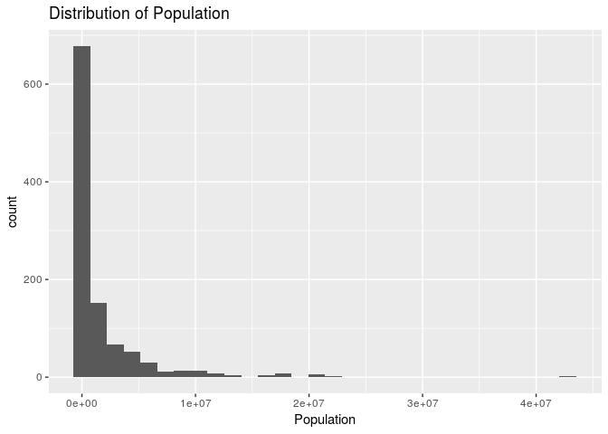

Stat210 Final Project
================
CamFam
May 1st, 2019

    ## ── Attaching packages ─────────────────────────── tidyverse 1.2.1 ──

    ## ✔ ggplot2 3.1.0     ✔ purrr   0.2.5
    ## ✔ tibble  2.0.0     ✔ dplyr   0.7.8
    ## ✔ tidyr   0.8.2     ✔ stringr 1.3.1
    ## ✔ readr   1.3.1     ✔ forcats 0.3.0

    ## ── Conflicts ────────────────────────────── tidyverse_conflicts() ──
    ## ✖ dplyr::filter() masks stats::filter()
    ## ✖ dplyr::lag()    masks stats::lag()

    ## 
    ## Attaching package: 'skimr'

    ## The following object is masked from 'package:knitr':
    ## 
    ##     kable

    ## 
    ## Attaching package: 'modelr'

    ## The following object is masked from 'package:broom':
    ## 
    ##     bootstrap

    ## The following object is masked from 'package:dslabs':
    ## 
    ##     heights

    ## Parsed with column specification:
    ## cols(
    ##   country = col_character(),
    ##   year = col_double(),
    ##   sex = col_character(),
    ##   age = col_character(),
    ##   suicides_no = col_double(),
    ##   population = col_double(),
    ##   `suicides/100k pop` = col_double(),
    ##   `country-year` = col_character(),
    ##   `HDI for year` = col_double(),
    ##   `gdp_for_year ($)` = col_number(),
    ##   `gdp_per_capita ($)` = col_double(),
    ##   generation = col_character()
    ## )

## Section 1. Introduction

With suicide being one of the leading causes of death for teens in
America, we thought it would be interesting to see how the U.S. stacks
up against other countries all over the world in terms of the number of
suicides that occur, as well as what factors may contribute to the
significant number of suicides in the U.S. and other countries.\[1\] We
want to explore how economic status, along with variables such as age,
sex, and human development index, affects suicide rates all across the
world. Our hypothesis is that generally, in poorer countries we predict
that suicide rates will lower.

Our response variable will be suicides/100k pop, which is the number of
suicides per 100,000 people in a certain country and year, which is
stored as a numeric in our dataset. Our predictors variables will be
age, sex, country, year, HDI, gdp\_for\_year, gdp\_per\_capita, and
generation. Age is the age an individual was when they passed, sex is
the gender of that individual, country is the country they are from,
year is the year they passed, HDI for year is the human development
index for a given country and year, gdp\_for\_year is the GDP for a
given country and year, gdp\_per\_capita is the GDP per capita for a
given country and year, and generation is the generation that an
individual belongs to. We wish to understand how the number of suicides
per 100,000 people in a certain country and year changes as year, GDP,
GDP per capita, and HDI increase or decreases, meaning we want to
understand the population coefficients for year, gdp\_for\_year,
gdp\_per\_capita, and HDI for year. Additionally, we want to understand
whether age, sex, generation, and country have an effect on the number
of suicides per 100,000 people, meaning we also want to understand the
population coefficients for these variables.

The variables relevant to the analysis of our research question are
stated above: suicides/100k pop, age, sex, country, year, HDI for year,
gdp\_for\_year, gdp\_per\_capita, and generation. Additionally,
suicides\_no (which is the number of suicides for individuals who are of
a certain age group and sex and who passed in a certain country and
year) and population, (which is the total number of individuals who are
of a certain age group and sex and who live in a certain country in a
certain year), since these are used to calculate suicides/100k pop.

We will now perform exploratory data analysis on the variables that we
plan to use in our model.

Given the longitudinal structure of our data and the need for making a
multilevel model, we are going to use the data collected in 2010 as that
year has a majority of the countries in the origianl data set and also
is the year HDI values were collected.

    ## Skim summary statistics
    ##  n obs: 1056 
    ##  n variables: 12 
    ## 
    ## ── Variable type:character ─────────────────────────────────────────
    ##      variable missing complete    n min max empty n_unique
    ##           age       0     1056 1056   9  11     0        6
    ##       country       0     1056 1056   4  28     0       88
    ##  country-year       0     1056 1056   8  32     0       88
    ##    generation       0     1056 1056   6  12     0        4
    ##           sex       0     1056 1056   4   6     0        2
    ## 
    ## ── Variable type:numeric ───────────────────────────────────────────
    ##            variable missing complete    n          mean            sd
    ##    gdp_for_year ($)       0     1056 1056       5.9e+11       1.8e+12
    ##  gdp_per_capita ($)       0     1056 1056   23857.19      22474.17   
    ##        HDI for year      48     1008 1056       0.79          0.086  
    ##          population       0     1056 1056 1891380.05    4052946.65   
    ##         suicides_no       0     1056 1056     226.04        805.51   
    ##   suicides/100k pop       0     1056 1056      11.22         16.94   
    ##                year       0     1056 1056    2010             0      
    ##          p0       p25          p50           p75         p100     hist
    ##     6.8e+08  2e+10         9.4e+10       3.8e+11      1.5e+13 ▇▁▁▁▁▁▁▁
    ##   991         7008.5   13817.5       36326       111328       ▇▂▂▂▁▁▁▁
    ##     0.61         0.73      0.8           0.88         0.94    ▃▃▆▇▆▆▇▇
    ##  1015       107517.75 453842.5     1548637.25         4.3e+07 ▇▁▁▁▁▁▁▁
    ##     0            2        22           107.5      11767       ▇▁▁▁▁▁▁▁
    ##     0            0.8       4.81         14.37       182.32    ▇▁▁▁▁▁▁▁
    ##  2010         2010      2010          2010         2010       ▁▁▁▇▁▁▁▁

We first need to turn our character variables into factors.

The countries that do not have HDI calculated for them are Aruba, Puerto
Rico, Korea, and Russia. Online, we can find the HDI from 2010 of South
Korea and Russia, which are .884 and .780 respectively. We will do these
after we add regions to our data set.

Later on in this EDA, we will want to do a boxplot of the countries;
however, that will be indiscernable based on the number of countries.
Instead, we should group countries into regions and their continents.

We will use the gapminder dataset for countries and regions. We will
extract the country, continent, and region from gapMinder, change the
names of differing countries, and then merge.

Online, we can find the HDI from 2010 of South Korea and Russia, which
are .884 and .780 respectively. We will do these after

Since the HDI’s of Puerto Rico and Aruba, since those we will find use
the average HDI from that region to impute.

To see the shape of the distribution of the number of suicides per
100,000 people, we can plot a histogram of the suicides/100k pop
variable.

    ## Skim summary statistics
    ##  n obs: 1056 
    ##  n variables: 14 
    ## 
    ## ── Variable type:character ─────────────────────────────────────────
    ##      variable missing complete    n min max empty n_unique
    ##  country-year       0     1056 1056   8  32     0       88
    ## 
    ## ── Variable type:factor ────────────────────────────────────────────
    ##    variable missing complete    n n_unique
    ##         age       0     1056 1056        6
    ##   continent       0     1056 1056        5
    ##     country       0     1056 1056       88
    ##  generation       0     1056 1056        4
    ##      region       0     1056 1056       16
    ##         sex       0     1056 1056        2
    ##                              top_counts ordered
    ##  15-: 176, 25-: 176, 35-: 176, 5-1: 176   FALSE
    ##   Eur: 420, Ame: 336, Asi: 240, Afr: 36   FALSE
    ##      Alb: 12, Arg: 12, Arm: 12, Aru: 12   FALSE
    ##  Gen: 352, Sil: 352, Gen: 176, Mil: 176   FALSE
    ##  Car: 120, Nor: 120, Wes: 120, Eas: 108   FALSE
    ##               fem: 528, mal: 528, NA: 0   FALSE
    ## 
    ## ── Variable type:numeric ───────────────────────────────────────────
    ##            variable missing complete    n          mean            sd
    ##    gdp_for_year ($)       0     1056 1056       5.9e+11       1.8e+12
    ##  gdp_per_capita ($)       0     1056 1056   23857.19      22474.17   
    ##                 HDI      48     1008 1056       0.79          0.086  
    ##          population       0     1056 1056 1891380.05    4052946.65   
    ##         suicides_no       0     1056 1056     226.04        805.51   
    ##   suicides/100k pop       0     1056 1056      11.22         16.94   
    ##                year       0     1056 1056    2010             0      
    ##          p0       p25          p50           p75         p100     hist
    ##     6.8e+08  2e+10         9.4e+10       3.8e+11      1.5e+13 ▇▁▁▁▁▁▁▁
    ##   991         7008.5   13817.5       36326       111328       ▇▂▂▂▁▁▁▁
    ##     0.61         0.73      0.8           0.88         0.94    ▃▃▆▇▆▆▇▇
    ##  1015       107517.75 453842.5     1548637.25         4.3e+07 ▇▁▁▁▁▁▁▁
    ##     0            2        22           107.5      11767       ▇▁▁▁▁▁▁▁
    ##     0            0.8       4.81         14.37       182.32    ▇▁▁▁▁▁▁▁
    ##  2010         2010      2010          2010         2010       ▁▁▁▇▁▁▁▁

    ## `stat_bin()` using `bins = 30`. Pick better value with `binwidth`.

<!-- -->

    ## 
    ## Skim summary statistics
    ## 
    ## ── Variable type:numeric ───────────────────────────────────────────
    ##                          variable missing complete    n  mean    sd p0 p25
    ##  suicideFinal$`suicides/100k pop`       0     1056 1056 11.22 16.94  0 0.8
    ##   p50   p75   p100     hist
    ##  4.81 14.37 182.32 ▇▁▁▁▁▁▁▁

Based on this histogram, we can see that it is not normally distributed
and is extremely right skewed. In fact, from skimming this variable, we
can see that the mean number of suicides per 100,000 people is only
11.22, while the maximum number of suicides per 100,000 people in this
dataset is 182.32. Thus, there is at least one extreme outlier in the
response variable, indicating that we should perform a log
transformation on the response variable.

Since this response variable has negative infinity values (this stems
from the fact that some countries have 0 suicides), we will first
increase the suicide number by 1 for each country and then recalculate
suicides per
    100k.

    ## `stat_bin()` using `bins = 30`. Pick better value with `binwidth`.

<!-- -->

From log transforming suicides/100k pop, we can already see that the
extreme outliers have disappeared, and the histogram seems to be
approximately normally distributed.

Note: suicides/100k pop is now log transformed for all plots below.

We will now look at an overview of the relationships that suicides/100k
pop has with each of the quantitative predictor variables (age, sex,
country, year, HDI, gdp\_for\_year, gdp\_per\_capita, and generation),
as well as the relationships these variables have with each other.

<!-- --> In
our data set, all ages have the same number of counts.
<!-- --> In
our data set, male and female have the same count

<!-- --> In
our data set, we see that most of the countries are from the Americas
and Europe.

<!-- -->
From this bar graph, we notice that most of our data set seems high in
regions from Western Asia, Southern Europe, South America, Northern
Europe, and the Caribbean.

<!-- -->

By examining these boxplots, we can tell that as age increases, suicide
rate tends to increase in general.

<!-- --> In
general, each continent has a similar average number of suicides, with
Europe having much more outliers with fewer suicides than the others.

<!-- --> The
average number of suicides/100k for each region is around 2. We see
Souther Africa as a key outlier with far less suicides and Eastern
Africa with far more suicides than the average.

<!-- -->

From this boxplot, we notice that males have a higher suicide rate/100k
people than females. However, there are many outliers in this data set
so we must explore further.

<!-- -->

From this boxplot, we see that the average suicide rate/100k people is
varied among generation. More specifically, we notice that Generation Z
and Millienials have lower rates than the average value of around
    2.

    ## `stat_bin()` using `bins = 30`. Pick better value with `binwidth`.

    ## Warning: Removed 48 rows containing non-finite values (stat_bin).

<!-- --> The
distribution of HDI shows that as HDI increases, suicide rate increases
until about .75 and then begins to slightly
    decrease.

    ## `stat_bin()` using `bins = 30`. Pick better value with `binwidth`.

<!-- -->
Because this is skewed greatly, a log transformation of gdp is
    needed.

    ## `stat_bin()` using `bins = 30`. Pick better value with `binwidth`.

<!-- -->

Log transforming the data set, we notice that the distribution of GDPs
of countries has a bimodal
    distribution.

    ## `stat_bin()` using `bins = 30`. Pick better value with `binwidth`.

<!-- -->
Like GDP, we will need to log transform this data
    set.

    ## `stat_bin()` using `bins = 30`. Pick better value with `binwidth`.

<!-- -->

Like the GDP of the country, the GDP Per Capita has a non-normal
distribution. Rather, it is skewed to the left. Since these variables
are so similar, there could be mulitcollinearity between the two.

    ## Warning: Removed 48 rows containing missing values (geom_point).

<!-- --> We
do not see a correlation between HDI and Suicides/100k.
<!-- --> We
do not see a correlation between GDP and Suicides/100k.

    ## Warning: Removed 48 rows containing missing values (geom_point).

<!-- --> We
do not see a correlation between GDP per capita and Suicides/100k.

<!-- -->

From the pairs plot, it looks as if HDI, and gdp\_for\_year do not have
a clear linear relationship with suicides/100k pop. However,
gdp\_per\_capita seems to be positively correlated with suicides/100k
pop, meaning as gdp\_per\_capita increases, so does suicides/100k pop.
Additionally, it looks as if HDI and gdp\_per\_capita seem to have a
strong non-linear relationship, indicating that we should continue
looking into this relationship and perhaps include an interaction term
between these two variables. Similarly, HDI and gdp\_for\_year also seem
to have a strong non-linear relationship, so we should include an
interaction term between these two variables as well.

<!-- -->

As mentioned before, we do see evidence of multicollinearity that we
must address in the model.

We plan to do a multiple linear regression because suicides/100k pop is
a quantitative variable (there are no levels to it, since it is a
continuous variable).

## Section 3. Data

    ## Observations: 27,820
    ## Variables: 12
    ## $ country              <chr> "Albania", "Albania", "Albania", "Albania",…
    ## $ year                 <dbl> 1987, 1987, 1987, 1987, 1987, 1987, 1987, 1…
    ## $ sex                  <chr> "male", "male", "female", "male", "male", "…
    ## $ age                  <chr> "15-24 years", "35-54 years", "15-24 years"…
    ## $ suicides_no          <dbl> 21, 16, 14, 1, 9, 1, 6, 4, 1, 0, 0, 0, 2, 1…
    ## $ population           <dbl> 312900, 308000, 289700, 21800, 274300, 3560…
    ## $ `suicides/100k pop`  <dbl> 6.71, 5.19, 4.83, 4.59, 3.28, 2.81, 2.15, 1…
    ## $ `country-year`       <chr> "Albania1987", "Albania1987", "Albania1987"…
    ## $ `HDI for year`       <dbl> NA, NA, NA, NA, NA, NA, NA, NA, NA, NA, NA,…
    ## $ `gdp_for_year ($)`   <dbl> 2156624900, 2156624900, 2156624900, 2156624…
    ## $ `gdp_per_capita ($)` <dbl> 796, 796, 796, 796, 796, 796, 796, 796, 796…
    ## $ generation           <chr> "Generation X", "Silent", "Generation X", "…

### Section 4 - References

  - \[1\] <https://www.cdc.gov/nchs/fastats/adolescent-health.htm>
  - \[2\] <http://hdr.undp.org/en/content/human-development-index-hdi>
    Your project goes here\! Before you submit, make sure your chunks
    are turned off with `echo = FALSE`.

You can add sections as you see fit. At a minimum, you should have the
following sections:

  - Section 1: Introduction (includes introduction and exploratory data
    analysis)
  - Section 2: Regression Analysis (includes the final model and
    discussion of assumptions)
  - Section 3: Discussion and Limitations
  - Section 4: Conclusion
  - Section 5: Additional Work
