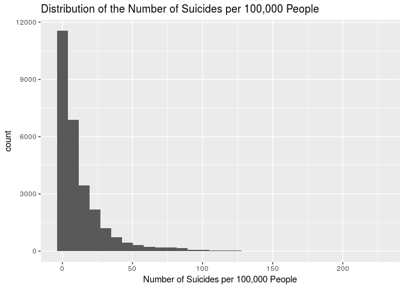
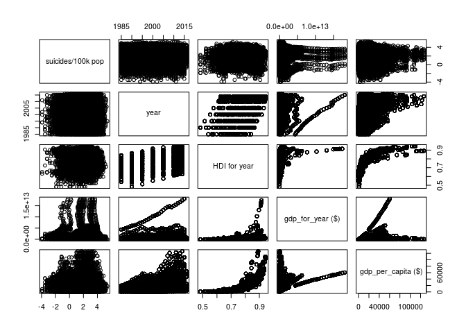
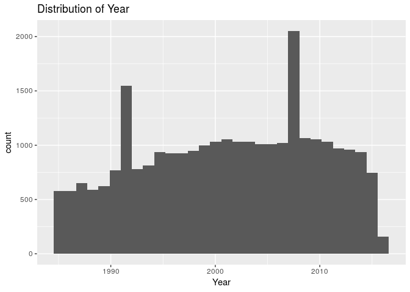
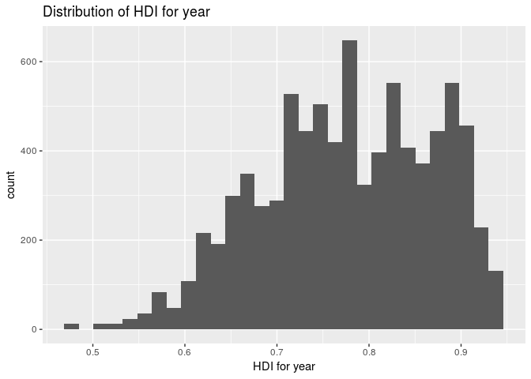
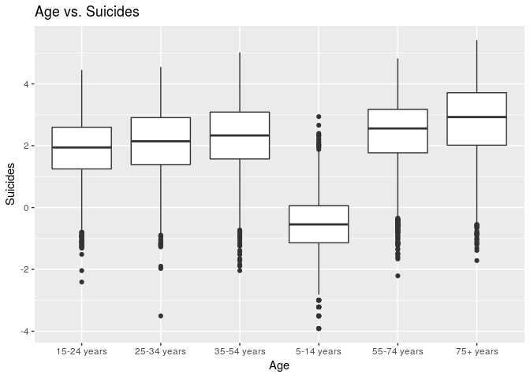
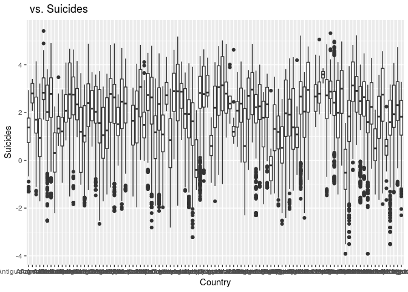

The Effect of Socio-Economics on Suicide Rates
================
Cam Fam
March 29, 2019

``` r
library(nnet)
library(tidyverse)
```

    ## ── Attaching packages ────────────────────────────────────────── tidyverse 1.2.1 ──

    ## ✔ ggplot2 3.1.0     ✔ purrr   0.2.5
    ## ✔ tibble  2.0.0     ✔ dplyr   0.7.8
    ## ✔ tidyr   0.8.2     ✔ stringr 1.3.1
    ## ✔ readr   1.3.1     ✔ forcats 0.3.0

    ## ── Conflicts ───────────────────────────────────────────── tidyverse_conflicts() ──
    ## ✖ dplyr::filter() masks stats::filter()
    ## ✖ dplyr::lag()    masks stats::lag()

``` r
library(knitr)
library(broom)
library(skimr)
```

    ## 
    ## Attaching package: 'skimr'

    ## The following object is masked from 'package:knitr':
    ## 
    ##     kable

``` r
suicide <- read_csv("/cloud/project/data/master.csv")
```

    ## Parsed with column specification:
    ## cols(
    ##   country = col_character(),
    ##   year = col_double(),
    ##   sex = col_character(),
    ##   age = col_character(),
    ##   suicides_no = col_double(),
    ##   population = col_double(),
    ##   `suicides/100k pop` = col_double(),
    ##   `country-year` = col_character(),
    ##   `HDI for year` = col_double(),
    ##   `gdp_for_year ($)` = col_number(),
    ##   `gdp_per_capita ($)` = col_double(),
    ##   generation = col_character()
    ## )

## Section 1. Introduction

With suicide being one of the leading causes of death for teens in
America, we thought it would be interesting to see how the U.S. stacks
up against other countries all over the world in terms of the number of
suicides that occur, as well as what factors may contribute to the
significant number of suicides in the U.S. and other countries.\[1\] We
want to explore how economic status, along with variables such as age,
sex, and human development index, affects suicide rates all across the
world. Our hypothesis is that generally, in poorer countries we predict
that suicide rates will lower.

## Section 2. Analysis plan

Our response variable will be suicides/100k pop, which is the number of
suicides per 100,000 people in a certain country and year, which is
stored as a numeric in our dataset. Our predictors variables will be
age, sex, country, year, HDI for year, gdp\_for\_year, gdp\_per\_capita,
and generation. Age is the age an individual was when they passed, sex
is the gender of that individual, country is the country they are from,
year is the year they passed, HDI for year is the human development
index for a given country and year, gdp\_for\_year is the GDP for a
given country and year, gdp\_per\_capita is the GDP per capita for a
given country and year, and generation is the generation that an
individual belongs to. We wish to understand how the number of suicides
per 100,000 people in a certain country and year changes as year, GDP,
GDP per capita, and HDI increase or decreases, meaning we want to
understand the population coefficients for year, gdp\_for\_year,
gdp\_per\_capita, and HDI for year. Additionally, we want to understand
whether age, sex, generation, and country have an effect on the number
of suicides per 100,000 people, meaning we also want to understand the
population coefficients for these variables.

The variables relevant to the analysis of our research question are
stated above: suicides/100k pop, age, sex, country, year, HDI for year,
gdp\_for\_year, gdp\_per\_capita, and generation. Additionally,
suicides\_no (which is the number of suicides for individuals who are of
a certain age group and sex and who passed in a certain country and
year) and population, (which is the total number of individuals who are
of a certain age group and sex and who live in a certain country in a
certain year), since these are used to calculate suicides/100k pop.

We will now perform exploratory data analysis on the variables that we
plan to use in our model.

To see the shape of the distribution of the number of suicides per
100,000 people, we can plot a histogram of the suicides/100k pop
variable.

``` r
ggplot(data=suicide, mapping=aes(x=`suicides/100k pop`)) + 
  geom_histogram() +
  labs(title="Distribution of the Number of Suicides per 100,000 People", x="Number of Suicides per 100,000 People")
```

    ## `stat_bin()` using `bins = 30`. Pick better value with `binwidth`.

<!-- -->

``` r
skim(suicide$`suicides/100k pop`)
```

    ## 
    ## Skim summary statistics
    ## 
    ## ── Variable type:numeric ──────────────────────────────────────────────────────────
    ##                     variable missing complete     n  mean    sd p0  p25
    ##  suicide$`suicides/100k pop`       0    27820 27820 12.82 18.96  0 0.92
    ##   p50   p75   p100     hist
    ##  5.99 16.62 224.97 ▇▁▁▁▁▁▁▁

Based on this histogram, we can see that it is not normally distributed
and is extremely right skewed. In fact, from skimming this variable, we
can see that the mean number of suicides per 100,000 people is only
12.82, while the maximum number of suicides per 100,000 people in this
dataset is 224.97. Thus, there is at least one extreme outlier in the
response variable, indicating that we should perform a log
transformation on the response
variable.

``` r
suicide <- suicide %>% mutate (`suicides/100k pop` = log(`suicides/100k pop`))
```

``` r
ggplot(data=suicide, mapping=aes(x=`suicides/100k pop`)) + 
  geom_histogram() +
  labs(title="Distribution of the Number of Suicides per 100,000 People", x="Number of Suicides per 100,000 People")
```

    ## `stat_bin()` using `bins = 30`. Pick better value with `binwidth`.

    ## Warning: Removed 4281 rows containing non-finite values (stat_bin).

<!-- -->

From log transforming suicides/100k pop, we can already see that the
extreme outliers have disappeared, and the histogram seems to be
approximately normally distributed.

It is important to note that in the dataset, some of the suicides/100k
pop values are -inf. This is because there were 0 suicides in that year
and country, and thus dividing by 0 when calculating the number of
suicides per 100,000 people resulted in -inf. In the future, we will
change all -inf to 0, since if there were 0 suicides in that year and
country for the entire population, then there must have been 0 suicides
in that year and country for every 100,000 people.

We will now look at an overview of the relationships that suicides/100k
pop has with each of the quantitative predictor variables (age, sex,
country, year, HDI for year, gdp\_for\_year, gdp\_per\_capita, and
generation), as well as the relationships these variables have with each
other.

``` r
pairs(`suicides/100k pop` ~ year + `HDI for year` + `gdp_for_year ($)` + `gdp_per_capita ($)`, data = suicide)
```

<!-- -->

From the pairs plot, it looks as if year, HDI for year, and
gdp\_for\_year do not have a clear linear relationship with
suicides/100k pop. However, gdp\_per\_capita seems to be positively
correlated with suicides/100k pop, meaning as gdp\_per\_capita
increases, so does suicides/100k pop. Additionally, it looks as if HDI
for year and gdp\_per\_capita seem to have a strong non-linear
relationship, indicating that we should continue looking into this
relationship and perhaps include an interaction term between these two
variables. Similarly, HDI for year and gdp\_for\_year also seem to have
a strong non-linear relationship, so we should include an interaction
term between these two variables as well.

``` r
ggplot(data=suicide, mapping=aes(x=`year`)) + 
  geom_histogram() +
  labs(title="Distribution of Year", x="Year")
```

    ## `stat_bin()` using `bins = 30`. Pick better value with `binwidth`.

<!-- --> The
distribution appears to be normal with two outliers around 1992 and
2008.

``` r
ggplot(data=suicide, mapping=aes(x=`HDI for year`)) + 
  geom_histogram() +
  labs(title="Distribution of HDI for year", x="HDI for year")
```

    ## `stat_bin()` using `bins = 30`. Pick better value with `binwidth`.

    ## Warning: Removed 19456 rows containing non-finite values (stat_bin).

<!-- --> The
distribution of HDI for year looks slightly left-skewed, but because our
sample size is so large, we will proceed with caution.

``` r
ggplot(data=suicide, mapping=aes(x=`age`, y= 'suicides/100k pop')) + 
  geom_boxplot() +
  labs(title="Age vs. Suicides", x="Age", y="Suicides")
```

<!-- -->

``` r
ggplot(data=suicide, mapping=aes(x=`country`, y= 'suicides/100k pop')) + 
  geom_boxplot() +
  labs(title=" vs. Suicides", x="Country", y="Suicides")
```

<!-- -->

age, sex, country, year, HDI for year, gdp\_for\_year, gdp\_per\_capita,
and generation

We plan to do a multiple linear regression because suicides/100k pop is
a quantitative variable (there are no levels to it, since it is a
continuous variable).

Based on the variables, we plan to predict suicide rate in the future
for certain countries, as well as what generation someone who commits
suicide is in given other variables.

## Section 3. Data

``` r
glimpse(suicide)
```

    ## Observations: 27,820
    ## Variables: 12
    ## $ country              <chr> "Albania", "Albania", "Albania", "Albania",…
    ## $ year                 <dbl> 1987, 1987, 1987, 1987, 1987, 1987, 1987, 1…
    ## $ sex                  <chr> "male", "male", "female", "male", "male", "…
    ## $ age                  <chr> "15-24 years", "35-54 years", "15-24 years"…
    ## $ suicides_no          <dbl> 21, 16, 14, 1, 9, 1, 6, 4, 1, 0, 0, 0, 2, 1…
    ## $ population           <dbl> 312900, 308000, 289700, 21800, 274300, 3560…
    ## $ `suicides/100k pop`  <dbl> 1.9035990, 1.6467337, 1.5748465, 1.5238800,…
    ## $ `country-year`       <chr> "Albania1987", "Albania1987", "Albania1987"…
    ## $ `HDI for year`       <dbl> NA, NA, NA, NA, NA, NA, NA, NA, NA, NA, NA,…
    ## $ `gdp_for_year ($)`   <dbl> 2156624900, 2156624900, 2156624900, 2156624…
    ## $ `gdp_per_capita ($)` <dbl> 796, 796, 796, 796, 796, 796, 796, 796, 796…
    ## $ generation           <chr> "Generation X", "Silent", "Generation X", "…

### Section 4 - References

  - \[1\] <https://www.cdc.gov/nchs/fastats/adolescent-health.htm>
  - \[2\] <http://hdr.undp.org/en/content/human-development-index-hdi>
